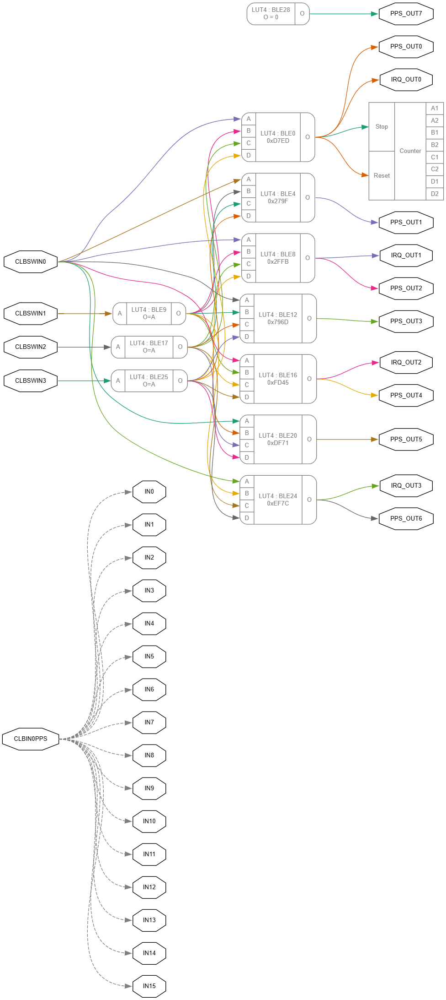

# CLB Bitstream Tools

Microchip added a **very cool peripheral** called the Configurable Logic Block (CLB) to there 
new [PIC16F13145](https://www.microchip.com/en-us/products/microcontrollers-and-microprocessors/8-bit-mcus/pic-mcus/pic16f13145) 
microcontroller family. It's **essentially a small FPGA** (32 LUTs) that can connect to the internals of the chip.

However, they **don't document how to configure it yourself**, only referring you to their online [configurator
tool](https://logic.microchip.com/clbsynthesizer/) that submits jobs to an API that places and routes to LUTs.

> The [CLB] Interface does not appear as an SFR in the Register Map and is **not directly user-accessible**; 
> it is accessible **only through a programming system** such as Microchip MPLAB® Integrated Development Environment 
> (IDE) that supports programming the CLB.
> \- [PIC16F13145 Datasheet](https://ww1.microchip.com/downloads/aemdocuments/documents/mcu08/productdocuments/datasheets/pic16f13145-family-microcontroller-data-sheet-ds40002519.pdf#page=313) 

**So I decided to reverse engineer it myself!**

You can read the walkthrough of the process I used [here](https://mcp-clb.markomo.me/).

This repo has tools for creating, reading, writing, and visualizing bitstreams.

You can play with thease tools in your broswer [here](https://mcp-clb.markomo.me/bitstream.html).

## Contents

 * `data_model.py`
   * This file defines the entire data structure and enumerations that represent the CLB's configurable elements. It's the "schema" for how CLB configurations are represented in Python, including:
     *   **Basic Logic Element (BLE) configurations:** Defines the structure for each of the 32 LUTs, including their 16-bit truth table (`LUT_CONFIG`), whether a D-flip-flop is enabled (`FLOPSEL`), and the source of their four inputs (`LUT_I_A` through `LUT_I_D`).
     *   **Input Multiplexers (`MUX_CFG`):** Specifies how external CLB inputs (IN0-IN15, SWIN0-SWIN31) are routed and synchronized.
     *   **Counter Configuration (`COUNTER`):** Defines settings for the internal CLB counter, including its reset and stop sources, and how its internal outputs are multiplexed.
     *   **Peripheral Output Routing (`PPS_OUTx`, `IRQ_OUTx`, `OESELn`):** Enumerations and data structures for routing CLB outputs to Peripheral Pin Select (PPS) pins, Interrupts, and Output Enables.
     *   **Clock Divider (`CLKDIV`):** Defines the clock division ratio for the CLB.
     *   It also includes the `FASM` base class, which loads Microchip's text-based FASM files.

 * `bitstream.py`
   * This is the core file for interacting with the CLB's binary configuration. It handles reading and writing the raw bitstream data, converting it to and from the structured Python objects defined in `data_model.py`.
   *   It implements methods to parse an existing bitstream (e.g., from a JSON file generated by Microchip's tool) into the Python data model, and conversely, to serialize the Python data model back into the binary bitstream.
   *   It supports saving the generated configuration in a Microchip assembly (`.s`) format, which can then be directly included in an MPLAB X project and programmed onto the microcontroller.

 * `build_lut.py`
   * This module simplifies the creation of 16-bit Look-Up Table (LUT) configurations. It provides a symbolic way to define the logic for a 4-input LUT.
   *   The `Expr` class allows users to write boolean expressions using standard Python operators (`&`, `|`, `~`, `^`, `==`, `!=`) for inputs `a`, `b`, `c`, and `d`.
   *   The `LUT4` class takes such a symbolic expression or a direct Python function (e.g., a lambda) and generates the corresponding 16-bit truth table string. This string directly represents the LUT's behavior and is used as the `LUT_CONFIG` value in a `BLE_CFG` object.

 * `auto_ble.py`
   * Building on `build_lut.py`, this module provides a higher-level abstraction for configuring Basic Logic Elements (BLEs).
   *   It introduces a unified `LUT_IN` enumeration that combines all possible CLB input sources (e.g., `CLBSWIN0`, `IN8`, `CLB_BLE_5`, `COUNT_IS_A1`) into a single, symbolic type.
   *   The `AutoBLE` function takes a boolean expression composed of these `LUT_IN` symbolic inputs. It automatically analyzes which inputs are used in the expression and then generates a complete `BLE_CFG` object, including the correct `LUT_I_A/B/C/D` assignments and the `LUT_CONFIG` bitstream, significantly simplifying BLE setup.

 * `clb_graph.py`
   * This module is dedicated to visualizing the configured CLB logic. It takes a `Bitstream` object (or an `FASM` object) and generates a Graphviz DOT language string.
   *   This DOT string can then be rendered by Graphviz tools into a graphical representation (e.g., SVG, PNG) of the CLB's internal connections.
   *   The visualization shows how external inputs are routed to LUTs, how LUTs connect to each other, and how their outputs drive peripheral connections (PPS, IRQ, OE) or the internal counter. It helps in understanding and debugging complex CLB designs.

## Bitstream Map

<style>

.bitgrid-table { border-collapse: collapse; font-family: monospace; font-size: 0.8em; margin-bottom: 1em; }
.bitgrid-table th, .bitgrid-table td { border: 1px solid #ccc; padding: 3px 5px; text-align: center; }
.bitgrid-table th { background-color: #f0f0f0; }
.bitgrid-base { font-weight: bold; background-color: #f8f8f8; }
.bitgrid-data code { white-space: nowrap; }

</style>
<table class="bitgrid-table">
<thead>
<tr>
<th class="bitgrid-header">Word</th>
<th class="bitgrid-header">+0</th>
<th class="bitgrid-header">+1</th>
<th class="bitgrid-header">+2</th>
<th class="bitgrid-header">+3</th>
<th class="bitgrid-header">+4</th>
<th class="bitgrid-header">+5</th>
<th class="bitgrid-header">+6</th>
<th class="bitgrid-header">+7</th>
<th class="bitgrid-header">+8</th>
<th class="bitgrid-header">+9</th>
<th class="bitgrid-header">+10</th>
<th class="bitgrid-header">+11</th>
<th class="bitgrid-header">+12</th>
<th class="bitgrid-header">+13</th>
</tr>
</thead>
<tbody>
<tr>
<td class="bitgrid-base">0</td>
<td class="bitgrid-data" style="background-color: #60AB9E; color: #000000; ">CKDIV:0</td>
<td class="bitgrid-data" style="background-color: #60AB9E; color: #000000; ">CKDIV:1</td>
<td class="bitgrid-data" style="background-color: #60AB9E; color: #000000; ">CKDIV:2</td>
<td class="bitgrid-data" style=""></td>
<td class="bitgrid-data" style=""></td>
<td class="bitgrid-data" style=""></td>
<td class="bitgrid-data" style=""></td>
<td class="bitgrid-data" style=""></td>
<td class="bitgrid-data" style=""></td>
<td class="bitgrid-data" style="background-color: #69B190; color: #000000; ">CNT:S:0</td>
<td class="bitgrid-data" style="background-color: #69B190; color: #000000; ">CNT:S:1</td>
<td class="bitgrid-data" style="background-color: #69B190; color: #000000; ">CNT:S:2</td>
<td class="bitgrid-data" style="background-color: #69B190; color: #000000; ">CNT:S:3</td>
<td class="bitgrid-data" style="background-color: #69B190; color: #000000; ">CNT:S:4</td>
</tr>
<tr>
<td class="bitgrid-base">1</td>
<td class="bitgrid-data" style="background-color: #69B190; color: #000000; ">CNT:R:0</td>
<td class="bitgrid-data" style="background-color: #69B190; color: #000000; ">CNT:R:1</td>
<td class="bitgrid-data" style="background-color: #69B190; color: #000000; ">CNT:R:2</td>
<td class="bitgrid-data" style="background-color: #69B190; color: #000000; ">CNT:R:3</td>
<td class="bitgrid-data" style="background-color: #69B190; color: #000000; ">CNT:R:4</td>
<td class="bitgrid-data" style="background-color: #69B190; color: #000000; ">CNT:D1:0</td>
<td class="bitgrid-data" style="background-color: #69B190; color: #000000; ">CNT:D1:1</td>
<td class="bitgrid-data" style="background-color: #69B190; color: #000000; ">CNT:D1:2</td>
<td class="bitgrid-data" style="background-color: #69B190; color: #000000; ">CNT:D2:0</td>
<td class="bitgrid-data" style="background-color: #69B190; color: #000000; ">CNT:D2:1</td>
<td class="bitgrid-data" style="background-color: #69B190; color: #000000; ">CNT:D2:2</td>
<td class="bitgrid-data" style=""></td>
<td class="bitgrid-data" style=""></td>
<td class="bitgrid-data" style=""></td>
</tr>
<tr>
<td class="bitgrid-base">2</td>
<td class="bitgrid-data" style="background-color: #69B190; color: #000000; ">CNT:B2:0</td>
<td class="bitgrid-data" style="background-color: #69B190; color: #000000; ">CNT:B2:1</td>
<td class="bitgrid-data" style="background-color: #69B190; color: #000000; ">CNT:B2:2</td>
<td class="bitgrid-data" style="background-color: #69B190; color: #000000; ">CNT:C1:0</td>
<td class="bitgrid-data" style="background-color: #69B190; color: #000000; ">CNT:C1:1</td>
<td class="bitgrid-data" style="background-color: #69B190; color: #000000; ">CNT:C1:2</td>
<td class="bitgrid-data" style="background-color: #69B190; color: #000000; ">CNT:C2:0</td>
<td class="bitgrid-data" style="background-color: #69B190; color: #000000; ">CNT:C2:1</td>
<td class="bitgrid-data" style="background-color: #69B190; color: #000000; ">CNT:C2:2</td>
<td class="bitgrid-data" style="background-color: #69B190; color: #000000; ">CNT:A1:0</td>
<td class="bitgrid-data" style="background-color: #69B190; color: #000000; ">CNT:A1:1</td>
<td class="bitgrid-data" style="background-color: #69B190; color: #000000; ">CNT:A1:2</td>
<td class="bitgrid-data" style="background-color: #69B190; color: #000000; ">CNT:A2:0</td>
<td class="bitgrid-data" style="background-color: #69B190; color: #000000; ">CNT:A2:1</td>
</tr>
<tr>
<td class="bitgrid-base">3</td>
<td class="bitgrid-data" style="background-color: #69B190; color: #000000; ">CNT:A2:2</td>
<td class="bitgrid-data" style="background-color: #69B190; color: #000000; ">CNT:B1:0</td>
<td class="bitgrid-data" style="background-color: #69B190; color: #000000; ">CNT:B1:1</td>
<td class="bitgrid-data" style="background-color: #69B190; color: #000000; ">CNT:B1:2</td>
<td class="bitgrid-data" style="background-color: #E8ECFB; color: #000000; ">PPS:6:0</td>
<td class="bitgrid-data" style="background-color: #E8ECFB; color: #000000; ">PPS:6:1</td>
<td class="bitgrid-data" style="background-color: #E8ECFB; color: #000000; ">PPS:7:0</td>
<td class="bitgrid-data" style="background-color: #E8ECFB; color: #000000; ">PPS:7:1</td>
<td class="bitgrid-data" style="background-color: #521A13; color: #FFFFFF; ">IRQ3:0</td>
<td class="bitgrid-data" style="background-color: #521A13; color: #FFFFFF; ">IRQ3:1</td>
<td class="bitgrid-data" style="background-color: #521A13; color: #FFFFFF; ">IRQ3:2</td>
<td class="bitgrid-data" style=""></td>
<td class="bitgrid-data" style=""></td>
<td class="bitgrid-data" style=""></td>
</tr>
<tr>
<td class="bitgrid-base">4</td>
<td class="bitgrid-data" style="background-color: #E8ECFB; color: #000000; ">PPS:4:0</td>
<td class="bitgrid-data" style="background-color: #E8ECFB; color: #000000; ">PPS:4:1</td>
<td class="bitgrid-data" style="background-color: #E8ECFB; color: #000000; ">PPS:5:0</td>
<td class="bitgrid-data" style="background-color: #E8ECFB; color: #000000; ">PPS:5:1</td>
<td class="bitgrid-data" style="background-color: #DDD8EF; color: #000000; ">IRQ2:0</td>
<td class="bitgrid-data" style="background-color: #DDD8EF; color: #000000; ">IRQ2:1</td>
<td class="bitgrid-data" style="background-color: #DDD8EF; color: #000000; ">IRQ2:2</td>
<td class="bitgrid-data" style=""></td>
<td class="bitgrid-data" style=""></td>
<td class="bitgrid-data" style=""></td>
<td class="bitgrid-data" style="background-color: #E8ECFB; color: #000000; ">PPS:2:0</td>
<td class="bitgrid-data" style="background-color: #E8ECFB; color: #000000; ">PPS:2:1</td>
<td class="bitgrid-data" style="background-color: #E8ECFB; color: #000000; ">PPS:3:0</td>
<td class="bitgrid-data" style="background-color: #E8ECFB; color: #000000; ">PPS:3:1</td>
</tr>
<tr>
<td class="bitgrid-base">5</td>
<td class="bitgrid-data" style="background-color: #721E17; color: #FFFFFF; ">IRQ1:0</td>
<td class="bitgrid-data" style="background-color: #721E17; color: #FFFFFF; ">IRQ1:1</td>
<td class="bitgrid-data" style="background-color: #721E17; color: #FFFFFF; ">IRQ1:2</td>
<td class="bitgrid-data" style=""></td>
<td class="bitgrid-data" style=""></td>
<td class="bitgrid-data" style="background-color: #E8ECFB; color: #000000; ">PPS:0:0</td>
<td class="bitgrid-data" style="background-color: #E8ECFB; color: #000000; ">PPS:0:1</td>
<td class="bitgrid-data" style="background-color: #E8ECFB; color: #000000; ">PPS:1:0</td>
<td class="bitgrid-data" style="background-color: #E8ECFB; color: #000000; ">PPS:1:1</td>
<td class="bitgrid-data" style="background-color: #D1C1E1; color: #000000; ">IRQ0:0</td>
<td class="bitgrid-data" style="background-color: #D1C1E1; color: #000000; ">IRQ0:1</td>
<td class="bitgrid-data" style="background-color: #D1C1E1; color: #000000; ">IRQ0:2</td>
<td class="bitgrid-data" style=""></td>
<td class="bitgrid-data" style=""></td>
</tr>
<tr>
<td class="bitgrid-base">6</td>
<td class="bitgrid-data" style="background-color: #95211B; color: #FFFFFF; ">MX:15:I:0</td>
<td class="bitgrid-data" style="background-color: #95211B; color: #FFFFFF; ">MX:15:I:1</td>
<td class="bitgrid-data" style="background-color: #95211B; color: #FFFFFF; ">MX:15:I:2</td>
<td class="bitgrid-data" style="background-color: #95211B; color: #FFFFFF; ">MX:15:I:3</td>
<td class="bitgrid-data" style="background-color: #95211B; color: #FFFFFF; ">MX:15:I:4</td>
<td class="bitgrid-data" style="background-color: #95211B; color: #FFFFFF; ">MX:15:I:5</td>
<td class="bitgrid-data" style="background-color: #95211B; color: #FFFFFF; ">MX:15:S:0</td>
<td class="bitgrid-data" style="background-color: #95211B; color: #FFFFFF; ">MX:15:S:1</td>
<td class="bitgrid-data" style="background-color: #95211B; color: #FFFFFF; ">MX:15:S:2</td>
<td class="bitgrid-data" style=""></td>
<td class="bitgrid-data" style="background-color: #95211B; color: #FFFFFF; ">MX:14:I:0</td>
<td class="bitgrid-data" style="background-color: #95211B; color: #FFFFFF; ">MX:14:I:1</td>
<td class="bitgrid-data" style="background-color: #95211B; color: #FFFFFF; ">MX:14:I:2</td>
<td class="bitgrid-data" style="background-color: #95211B; color: #FFFFFF; ">MX:14:I:3</td>
</tr>
<tr>
<td class="bitgrid-base">7</td>
<td class="bitgrid-data" style="background-color: #95211B; color: #FFFFFF; ">MX:14:I:4</td>
<td class="bitgrid-data" style="background-color: #95211B; color: #FFFFFF; ">MX:14:I:5</td>
<td class="bitgrid-data" style="background-color: #95211B; color: #FFFFFF; ">MX:14:S:0</td>
<td class="bitgrid-data" style="background-color: #95211B; color: #FFFFFF; ">MX:14:S:1</td>
<td class="bitgrid-data" style="background-color: #95211B; color: #FFFFFF; ">MX:14:S:2</td>
<td class="bitgrid-data" style="background-color: #95211B; color: #FFFFFF; ">MX:13:I:0</td>
<td class="bitgrid-data" style="background-color: #95211B; color: #FFFFFF; ">MX:13:I:1</td>
<td class="bitgrid-data" style="background-color: #95211B; color: #FFFFFF; ">MX:13:I:2</td>
<td class="bitgrid-data" style="background-color: #95211B; color: #FFFFFF; ">MX:13:I:3</td>
<td class="bitgrid-data" style="background-color: #95211B; color: #FFFFFF; ">MX:13:I:4</td>
<td class="bitgrid-data" style="background-color: #95211B; color: #FFFFFF; ">MX:13:I:5</td>
<td class="bitgrid-data" style="background-color: #95211B; color: #FFFFFF; ">MX:13:S:0</td>
<td class="bitgrid-data" style="background-color: #95211B; color: #FFFFFF; ">MX:13:S:1</td>
<td class="bitgrid-data" style="background-color: #95211B; color: #FFFFFF; ">MX:13:S:2</td>
</tr>
<tr>
<td class="bitgrid-base">8</td>
<td class="bitgrid-data" style="background-color: #95211B; color: #FFFFFF; ">MX:12:I:0</td>
<td class="bitgrid-data" style="background-color: #95211B; color: #FFFFFF; ">MX:12:I:1</td>
<td class="bitgrid-data" style="background-color: #95211B; color: #FFFFFF; ">MX:12:I:2</td>
<td class="bitgrid-data" style="background-color: #95211B; color: #FFFFFF; ">MX:12:I:3</td>
<td class="bitgrid-data" style="background-color: #95211B; color: #FFFFFF; ">MX:12:I:4</td>
<td class="bitgrid-data" style="background-color: #95211B; color: #FFFFFF; ">MX:12:I:5</td>
<td class="bitgrid-data" style="background-color: #95211B; color: #FFFFFF; ">MX:12:S:0</td>
<td class="bitgrid-data" style="background-color: #95211B; color: #FFFFFF; ">MX:12:S:1</td>
<td class="bitgrid-data" style="background-color: #95211B; color: #FFFFFF; ">MX:12:S:2</td>
<td class="bitgrid-data" style="background-color: #95211B; color: #FFFFFF; ">MX:11:I:0</td>
<td class="bitgrid-data" style="background-color: #95211B; color: #FFFFFF; ">MX:11:I:1</td>
<td class="bitgrid-data" style="background-color: #95211B; color: #FFFFFF; ">MX:11:I:2</td>
<td class="bitgrid-data" style="background-color: #95211B; color: #FFFFFF; ">MX:11:I:3</td>
<td class="bitgrid-data" style="background-color: #95211B; color: #FFFFFF; ">MX:11:I:4</td>
</tr>
<tr>
<td class="bitgrid-base">9</td>
<td class="bitgrid-data" style="background-color: #95211B; color: #FFFFFF; ">MX:11:I:5</td>
<td class="bitgrid-data" style="background-color: #95211B; color: #FFFFFF; ">MX:11:S:0</td>
<td class="bitgrid-data" style="background-color: #95211B; color: #FFFFFF; ">MX:11:S:1</td>
<td class="bitgrid-data" style="background-color: #95211B; color: #FFFFFF; ">MX:11:S:2</td>
<td class="bitgrid-data" style=""></td>
<td class="bitgrid-data" style="background-color: #95211B; color: #FFFFFF; ">MX:10:I:0</td>
<td class="bitgrid-data" style="background-color: #95211B; color: #FFFFFF; ">MX:10:I:1</td>
<td class="bitgrid-data" style="background-color: #95211B; color: #FFFFFF; ">MX:10:I:2</td>
<td class="bitgrid-data" style="background-color: #95211B; color: #FFFFFF; ">MX:10:I:3</td>
<td class="bitgrid-data" style="background-color: #95211B; color: #FFFFFF; ">MX:10:I:4</td>
<td class="bitgrid-data" style="background-color: #95211B; color: #FFFFFF; ">MX:10:I:5</td>
<td class="bitgrid-data" style="background-color: #95211B; color: #FFFFFF; ">MX:10:S:0</td>
<td class="bitgrid-data" style="background-color: #95211B; color: #FFFFFF; ">MX:10:S:1</td>
<td class="bitgrid-data" style="background-color: #95211B; color: #FFFFFF; ">MX:10:S:2</td>
</tr>
<tr>
<td class="bitgrid-base">10</td>
<td class="bitgrid-data" style="background-color: #95211B; color: #FFFFFF; ">MX:9:I:0</td>
<td class="bitgrid-data" style="background-color: #95211B; color: #FFFFFF; ">MX:9:I:1</td>
<td class="bitgrid-data" style="background-color: #95211B; color: #FFFFFF; ">MX:9:I:2</td>
<td class="bitgrid-data" style="background-color: #95211B; color: #FFFFFF; ">MX:9:I:3</td>
<td class="bitgrid-data" style="background-color: #95211B; color: #FFFFFF; ">MX:9:I:4</td>
<td class="bitgrid-data" style="background-color: #95211B; color: #FFFFFF; ">MX:9:I:5</td>
<td class="bitgrid-data" style="background-color: #95211B; color: #FFFFFF; ">MX:9:S:0</td>
<td class="bitgrid-data" style="background-color: #95211B; color: #FFFFFF; ">MX:9:S:1</td>
<td class="bitgrid-data" style="background-color: #95211B; color: #FFFFFF; ">MX:9:S:2</td>
<td class="bitgrid-data" style="background-color: #95211B; color: #FFFFFF; ">MX:8:I:0</td>
<td class="bitgrid-data" style="background-color: #95211B; color: #FFFFFF; ">MX:8:I:1</td>
<td class="bitgrid-data" style="background-color: #95211B; color: #FFFFFF; ">MX:8:I:2</td>
<td class="bitgrid-data" style="background-color: #95211B; color: #FFFFFF; ">MX:8:I:3</td>
<td class="bitgrid-data" style="background-color: #95211B; color: #FFFFFF; ">MX:8:I:4</td>
</tr>
<tr>
<td class="bitgrid-base">11</td>
<td class="bitgrid-data" style="background-color: #95211B; color: #FFFFFF; ">MX:8:I:5</td>
<td class="bitgrid-data" style="background-color: #95211B; color: #FFFFFF; ">MX:8:S:0</td>
<td class="bitgrid-data" style="background-color: #95211B; color: #FFFFFF; ">MX:8:S:1</td>
<td class="bitgrid-data" style="background-color: #95211B; color: #FFFFFF; ">MX:8:S:2</td>
<td class="bitgrid-data" style="background-color: #95211B; color: #FFFFFF; ">MX:7:I:0</td>
<td class="bitgrid-data" style="background-color: #95211B; color: #FFFFFF; ">MX:7:I:1</td>
<td class="bitgrid-data" style="background-color: #95211B; color: #FFFFFF; ">MX:7:I:2</td>
<td class="bitgrid-data" style="background-color: #95211B; color: #FFFFFF; ">MX:7:I:3</td>
<td class="bitgrid-data" style="background-color: #95211B; color: #FFFFFF; ">MX:7:I:4</td>
<td class="bitgrid-data" style="background-color: #95211B; color: #FFFFFF; ">MX:7:I:5</td>
<td class="bitgrid-data" style="background-color: #95211B; color: #FFFFFF; ">MX:7:S:0</td>
<td class="bitgrid-data" style="background-color: #95211B; color: #FFFFFF; ">MX:7:S:1</td>
<td class="bitgrid-data" style="background-color: #95211B; color: #FFFFFF; ">MX:7:S:2</td>
<td class="bitgrid-data" style=""></td>
</tr>
<tr>
<td class="bitgrid-base">12</td>
<td class="bitgrid-data" style="background-color: #95211B; color: #FFFFFF; ">MX:6:I:0</td>
<td class="bitgrid-data" style="background-color: #95211B; color: #FFFFFF; ">MX:6:I:1</td>
<td class="bitgrid-data" style="background-color: #95211B; color: #FFFFFF; ">MX:6:I:2</td>
<td class="bitgrid-data" style="background-color: #95211B; color: #FFFFFF; ">MX:6:I:3</td>
<td class="bitgrid-data" style="background-color: #95211B; color: #FFFFFF; ">MX:6:I:4</td>
<td class="bitgrid-data" style="background-color: #95211B; color: #FFFFFF; ">MX:6:I:5</td>
<td class="bitgrid-data" style="background-color: #95211B; color: #FFFFFF; ">MX:6:S:0</td>
<td class="bitgrid-data" style="background-color: #95211B; color: #FFFFFF; ">MX:6:S:1</td>
<td class="bitgrid-data" style="background-color: #95211B; color: #FFFFFF; ">MX:6:S:2</td>
<td class="bitgrid-data" style=""></td>
<td class="bitgrid-data" style="background-color: #95211B; color: #FFFFFF; ">MX:5:I:0</td>
<td class="bitgrid-data" style="background-color: #95211B; color: #FFFFFF; ">MX:5:I:1</td>
<td class="bitgrid-data" style="background-color: #95211B; color: #FFFFFF; ">MX:5:I:2</td>
<td class="bitgrid-data" style="background-color: #95211B; color: #FFFFFF; ">MX:5:I:3</td>
</tr>
<tr>
<td class="bitgrid-base">13</td>
<td class="bitgrid-data" style="background-color: #95211B; color: #FFFFFF; ">MX:5:I:4</td>
<td class="bitgrid-data" style="background-color: #95211B; color: #FFFFFF; ">MX:5:I:5</td>
<td class="bitgrid-data" style="background-color: #95211B; color: #FFFFFF; ">MX:5:S:0</td>
<td class="bitgrid-data" style="background-color: #95211B; color: #FFFFFF; ">MX:5:S:1</td>
<td class="bitgrid-data" style="background-color: #95211B; color: #FFFFFF; ">MX:5:S:2</td>
<td class="bitgrid-data" style="background-color: #95211B; color: #FFFFFF; ">MX:4:I:0</td>
<td class="bitgrid-data" style="background-color: #95211B; color: #FFFFFF; ">MX:4:I:1</td>
<td class="bitgrid-data" style="background-color: #95211B; color: #FFFFFF; ">MX:4:I:2</td>
<td class="bitgrid-data" style="background-color: #95211B; color: #FFFFFF; ">MX:4:I:3</td>
<td class="bitgrid-data" style="background-color: #95211B; color: #FFFFFF; ">MX:4:I:4</td>
<td class="bitgrid-data" style="background-color: #95211B; color: #FFFFFF; ">MX:4:I:5</td>
<td class="bitgrid-data" style="background-color: #95211B; color: #FFFFFF; ">MX:4:S:0</td>
<td class="bitgrid-data" style="background-color: #95211B; color: #FFFFFF; ">MX:4:S:1</td>
<td class="bitgrid-data" style="background-color: #95211B; color: #FFFFFF; ">MX:4:S:2</td>
</tr>
<tr>
<td class="bitgrid-base">14</td>
<td class="bitgrid-data" style="background-color: #95211B; color: #FFFFFF; ">MX:3:I:0</td>
<td class="bitgrid-data" style="background-color: #95211B; color: #FFFFFF; ">MX:3:I:1</td>
<td class="bitgrid-data" style="background-color: #95211B; color: #FFFFFF; ">MX:3:I:2</td>
<td class="bitgrid-data" style="background-color: #95211B; color: #FFFFFF; ">MX:3:I:3</td>
<td class="bitgrid-data" style="background-color: #95211B; color: #FFFFFF; ">MX:3:I:4</td>
<td class="bitgrid-data" style="background-color: #95211B; color: #FFFFFF; ">MX:3:I:5</td>
<td class="bitgrid-data" style="background-color: #95211B; color: #FFFFFF; ">MX:3:S:0</td>
<td class="bitgrid-data" style="background-color: #95211B; color: #FFFFFF; ">MX:3:S:1</td>
<td class="bitgrid-data" style="background-color: #95211B; color: #FFFFFF; ">MX:3:S:2</td>
<td class="bitgrid-data" style=""></td>
<td class="bitgrid-data" style="background-color: #95211B; color: #FFFFFF; ">MX:2:I:0</td>
<td class="bitgrid-data" style="background-color: #95211B; color: #FFFFFF; ">MX:2:I:1</td>
<td class="bitgrid-data" style="background-color: #95211B; color: #FFFFFF; ">MX:2:I:2</td>
<td class="bitgrid-data" style="background-color: #95211B; color: #FFFFFF; ">MX:2:I:3</td>
</tr>
<tr>
<td class="bitgrid-base">15</td>
<td class="bitgrid-data" style="background-color: #95211B; color: #FFFFFF; ">MX:2:I:4</td>
<td class="bitgrid-data" style="background-color: #95211B; color: #FFFFFF; ">MX:2:I:5</td>
<td class="bitgrid-data" style="background-color: #95211B; color: #FFFFFF; ">MX:2:S:0</td>
<td class="bitgrid-data" style="background-color: #95211B; color: #FFFFFF; ">MX:2:S:1</td>
<td class="bitgrid-data" style="background-color: #95211B; color: #FFFFFF; ">MX:2:S:2</td>
<td class="bitgrid-data" style="background-color: #95211B; color: #FFFFFF; ">MX:1:I:0</td>
<td class="bitgrid-data" style="background-color: #95211B; color: #FFFFFF; ">MX:1:I:1</td>
<td class="bitgrid-data" style="background-color: #95211B; color: #FFFFFF; ">MX:1:I:2</td>
<td class="bitgrid-data" style="background-color: #95211B; color: #FFFFFF; ">MX:1:I:3</td>
<td class="bitgrid-data" style="background-color: #95211B; color: #FFFFFF; ">MX:1:I:4</td>
<td class="bitgrid-data" style="background-color: #95211B; color: #FFFFFF; ">MX:1:I:5</td>
<td class="bitgrid-data" style="background-color: #95211B; color: #FFFFFF; ">MX:1:S:0</td>
<td class="bitgrid-data" style="background-color: #95211B; color: #FFFFFF; ">MX:1:S:1</td>
<td class="bitgrid-data" style="background-color: #95211B; color: #FFFFFF; ">MX:1:S:2</td>
</tr>
<tr>
<td class="bitgrid-base">16</td>
<td class="bitgrid-data" style="background-color: #95211B; color: #FFFFFF; ">MX:0:I:0</td>
<td class="bitgrid-data" style="background-color: #95211B; color: #FFFFFF; ">MX:0:I:1</td>
<td class="bitgrid-data" style="background-color: #95211B; color: #FFFFFF; ">MX:0:I:2</td>
<td class="bitgrid-data" style="background-color: #95211B; color: #FFFFFF; ">MX:0:I:3</td>
<td class="bitgrid-data" style="background-color: #95211B; color: #FFFFFF; ">MX:0:I:4</td>
<td class="bitgrid-data" style="background-color: #95211B; color: #FFFFFF; ">MX:0:I:5</td>
<td class="bitgrid-data" style="background-color: #95211B; color: #FFFFFF; ">MX:0:S:0</td>
<td class="bitgrid-data" style="background-color: #95211B; color: #FFFFFF; ">MX:0:S:1</td>
<td class="bitgrid-data" style="background-color: #95211B; color: #FFFFFF; ">MX:0:S:2</td>
<td class="bitgrid-data" style="background-color: #C3A8D1; color: #000000; ">31:D:0</td>
<td class="bitgrid-data" style="background-color: #C3A8D1; color: #000000; ">31:D:1</td>
<td class="bitgrid-data" style="background-color: #C3A8D1; color: #000000; ">31:D:2</td>
<td class="bitgrid-data" style="background-color: #C3A8D1; color: #000000; ">31:D:3</td>
<td class="bitgrid-data" style="background-color: #C3A8D1; color: #000000; ">31:D:4</td>
</tr>
<tr>
<td class="bitgrid-base">17</td>
<td class="bitgrid-data" style="background-color: #C3A8D1; color: #000000; ">31:12</td>
<td class="bitgrid-data" style="background-color: #C3A8D1; color: #000000; ">31:13</td>
<td class="bitgrid-data" style="background-color: #C3A8D1; color: #000000; ">31:14</td>
<td class="bitgrid-data" style="background-color: #C3A8D1; color: #000000; ">31:15</td>
<td class="bitgrid-data" style="background-color: #C3A8D1; color: #000000; ">31:FS</td>
<td class="bitgrid-data" style="background-color: #C3A8D1; color: #000000; ">31:C:0</td>
<td class="bitgrid-data" style="background-color: #C3A8D1; color: #000000; ">31:C:1</td>
<td class="bitgrid-data" style="background-color: #C3A8D1; color: #000000; ">31:C:2</td>
<td class="bitgrid-data" style="background-color: #C3A8D1; color: #000000; ">31:C:3</td>
<td class="bitgrid-data" style="background-color: #C3A8D1; color: #000000; ">31:C:4</td>
<td class="bitgrid-data" style="background-color: #C3A8D1; color: #000000; ">31:8</td>
<td class="bitgrid-data" style="background-color: #C3A8D1; color: #000000; ">31:9</td>
<td class="bitgrid-data" style="background-color: #C3A8D1; color: #000000; ">31:10</td>
<td class="bitgrid-data" style="background-color: #C3A8D1; color: #000000; ">31:11</td>
</tr>
<tr>
<td class="bitgrid-base">18</td>
<td class="bitgrid-data" style="background-color: #C3A8D1; color: #000000; ">31:B:0</td>
<td class="bitgrid-data" style="background-color: #C3A8D1; color: #000000; ">31:B:1</td>
<td class="bitgrid-data" style="background-color: #C3A8D1; color: #000000; ">31:B:2</td>
<td class="bitgrid-data" style="background-color: #C3A8D1; color: #000000; ">31:B:3</td>
<td class="bitgrid-data" style="background-color: #C3A8D1; color: #000000; ">31:B:4</td>
<td class="bitgrid-data" style="background-color: #C3A8D1; color: #000000; ">31:4</td>
<td class="bitgrid-data" style="background-color: #C3A8D1; color: #000000; ">31:5</td>
<td class="bitgrid-data" style="background-color: #C3A8D1; color: #000000; ">31:6</td>
<td class="bitgrid-data" style="background-color: #C3A8D1; color: #000000; ">31:7</td>
<td class="bitgrid-data" style="background-color: #C3A8D1; color: #000000; ">31:A:0</td>
<td class="bitgrid-data" style="background-color: #C3A8D1; color: #000000; ">31:A:1</td>
<td class="bitgrid-data" style="background-color: #C3A8D1; color: #000000; ">31:A:2</td>
<td class="bitgrid-data" style="background-color: #C3A8D1; color: #000000; ">31:A:3</td>
<td class="bitgrid-data" style="background-color: #C3A8D1; color: #000000; ">31:A:4</td>
</tr>
<tr>
<td class="bitgrid-base">19</td>
<td class="bitgrid-data" style="background-color: #C3A8D1; color: #000000; ">31:0</td>
<td class="bitgrid-data" style="background-color: #C3A8D1; color: #000000; ">31:1</td>
<td class="bitgrid-data" style="background-color: #C3A8D1; color: #000000; ">31:2</td>
<td class="bitgrid-data" style="background-color: #C3A8D1; color: #000000; ">31:3</td>
<td class="bitgrid-data" style="background-color: #B8221E; color: #FFFFFF; ">30:D:0</td>
<td class="bitgrid-data" style="background-color: #B8221E; color: #FFFFFF; ">30:D:1</td>
<td class="bitgrid-data" style="background-color: #B8221E; color: #FFFFFF; ">30:D:2</td>
<td class="bitgrid-data" style="background-color: #B8221E; color: #FFFFFF; ">30:D:3</td>
<td class="bitgrid-data" style="background-color: #B8221E; color: #FFFFFF; ">30:D:4</td>
<td class="bitgrid-data" style="background-color: #B8221E; color: #FFFFFF; ">30:12</td>
<td class="bitgrid-data" style="background-color: #B8221E; color: #FFFFFF; ">30:13</td>
<td class="bitgrid-data" style="background-color: #B8221E; color: #FFFFFF; ">30:14</td>
<td class="bitgrid-data" style="background-color: #B8221E; color: #FFFFFF; ">30:15</td>
<td class="bitgrid-data" style="background-color: #B8221E; color: #FFFFFF; ">30:FS</td>
</tr>
<tr>
<td class="bitgrid-base">20</td>
<td class="bitgrid-data" style="background-color: #B8221E; color: #FFFFFF; ">30:C:0</td>
<td class="bitgrid-data" style="background-color: #B8221E; color: #FFFFFF; ">30:C:1</td>
<td class="bitgrid-data" style="background-color: #B8221E; color: #FFFFFF; ">30:C:2</td>
<td class="bitgrid-data" style="background-color: #B8221E; color: #FFFFFF; ">30:C:3</td>
<td class="bitgrid-data" style="background-color: #B8221E; color: #FFFFFF; ">30:C:4</td>
<td class="bitgrid-data" style="background-color: #B8221E; color: #FFFFFF; ">30:8</td>
<td class="bitgrid-data" style="background-color: #B8221E; color: #FFFFFF; ">30:9</td>
<td class="bitgrid-data" style="background-color: #B8221E; color: #FFFFFF; ">30:10</td>
<td class="bitgrid-data" style="background-color: #B8221E; color: #FFFFFF; ">30:11</td>
<td class="bitgrid-data" style=""></td>
<td class="bitgrid-data" style="background-color: #B8221E; color: #FFFFFF; ">30:B:0</td>
<td class="bitgrid-data" style="background-color: #B8221E; color: #FFFFFF; ">30:B:1</td>
<td class="bitgrid-data" style="background-color: #B8221E; color: #FFFFFF; ">30:B:2</td>
<td class="bitgrid-data" style="background-color: #B8221E; color: #FFFFFF; ">30:B:3</td>
</tr>
<tr>
<td class="bitgrid-base">21</td>
<td class="bitgrid-data" style="background-color: #B8221E; color: #FFFFFF; ">30:B:4</td>
<td class="bitgrid-data" style="background-color: #B8221E; color: #FFFFFF; ">30:4</td>
<td class="bitgrid-data" style="background-color: #B8221E; color: #FFFFFF; ">30:5</td>
<td class="bitgrid-data" style="background-color: #B8221E; color: #FFFFFF; ">30:6</td>
<td class="bitgrid-data" style="background-color: #B8221E; color: #FFFFFF; ">30:7</td>
<td class="bitgrid-data" style="background-color: #B8221E; color: #FFFFFF; ">30:A:0</td>
<td class="bitgrid-data" style="background-color: #B8221E; color: #FFFFFF; ">30:A:1</td>
<td class="bitgrid-data" style="background-color: #B8221E; color: #FFFFFF; ">30:A:2</td>
<td class="bitgrid-data" style="background-color: #B8221E; color: #FFFFFF; ">30:A:3</td>
<td class="bitgrid-data" style="background-color: #B8221E; color: #FFFFFF; ">30:A:4</td>
<td class="bitgrid-data" style="background-color: #B8221E; color: #FFFFFF; ">30:0</td>
<td class="bitgrid-data" style="background-color: #B8221E; color: #FFFFFF; ">30:1</td>
<td class="bitgrid-data" style="background-color: #B8221E; color: #FFFFFF; ">30:2</td>
<td class="bitgrid-data" style="background-color: #B8221E; color: #FFFFFF; ">30:3</td>
</tr>
<tr>
<td class="bitgrid-base">22</td>
<td class="bitgrid-data" style="background-color: #B58FC2; color: #000000; ">29:D:0</td>
<td class="bitgrid-data" style="background-color: #B58FC2; color: #000000; ">29:D:1</td>
<td class="bitgrid-data" style="background-color: #B58FC2; color: #000000; ">29:D:2</td>
<td class="bitgrid-data" style="background-color: #B58FC2; color: #000000; ">29:D:3</td>
<td class="bitgrid-data" style="background-color: #B58FC2; color: #000000; ">29:D:4</td>
<td class="bitgrid-data" style="background-color: #B58FC2; color: #000000; ">29:12</td>
<td class="bitgrid-data" style="background-color: #B58FC2; color: #000000; ">29:13</td>
<td class="bitgrid-data" style="background-color: #B58FC2; color: #000000; ">29:14</td>
<td class="bitgrid-data" style="background-color: #B58FC2; color: #000000; ">29:15</td>
<td class="bitgrid-data" style="background-color: #B58FC2; color: #000000; ">29:FS</td>
<td class="bitgrid-data" style="background-color: #B58FC2; color: #000000; ">29:C:0</td>
<td class="bitgrid-data" style="background-color: #B58FC2; color: #000000; ">29:C:1</td>
<td class="bitgrid-data" style="background-color: #B58FC2; color: #000000; ">29:C:2</td>
<td class="bitgrid-data" style="background-color: #B58FC2; color: #000000; ">29:C:3</td>
</tr>
<tr>
<td class="bitgrid-base">23</td>
<td class="bitgrid-data" style="background-color: #B58FC2; color: #000000; ">29:C:4</td>
<td class="bitgrid-data" style="background-color: #B58FC2; color: #000000; ">29:8</td>
<td class="bitgrid-data" style="background-color: #B58FC2; color: #000000; ">29:9</td>
<td class="bitgrid-data" style="background-color: #B58FC2; color: #000000; ">29:10</td>
<td class="bitgrid-data" style="background-color: #B58FC2; color: #000000; ">29:11</td>
<td class="bitgrid-data" style="background-color: #B58FC2; color: #000000; ">29:B:0</td>
<td class="bitgrid-data" style="background-color: #B58FC2; color: #000000; ">29:B:1</td>
<td class="bitgrid-data" style="background-color: #B58FC2; color: #000000; ">29:B:2</td>
<td class="bitgrid-data" style="background-color: #B58FC2; color: #000000; ">29:B:3</td>
<td class="bitgrid-data" style="background-color: #B58FC2; color: #000000; ">29:B:4</td>
<td class="bitgrid-data" style="background-color: #B58FC2; color: #000000; ">29:4</td>
<td class="bitgrid-data" style="background-color: #B58FC2; color: #000000; ">29:5</td>
<td class="bitgrid-data" style="background-color: #B58FC2; color: #000000; ">29:6</td>
<td class="bitgrid-data" style="background-color: #B58FC2; color: #000000; ">29:7</td>
</tr>
<tr>
<td class="bitgrid-base">24</td>
<td class="bitgrid-data" style="background-color: #B58FC2; color: #000000; ">29:A:0</td>
<td class="bitgrid-data" style="background-color: #B58FC2; color: #000000; ">29:A:1</td>
<td class="bitgrid-data" style="background-color: #B58FC2; color: #000000; ">29:A:2</td>
<td class="bitgrid-data" style="background-color: #B58FC2; color: #000000; ">29:A:3</td>
<td class="bitgrid-data" style="background-color: #B58FC2; color: #000000; ">29:A:4</td>
<td class="bitgrid-data" style="background-color: #B58FC2; color: #000000; ">29:0</td>
<td class="bitgrid-data" style="background-color: #B58FC2; color: #000000; ">29:1</td>
<td class="bitgrid-data" style="background-color: #B58FC2; color: #000000; ">29:2</td>
<td class="bitgrid-data" style="background-color: #B58FC2; color: #000000; ">29:3</td>
<td class="bitgrid-data" style="background-color: #DA2222; color: #FFFFFF; ">28:D:0</td>
<td class="bitgrid-data" style="background-color: #DA2222; color: #FFFFFF; ">28:D:1</td>
<td class="bitgrid-data" style="background-color: #DA2222; color: #FFFFFF; ">28:D:2</td>
<td class="bitgrid-data" style="background-color: #DA2222; color: #FFFFFF; ">28:D:3</td>
<td class="bitgrid-data" style="background-color: #DA2222; color: #FFFFFF; ">28:D:4</td>
</tr>
<tr>
<td class="bitgrid-base">25</td>
<td class="bitgrid-data" style="background-color: #DA2222; color: #FFFFFF; ">28:12</td>
<td class="bitgrid-data" style="background-color: #DA2222; color: #FFFFFF; ">28:13</td>
<td class="bitgrid-data" style="background-color: #DA2222; color: #FFFFFF; ">28:14</td>
<td class="bitgrid-data" style="background-color: #DA2222; color: #FFFFFF; ">28:15</td>
<td class="bitgrid-data" style="background-color: #DA2222; color: #FFFFFF; ">28:FS</td>
<td class="bitgrid-data" style="background-color: #DA2222; color: #FFFFFF; ">28:C:0</td>
<td class="bitgrid-data" style="background-color: #DA2222; color: #FFFFFF; ">28:C:1</td>
<td class="bitgrid-data" style="background-color: #DA2222; color: #FFFFFF; ">28:C:2</td>
<td class="bitgrid-data" style="background-color: #DA2222; color: #FFFFFF; ">28:C:3</td>
<td class="bitgrid-data" style="background-color: #DA2222; color: #FFFFFF; ">28:C:4</td>
<td class="bitgrid-data" style="background-color: #DA2222; color: #FFFFFF; ">28:8</td>
<td class="bitgrid-data" style="background-color: #DA2222; color: #FFFFFF; ">28:9</td>
<td class="bitgrid-data" style="background-color: #DA2222; color: #FFFFFF; ">28:10</td>
<td class="bitgrid-data" style="background-color: #DA2222; color: #FFFFFF; ">28:11</td>
</tr>
<tr>
<td class="bitgrid-base">26</td>
<td class="bitgrid-data" style="background-color: #DA2222; color: #FFFFFF; ">28:B:0</td>
<td class="bitgrid-data" style="background-color: #DA2222; color: #FFFFFF; ">28:B:1</td>
<td class="bitgrid-data" style="background-color: #DA2222; color: #FFFFFF; ">28:B:2</td>
<td class="bitgrid-data" style="background-color: #DA2222; color: #FFFFFF; ">28:B:3</td>
<td class="bitgrid-data" style="background-color: #DA2222; color: #FFFFFF; ">28:B:4</td>
<td class="bitgrid-data" style="background-color: #DA2222; color: #FFFFFF; ">28:4</td>
<td class="bitgrid-data" style="background-color: #DA2222; color: #FFFFFF; ">28:5</td>
<td class="bitgrid-data" style="background-color: #DA2222; color: #FFFFFF; ">28:6</td>
<td class="bitgrid-data" style="background-color: #DA2222; color: #FFFFFF; ">28:7</td>
<td class="bitgrid-data" style="background-color: #DA2222; color: #FFFFFF; ">28:A:0</td>
<td class="bitgrid-data" style="background-color: #DA2222; color: #FFFFFF; ">28:A:1</td>
<td class="bitgrid-data" style="background-color: #DA2222; color: #FFFFFF; ">28:A:2</td>
<td class="bitgrid-data" style="background-color: #DA2222; color: #FFFFFF; ">28:A:3</td>
<td class="bitgrid-data" style="background-color: #DA2222; color: #FFFFFF; ">28:A:4</td>
</tr>
<tr>
<td class="bitgrid-base">27</td>
<td class="bitgrid-data" style="background-color: #DA2222; color: #FFFFFF; ">28:0</td>
<td class="bitgrid-data" style="background-color: #DA2222; color: #FFFFFF; ">28:1</td>
<td class="bitgrid-data" style="background-color: #DA2222; color: #FFFFFF; ">28:2</td>
<td class="bitgrid-data" style="background-color: #DA2222; color: #FFFFFF; ">28:3</td>
<td class="bitgrid-data" style="background-color: #A778B4; color: #000000; ">27:D:0</td>
<td class="bitgrid-data" style="background-color: #A778B4; color: #000000; ">27:D:1</td>
<td class="bitgrid-data" style="background-color: #A778B4; color: #000000; ">27:D:2</td>
<td class="bitgrid-data" style="background-color: #A778B4; color: #000000; ">27:D:3</td>
<td class="bitgrid-data" style="background-color: #A778B4; color: #000000; ">27:D:4</td>
<td class="bitgrid-data" style="background-color: #A778B4; color: #000000; ">27:12</td>
<td class="bitgrid-data" style="background-color: #A778B4; color: #000000; ">27:13</td>
<td class="bitgrid-data" style="background-color: #A778B4; color: #000000; ">27:14</td>
<td class="bitgrid-data" style="background-color: #A778B4; color: #000000; ">27:15</td>
<td class="bitgrid-data" style="background-color: #A778B4; color: #000000; ">27:FS</td>
</tr>
<tr>
<td class="bitgrid-base">28</td>
<td class="bitgrid-data" style="background-color: #A778B4; color: #000000; ">27:C:0</td>
<td class="bitgrid-data" style="background-color: #A778B4; color: #000000; ">27:C:1</td>
<td class="bitgrid-data" style="background-color: #A778B4; color: #000000; ">27:C:2</td>
<td class="bitgrid-data" style="background-color: #A778B4; color: #000000; ">27:C:3</td>
<td class="bitgrid-data" style="background-color: #A778B4; color: #000000; ">27:C:4</td>
<td class="bitgrid-data" style="background-color: #A778B4; color: #000000; ">27:8</td>
<td class="bitgrid-data" style="background-color: #A778B4; color: #000000; ">27:9</td>
<td class="bitgrid-data" style="background-color: #A778B4; color: #000000; ">27:10</td>
<td class="bitgrid-data" style="background-color: #A778B4; color: #000000; ">27:11</td>
<td class="bitgrid-data" style=""></td>
<td class="bitgrid-data" style="background-color: #A778B4; color: #000000; ">27:B:0</td>
<td class="bitgrid-data" style="background-color: #A778B4; color: #000000; ">27:B:1</td>
<td class="bitgrid-data" style="background-color: #A778B4; color: #000000; ">27:B:2</td>
<td class="bitgrid-data" style="background-color: #A778B4; color: #000000; ">27:B:3</td>
</tr>
<tr>
<td class="bitgrid-base">29</td>
<td class="bitgrid-data" style="background-color: #A778B4; color: #000000; ">27:B:4</td>
<td class="bitgrid-data" style="background-color: #A778B4; color: #000000; ">27:4</td>
<td class="bitgrid-data" style="background-color: #A778B4; color: #000000; ">27:5</td>
<td class="bitgrid-data" style="background-color: #A778B4; color: #000000; ">27:6</td>
<td class="bitgrid-data" style="background-color: #A778B4; color: #000000; ">27:7</td>
<td class="bitgrid-data" style="background-color: #A778B4; color: #000000; ">27:A:0</td>
<td class="bitgrid-data" style="background-color: #A778B4; color: #000000; ">27:A:1</td>
<td class="bitgrid-data" style="background-color: #A778B4; color: #000000; ">27:A:2</td>
<td class="bitgrid-data" style="background-color: #A778B4; color: #000000; ">27:A:3</td>
<td class="bitgrid-data" style="background-color: #A778B4; color: #000000; ">27:A:4</td>
<td class="bitgrid-data" style="background-color: #A778B4; color: #000000; ">27:0</td>
<td class="bitgrid-data" style="background-color: #A778B4; color: #000000; ">27:1</td>
<td class="bitgrid-data" style="background-color: #A778B4; color: #000000; ">27:2</td>
<td class="bitgrid-data" style="background-color: #A778B4; color: #000000; ">27:3</td>
</tr>
<tr>
<td class="bitgrid-base">30</td>
<td class="bitgrid-data" style="background-color: #DF4828; color: #FFFFFF; ">26:D:0</td>
<td class="bitgrid-data" style="background-color: #DF4828; color: #FFFFFF; ">26:D:1</td>
<td class="bitgrid-data" style="background-color: #DF4828; color: #FFFFFF; ">26:D:2</td>
<td class="bitgrid-data" style="background-color: #DF4828; color: #FFFFFF; ">26:D:3</td>
<td class="bitgrid-data" style="background-color: #DF4828; color: #FFFFFF; ">26:D:4</td>
<td class="bitgrid-data" style="background-color: #DF4828; color: #FFFFFF; ">26:12</td>
<td class="bitgrid-data" style="background-color: #DF4828; color: #FFFFFF; ">26:13</td>
<td class="bitgrid-data" style="background-color: #DF4828; color: #FFFFFF; ">26:14</td>
<td class="bitgrid-data" style="background-color: #DF4828; color: #FFFFFF; ">26:15</td>
<td class="bitgrid-data" style="background-color: #DF4828; color: #FFFFFF; ">26:FS</td>
<td class="bitgrid-data" style="background-color: #DF4828; color: #FFFFFF; ">26:C:0</td>
<td class="bitgrid-data" style="background-color: #DF4828; color: #FFFFFF; ">26:C:1</td>
<td class="bitgrid-data" style="background-color: #DF4828; color: #FFFFFF; ">26:C:2</td>
<td class="bitgrid-data" style="background-color: #DF4828; color: #FFFFFF; ">26:C:3</td>
</tr>
<tr>
<td class="bitgrid-base">31</td>
<td class="bitgrid-data" style="background-color: #DF4828; color: #FFFFFF; ">26:C:4</td>
<td class="bitgrid-data" style="background-color: #DF4828; color: #FFFFFF; ">26:8</td>
<td class="bitgrid-data" style="background-color: #DF4828; color: #FFFFFF; ">26:9</td>
<td class="bitgrid-data" style="background-color: #DF4828; color: #FFFFFF; ">26:10</td>
<td class="bitgrid-data" style="background-color: #DF4828; color: #FFFFFF; ">26:11</td>
<td class="bitgrid-data" style="background-color: #DF4828; color: #FFFFFF; ">26:B:0</td>
<td class="bitgrid-data" style="background-color: #DF4828; color: #FFFFFF; ">26:B:1</td>
<td class="bitgrid-data" style="background-color: #DF4828; color: #FFFFFF; ">26:B:2</td>
<td class="bitgrid-data" style="background-color: #DF4828; color: #FFFFFF; ">26:B:3</td>
<td class="bitgrid-data" style="background-color: #DF4828; color: #FFFFFF; ">26:B:4</td>
<td class="bitgrid-data" style="background-color: #DF4828; color: #FFFFFF; ">26:4</td>
<td class="bitgrid-data" style="background-color: #DF4828; color: #FFFFFF; ">26:5</td>
<td class="bitgrid-data" style="background-color: #DF4828; color: #FFFFFF; ">26:6</td>
<td class="bitgrid-data" style="background-color: #DF4828; color: #FFFFFF; ">26:7</td>
</tr>
<tr>
<td class="bitgrid-base">32</td>
<td class="bitgrid-data" style="background-color: #DF4828; color: #FFFFFF; ">26:A:0</td>
<td class="bitgrid-data" style="background-color: #DF4828; color: #FFFFFF; ">26:A:1</td>
<td class="bitgrid-data" style="background-color: #DF4828; color: #FFFFFF; ">26:A:2</td>
<td class="bitgrid-data" style="background-color: #DF4828; color: #FFFFFF; ">26:A:3</td>
<td class="bitgrid-data" style="background-color: #DF4828; color: #FFFFFF; ">26:A:4</td>
<td class="bitgrid-data" style="background-color: #DF4828; color: #FFFFFF; ">26:0</td>
<td class="bitgrid-data" style="background-color: #DF4828; color: #FFFFFF; ">26:1</td>
<td class="bitgrid-data" style="background-color: #DF4828; color: #FFFFFF; ">26:2</td>
<td class="bitgrid-data" style="background-color: #DF4828; color: #FFFFFF; ">26:3</td>
<td class="bitgrid-data" style="background-color: #9B62A7; color: #FFFFFF; ">25:D:0</td>
<td class="bitgrid-data" style="background-color: #9B62A7; color: #FFFFFF; ">25:D:1</td>
<td class="bitgrid-data" style="background-color: #9B62A7; color: #FFFFFF; ">25:D:2</td>
<td class="bitgrid-data" style="background-color: #9B62A7; color: #FFFFFF; ">25:D:3</td>
<td class="bitgrid-data" style="background-color: #9B62A7; color: #FFFFFF; ">25:D:4</td>
</tr>
<tr>
<td class="bitgrid-base">33</td>
<td class="bitgrid-data" style="background-color: #9B62A7; color: #FFFFFF; ">25:12</td>
<td class="bitgrid-data" style="background-color: #9B62A7; color: #FFFFFF; ">25:13</td>
<td class="bitgrid-data" style="background-color: #9B62A7; color: #FFFFFF; ">25:14</td>
<td class="bitgrid-data" style="background-color: #9B62A7; color: #FFFFFF; ">25:15</td>
<td class="bitgrid-data" style="background-color: #9B62A7; color: #FFFFFF; ">25:FS</td>
<td class="bitgrid-data" style="background-color: #9B62A7; color: #FFFFFF; ">25:C:0</td>
<td class="bitgrid-data" style="background-color: #9B62A7; color: #FFFFFF; ">25:C:1</td>
<td class="bitgrid-data" style="background-color: #9B62A7; color: #FFFFFF; ">25:C:2</td>
<td class="bitgrid-data" style="background-color: #9B62A7; color: #FFFFFF; ">25:C:3</td>
<td class="bitgrid-data" style="background-color: #9B62A7; color: #FFFFFF; ">25:C:4</td>
<td class="bitgrid-data" style="background-color: #9B62A7; color: #FFFFFF; ">25:8</td>
<td class="bitgrid-data" style="background-color: #9B62A7; color: #FFFFFF; ">25:9</td>
<td class="bitgrid-data" style="background-color: #9B62A7; color: #FFFFFF; ">25:10</td>
<td class="bitgrid-data" style="background-color: #9B62A7; color: #FFFFFF; ">25:11</td>
</tr>
<tr>
<td class="bitgrid-base">34</td>
<td class="bitgrid-data" style="background-color: #9B62A7; color: #FFFFFF; ">25:B:0</td>
<td class="bitgrid-data" style="background-color: #9B62A7; color: #FFFFFF; ">25:B:1</td>
<td class="bitgrid-data" style="background-color: #9B62A7; color: #FFFFFF; ">25:B:2</td>
<td class="bitgrid-data" style="background-color: #9B62A7; color: #FFFFFF; ">25:B:3</td>
<td class="bitgrid-data" style="background-color: #9B62A7; color: #FFFFFF; ">25:B:4</td>
<td class="bitgrid-data" style="background-color: #9B62A7; color: #FFFFFF; ">25:4</td>
<td class="bitgrid-data" style="background-color: #9B62A7; color: #FFFFFF; ">25:5</td>
<td class="bitgrid-data" style="background-color: #9B62A7; color: #FFFFFF; ">25:6</td>
<td class="bitgrid-data" style="background-color: #9B62A7; color: #FFFFFF; ">25:7</td>
<td class="bitgrid-data" style="background-color: #9B62A7; color: #FFFFFF; ">25:A:0</td>
<td class="bitgrid-data" style="background-color: #9B62A7; color: #FFFFFF; ">25:A:1</td>
<td class="bitgrid-data" style="background-color: #9B62A7; color: #FFFFFF; ">25:A:2</td>
<td class="bitgrid-data" style="background-color: #9B62A7; color: #FFFFFF; ">25:A:3</td>
<td class="bitgrid-data" style="background-color: #9B62A7; color: #FFFFFF; ">25:A:4</td>
</tr>
<tr>
<td class="bitgrid-base">35</td>
<td class="bitgrid-data" style="background-color: #9B62A7; color: #FFFFFF; ">25:0</td>
<td class="bitgrid-data" style="background-color: #9B62A7; color: #FFFFFF; ">25:1</td>
<td class="bitgrid-data" style="background-color: #9B62A7; color: #FFFFFF; ">25:2</td>
<td class="bitgrid-data" style="background-color: #9B62A7; color: #FFFFFF; ">25:3</td>
<td class="bitgrid-data" style="background-color: #E4632D; color: #000000; ">24:D:0</td>
<td class="bitgrid-data" style="background-color: #E4632D; color: #000000; ">24:D:1</td>
<td class="bitgrid-data" style="background-color: #E4632D; color: #000000; ">24:D:2</td>
<td class="bitgrid-data" style="background-color: #E4632D; color: #000000; ">24:D:3</td>
<td class="bitgrid-data" style="background-color: #E4632D; color: #000000; ">24:D:4</td>
<td class="bitgrid-data" style="background-color: #E4632D; color: #000000; ">24:12</td>
<td class="bitgrid-data" style="background-color: #E4632D; color: #000000; ">24:13</td>
<td class="bitgrid-data" style="background-color: #E4632D; color: #000000; ">24:14</td>
<td class="bitgrid-data" style="background-color: #E4632D; color: #000000; ">24:15</td>
<td class="bitgrid-data" style="background-color: #E4632D; color: #000000; ">24:FS</td>
</tr>
<tr>
<td class="bitgrid-base">36</td>
<td class="bitgrid-data" style="background-color: #E4632D; color: #000000; ">24:C:0</td>
<td class="bitgrid-data" style="background-color: #E4632D; color: #000000; ">24:C:1</td>
<td class="bitgrid-data" style="background-color: #E4632D; color: #000000; ">24:C:2</td>
<td class="bitgrid-data" style="background-color: #E4632D; color: #000000; ">24:C:3</td>
<td class="bitgrid-data" style="background-color: #E4632D; color: #000000; ">24:C:4</td>
<td class="bitgrid-data" style="background-color: #E4632D; color: #000000; ">24:8</td>
<td class="bitgrid-data" style="background-color: #E4632D; color: #000000; ">24:9</td>
<td class="bitgrid-data" style="background-color: #E4632D; color: #000000; ">24:10</td>
<td class="bitgrid-data" style="background-color: #E4632D; color: #000000; ">24:11</td>
<td class="bitgrid-data" style=""></td>
<td class="bitgrid-data" style="background-color: #E4632D; color: #000000; ">24:B:0</td>
<td class="bitgrid-data" style="background-color: #E4632D; color: #000000; ">24:B:1</td>
<td class="bitgrid-data" style="background-color: #E4632D; color: #000000; ">24:B:2</td>
<td class="bitgrid-data" style="background-color: #E4632D; color: #000000; ">24:B:3</td>
</tr>
<tr>
<td class="bitgrid-base">37</td>
<td class="bitgrid-data" style="background-color: #E4632D; color: #000000; ">24:B:4</td>
<td class="bitgrid-data" style="background-color: #E4632D; color: #000000; ">24:4</td>
<td class="bitgrid-data" style="background-color: #E4632D; color: #000000; ">24:5</td>
<td class="bitgrid-data" style="background-color: #E4632D; color: #000000; ">24:6</td>
<td class="bitgrid-data" style="background-color: #E4632D; color: #000000; ">24:7</td>
<td class="bitgrid-data" style="background-color: #E4632D; color: #000000; ">24:A:0</td>
<td class="bitgrid-data" style="background-color: #E4632D; color: #000000; ">24:A:1</td>
<td class="bitgrid-data" style="background-color: #E4632D; color: #000000; ">24:A:2</td>
<td class="bitgrid-data" style="background-color: #E4632D; color: #000000; ">24:A:3</td>
<td class="bitgrid-data" style="background-color: #E4632D; color: #000000; ">24:A:4</td>
<td class="bitgrid-data" style="background-color: #E4632D; color: #000000; ">24:0</td>
<td class="bitgrid-data" style="background-color: #E4632D; color: #000000; ">24:1</td>
<td class="bitgrid-data" style="background-color: #E4632D; color: #000000; ">24:2</td>
<td class="bitgrid-data" style="background-color: #E4632D; color: #000000; ">24:3</td>
</tr>
<tr>
<td class="bitgrid-base">38</td>
<td class="bitgrid-data" style="background-color: #8C4E99; color: #FFFFFF; ">23:D:0</td>
<td class="bitgrid-data" style="background-color: #8C4E99; color: #FFFFFF; ">23:D:1</td>
<td class="bitgrid-data" style="background-color: #8C4E99; color: #FFFFFF; ">23:D:2</td>
<td class="bitgrid-data" style="background-color: #8C4E99; color: #FFFFFF; ">23:D:3</td>
<td class="bitgrid-data" style="background-color: #8C4E99; color: #FFFFFF; ">23:D:4</td>
<td class="bitgrid-data" style="background-color: #8C4E99; color: #FFFFFF; ">23:12</td>
<td class="bitgrid-data" style="background-color: #8C4E99; color: #FFFFFF; ">23:13</td>
<td class="bitgrid-data" style="background-color: #8C4E99; color: #FFFFFF; ">23:14</td>
<td class="bitgrid-data" style="background-color: #8C4E99; color: #FFFFFF; ">23:15</td>
<td class="bitgrid-data" style="background-color: #8C4E99; color: #FFFFFF; ">23:FS</td>
<td class="bitgrid-data" style="background-color: #8C4E99; color: #FFFFFF; ">23:C:0</td>
<td class="bitgrid-data" style="background-color: #8C4E99; color: #FFFFFF; ">23:C:1</td>
<td class="bitgrid-data" style="background-color: #8C4E99; color: #FFFFFF; ">23:C:2</td>
<td class="bitgrid-data" style="background-color: #8C4E99; color: #FFFFFF; ">23:C:3</td>
</tr>
<tr>
<td class="bitgrid-base">39</td>
<td class="bitgrid-data" style="background-color: #8C4E99; color: #FFFFFF; ">23:C:4</td>
<td class="bitgrid-data" style="background-color: #8C4E99; color: #FFFFFF; ">23:8</td>
<td class="bitgrid-data" style="background-color: #8C4E99; color: #FFFFFF; ">23:9</td>
<td class="bitgrid-data" style="background-color: #8C4E99; color: #FFFFFF; ">23:10</td>
<td class="bitgrid-data" style="background-color: #8C4E99; color: #FFFFFF; ">23:11</td>
<td class="bitgrid-data" style="background-color: #8C4E99; color: #FFFFFF; ">23:B:0</td>
<td class="bitgrid-data" style="background-color: #8C4E99; color: #FFFFFF; ">23:B:1</td>
<td class="bitgrid-data" style="background-color: #8C4E99; color: #FFFFFF; ">23:B:2</td>
<td class="bitgrid-data" style="background-color: #8C4E99; color: #FFFFFF; ">23:B:3</td>
<td class="bitgrid-data" style="background-color: #8C4E99; color: #FFFFFF; ">23:B:4</td>
<td class="bitgrid-data" style="background-color: #8C4E99; color: #FFFFFF; ">23:4</td>
<td class="bitgrid-data" style="background-color: #8C4E99; color: #FFFFFF; ">23:5</td>
<td class="bitgrid-data" style="background-color: #8C4E99; color: #FFFFFF; ">23:6</td>
<td class="bitgrid-data" style="background-color: #8C4E99; color: #FFFFFF; ">23:7</td>
</tr>
<tr>
<td class="bitgrid-base">40</td>
<td class="bitgrid-data" style="background-color: #8C4E99; color: #FFFFFF; ">23:A:0</td>
<td class="bitgrid-data" style="background-color: #8C4E99; color: #FFFFFF; ">23:A:1</td>
<td class="bitgrid-data" style="background-color: #8C4E99; color: #FFFFFF; ">23:A:2</td>
<td class="bitgrid-data" style="background-color: #8C4E99; color: #FFFFFF; ">23:A:3</td>
<td class="bitgrid-data" style="background-color: #8C4E99; color: #FFFFFF; ">23:A:4</td>
<td class="bitgrid-data" style="background-color: #8C4E99; color: #FFFFFF; ">23:0</td>
<td class="bitgrid-data" style="background-color: #8C4E99; color: #FFFFFF; ">23:1</td>
<td class="bitgrid-data" style="background-color: #8C4E99; color: #FFFFFF; ">23:2</td>
<td class="bitgrid-data" style="background-color: #8C4E99; color: #FFFFFF; ">23:3</td>
<td class="bitgrid-data" style="background-color: #E67932; color: #000000; ">22:D:0</td>
<td class="bitgrid-data" style="background-color: #E67932; color: #000000; ">22:D:1</td>
<td class="bitgrid-data" style="background-color: #E67932; color: #000000; ">22:D:2</td>
<td class="bitgrid-data" style="background-color: #E67932; color: #000000; ">22:D:3</td>
<td class="bitgrid-data" style="background-color: #E67932; color: #000000; ">22:D:4</td>
</tr>
<tr>
<td class="bitgrid-base">41</td>
<td class="bitgrid-data" style="background-color: #E67932; color: #000000; ">22:12</td>
<td class="bitgrid-data" style="background-color: #E67932; color: #000000; ">22:13</td>
<td class="bitgrid-data" style="background-color: #E67932; color: #000000; ">22:14</td>
<td class="bitgrid-data" style="background-color: #E67932; color: #000000; ">22:15</td>
<td class="bitgrid-data" style="background-color: #E67932; color: #000000; ">22:FS</td>
<td class="bitgrid-data" style="background-color: #E67932; color: #000000; ">22:C:0</td>
<td class="bitgrid-data" style="background-color: #E67932; color: #000000; ">22:C:1</td>
<td class="bitgrid-data" style="background-color: #E67932; color: #000000; ">22:C:2</td>
<td class="bitgrid-data" style="background-color: #E67932; color: #000000; ">22:C:3</td>
<td class="bitgrid-data" style="background-color: #E67932; color: #000000; ">22:C:4</td>
<td class="bitgrid-data" style="background-color: #E67932; color: #000000; ">22:8</td>
<td class="bitgrid-data" style="background-color: #E67932; color: #000000; ">22:9</td>
<td class="bitgrid-data" style="background-color: #E67932; color: #000000; ">22:10</td>
<td class="bitgrid-data" style="background-color: #E67932; color: #000000; ">22:11</td>
</tr>
<tr>
<td class="bitgrid-base">42</td>
<td class="bitgrid-data" style="background-color: #E67932; color: #000000; ">22:B:0</td>
<td class="bitgrid-data" style="background-color: #E67932; color: #000000; ">22:B:1</td>
<td class="bitgrid-data" style="background-color: #E67932; color: #000000; ">22:B:2</td>
<td class="bitgrid-data" style="background-color: #E67932; color: #000000; ">22:B:3</td>
<td class="bitgrid-data" style="background-color: #E67932; color: #000000; ">22:B:4</td>
<td class="bitgrid-data" style="background-color: #E67932; color: #000000; ">22:4</td>
<td class="bitgrid-data" style="background-color: #E67932; color: #000000; ">22:5</td>
<td class="bitgrid-data" style="background-color: #E67932; color: #000000; ">22:6</td>
<td class="bitgrid-data" style="background-color: #E67932; color: #000000; ">22:7</td>
<td class="bitgrid-data" style="background-color: #E67932; color: #000000; ">22:A:0</td>
<td class="bitgrid-data" style="background-color: #E67932; color: #000000; ">22:A:1</td>
<td class="bitgrid-data" style="background-color: #E67932; color: #000000; ">22:A:2</td>
<td class="bitgrid-data" style="background-color: #E67932; color: #000000; ">22:A:3</td>
<td class="bitgrid-data" style="background-color: #E67932; color: #000000; ">22:A:4</td>
</tr>
<tr>
<td class="bitgrid-base">43</td>
<td class="bitgrid-data" style="background-color: #E67932; color: #000000; ">22:0</td>
<td class="bitgrid-data" style="background-color: #E67932; color: #000000; ">22:1</td>
<td class="bitgrid-data" style="background-color: #E67932; color: #000000; ">22:2</td>
<td class="bitgrid-data" style="background-color: #E67932; color: #000000; ">22:3</td>
<td class="bitgrid-data" style="background-color: #6F4C9B; color: #FFFFFF; ">21:D:0</td>
<td class="bitgrid-data" style="background-color: #6F4C9B; color: #FFFFFF; ">21:D:1</td>
<td class="bitgrid-data" style="background-color: #6F4C9B; color: #FFFFFF; ">21:D:2</td>
<td class="bitgrid-data" style="background-color: #6F4C9B; color: #FFFFFF; ">21:D:3</td>
<td class="bitgrid-data" style="background-color: #6F4C9B; color: #FFFFFF; ">21:D:4</td>
<td class="bitgrid-data" style="background-color: #6F4C9B; color: #FFFFFF; ">21:12</td>
<td class="bitgrid-data" style="background-color: #6F4C9B; color: #FFFFFF; ">21:13</td>
<td class="bitgrid-data" style="background-color: #6F4C9B; color: #FFFFFF; ">21:14</td>
<td class="bitgrid-data" style="background-color: #6F4C9B; color: #FFFFFF; ">21:15</td>
<td class="bitgrid-data" style="background-color: #6F4C9B; color: #FFFFFF; ">21:FS</td>
</tr>
<tr>
<td class="bitgrid-base">44</td>
<td class="bitgrid-data" style="background-color: #6F4C9B; color: #FFFFFF; ">21:C:0</td>
<td class="bitgrid-data" style="background-color: #6F4C9B; color: #FFFFFF; ">21:C:1</td>
<td class="bitgrid-data" style="background-color: #6F4C9B; color: #FFFFFF; ">21:C:2</td>
<td class="bitgrid-data" style="background-color: #6F4C9B; color: #FFFFFF; ">21:C:3</td>
<td class="bitgrid-data" style="background-color: #6F4C9B; color: #FFFFFF; ">21:C:4</td>
<td class="bitgrid-data" style="background-color: #6F4C9B; color: #FFFFFF; ">21:8</td>
<td class="bitgrid-data" style="background-color: #6F4C9B; color: #FFFFFF; ">21:9</td>
<td class="bitgrid-data" style="background-color: #6F4C9B; color: #FFFFFF; ">21:10</td>
<td class="bitgrid-data" style="background-color: #6F4C9B; color: #FFFFFF; ">21:11</td>
<td class="bitgrid-data" style=""></td>
<td class="bitgrid-data" style="background-color: #6F4C9B; color: #FFFFFF; ">21:B:0</td>
<td class="bitgrid-data" style="background-color: #6F4C9B; color: #FFFFFF; ">21:B:1</td>
<td class="bitgrid-data" style="background-color: #6F4C9B; color: #FFFFFF; ">21:B:2</td>
<td class="bitgrid-data" style="background-color: #6F4C9B; color: #FFFFFF; ">21:B:3</td>
</tr>
<tr>
<td class="bitgrid-base">45</td>
<td class="bitgrid-data" style="background-color: #6F4C9B; color: #FFFFFF; ">21:B:4</td>
<td class="bitgrid-data" style="background-color: #6F4C9B; color: #FFFFFF; ">21:4</td>
<td class="bitgrid-data" style="background-color: #6F4C9B; color: #FFFFFF; ">21:5</td>
<td class="bitgrid-data" style="background-color: #6F4C9B; color: #FFFFFF; ">21:6</td>
<td class="bitgrid-data" style="background-color: #6F4C9B; color: #FFFFFF; ">21:7</td>
<td class="bitgrid-data" style="background-color: #6F4C9B; color: #FFFFFF; ">21:A:0</td>
<td class="bitgrid-data" style="background-color: #6F4C9B; color: #FFFFFF; ">21:A:1</td>
<td class="bitgrid-data" style="background-color: #6F4C9B; color: #FFFFFF; ">21:A:2</td>
<td class="bitgrid-data" style="background-color: #6F4C9B; color: #FFFFFF; ">21:A:3</td>
<td class="bitgrid-data" style="background-color: #6F4C9B; color: #FFFFFF; ">21:A:4</td>
<td class="bitgrid-data" style="background-color: #6F4C9B; color: #FFFFFF; ">21:0</td>
<td class="bitgrid-data" style="background-color: #6F4C9B; color: #FFFFFF; ">21:1</td>
<td class="bitgrid-data" style="background-color: #6F4C9B; color: #FFFFFF; ">21:2</td>
<td class="bitgrid-data" style="background-color: #6F4C9B; color: #FFFFFF; ">21:3</td>
</tr>
<tr>
<td class="bitgrid-base">46</td>
<td class="bitgrid-data" style="background-color: #E78C35; color: #000000; ">20:D:0</td>
<td class="bitgrid-data" style="background-color: #E78C35; color: #000000; ">20:D:1</td>
<td class="bitgrid-data" style="background-color: #E78C35; color: #000000; ">20:D:2</td>
<td class="bitgrid-data" style="background-color: #E78C35; color: #000000; ">20:D:3</td>
<td class="bitgrid-data" style="background-color: #E78C35; color: #000000; ">20:D:4</td>
<td class="bitgrid-data" style="background-color: #E78C35; color: #000000; ">20:12</td>
<td class="bitgrid-data" style="background-color: #E78C35; color: #000000; ">20:13</td>
<td class="bitgrid-data" style="background-color: #E78C35; color: #000000; ">20:14</td>
<td class="bitgrid-data" style="background-color: #E78C35; color: #000000; ">20:15</td>
<td class="bitgrid-data" style="background-color: #E78C35; color: #000000; ">20:FS</td>
<td class="bitgrid-data" style="background-color: #E78C35; color: #000000; ">20:C:0</td>
<td class="bitgrid-data" style="background-color: #E78C35; color: #000000; ">20:C:1</td>
<td class="bitgrid-data" style="background-color: #E78C35; color: #000000; ">20:C:2</td>
<td class="bitgrid-data" style="background-color: #E78C35; color: #000000; ">20:C:3</td>
</tr>
<tr>
<td class="bitgrid-base">47</td>
<td class="bitgrid-data" style="background-color: #E78C35; color: #000000; ">20:C:4</td>
<td class="bitgrid-data" style="background-color: #E78C35; color: #000000; ">20:8</td>
<td class="bitgrid-data" style="background-color: #E78C35; color: #000000; ">20:9</td>
<td class="bitgrid-data" style="background-color: #E78C35; color: #000000; ">20:10</td>
<td class="bitgrid-data" style="background-color: #E78C35; color: #000000; ">20:11</td>
<td class="bitgrid-data" style="background-color: #E78C35; color: #000000; ">20:B:0</td>
<td class="bitgrid-data" style="background-color: #E78C35; color: #000000; ">20:B:1</td>
<td class="bitgrid-data" style="background-color: #E78C35; color: #000000; ">20:B:2</td>
<td class="bitgrid-data" style="background-color: #E78C35; color: #000000; ">20:B:3</td>
<td class="bitgrid-data" style="background-color: #E78C35; color: #000000; ">20:B:4</td>
<td class="bitgrid-data" style="background-color: #E78C35; color: #000000; ">20:4</td>
<td class="bitgrid-data" style="background-color: #E78C35; color: #000000; ">20:5</td>
<td class="bitgrid-data" style="background-color: #E78C35; color: #000000; ">20:6</td>
<td class="bitgrid-data" style="background-color: #E78C35; color: #000000; ">20:7</td>
</tr>
<tr>
<td class="bitgrid-base">48</td>
<td class="bitgrid-data" style="background-color: #E78C35; color: #000000; ">20:A:0</td>
<td class="bitgrid-data" style="background-color: #E78C35; color: #000000; ">20:A:1</td>
<td class="bitgrid-data" style="background-color: #E78C35; color: #000000; ">20:A:2</td>
<td class="bitgrid-data" style="background-color: #E78C35; color: #000000; ">20:A:3</td>
<td class="bitgrid-data" style="background-color: #E78C35; color: #000000; ">20:A:4</td>
<td class="bitgrid-data" style="background-color: #E78C35; color: #000000; ">20:0</td>
<td class="bitgrid-data" style="background-color: #E78C35; color: #000000; ">20:1</td>
<td class="bitgrid-data" style="background-color: #E78C35; color: #000000; ">20:2</td>
<td class="bitgrid-data" style="background-color: #E78C35; color: #000000; ">20:3</td>
<td class="bitgrid-data" style="background-color: #6059A9; color: #FFFFFF; ">19:D:0</td>
<td class="bitgrid-data" style="background-color: #6059A9; color: #FFFFFF; ">19:D:1</td>
<td class="bitgrid-data" style="background-color: #6059A9; color: #FFFFFF; ">19:D:2</td>
<td class="bitgrid-data" style="background-color: #6059A9; color: #FFFFFF; ">19:D:3</td>
<td class="bitgrid-data" style="background-color: #6059A9; color: #FFFFFF; ">19:D:4</td>
</tr>
<tr>
<td class="bitgrid-base">49</td>
<td class="bitgrid-data" style="background-color: #6059A9; color: #FFFFFF; ">19:12</td>
<td class="bitgrid-data" style="background-color: #6059A9; color: #FFFFFF; ">19:13</td>
<td class="bitgrid-data" style="background-color: #6059A9; color: #FFFFFF; ">19:14</td>
<td class="bitgrid-data" style="background-color: #6059A9; color: #FFFFFF; ">19:15</td>
<td class="bitgrid-data" style="background-color: #6059A9; color: #FFFFFF; ">19:FS</td>
<td class="bitgrid-data" style="background-color: #6059A9; color: #FFFFFF; ">19:C:0</td>
<td class="bitgrid-data" style="background-color: #6059A9; color: #FFFFFF; ">19:C:1</td>
<td class="bitgrid-data" style="background-color: #6059A9; color: #FFFFFF; ">19:C:2</td>
<td class="bitgrid-data" style="background-color: #6059A9; color: #FFFFFF; ">19:C:3</td>
<td class="bitgrid-data" style="background-color: #6059A9; color: #FFFFFF; ">19:C:4</td>
<td class="bitgrid-data" style="background-color: #6059A9; color: #FFFFFF; ">19:8</td>
<td class="bitgrid-data" style="background-color: #6059A9; color: #FFFFFF; ">19:9</td>
<td class="bitgrid-data" style="background-color: #6059A9; color: #FFFFFF; ">19:10</td>
<td class="bitgrid-data" style="background-color: #6059A9; color: #FFFFFF; ">19:11</td>
</tr>
<tr>
<td class="bitgrid-base">50</td>
<td class="bitgrid-data" style="background-color: #6059A9; color: #FFFFFF; ">19:B:0</td>
<td class="bitgrid-data" style="background-color: #6059A9; color: #FFFFFF; ">19:B:1</td>
<td class="bitgrid-data" style="background-color: #6059A9; color: #FFFFFF; ">19:B:2</td>
<td class="bitgrid-data" style="background-color: #6059A9; color: #FFFFFF; ">19:B:3</td>
<td class="bitgrid-data" style="background-color: #6059A9; color: #FFFFFF; ">19:B:4</td>
<td class="bitgrid-data" style="background-color: #6059A9; color: #FFFFFF; ">19:4</td>
<td class="bitgrid-data" style="background-color: #6059A9; color: #FFFFFF; ">19:5</td>
<td class="bitgrid-data" style="background-color: #6059A9; color: #FFFFFF; ">19:6</td>
<td class="bitgrid-data" style="background-color: #6059A9; color: #FFFFFF; ">19:7</td>
<td class="bitgrid-data" style="background-color: #6059A9; color: #FFFFFF; ">19:A:0</td>
<td class="bitgrid-data" style="background-color: #6059A9; color: #FFFFFF; ">19:A:1</td>
<td class="bitgrid-data" style="background-color: #6059A9; color: #FFFFFF; ">19:A:2</td>
<td class="bitgrid-data" style="background-color: #6059A9; color: #FFFFFF; ">19:A:3</td>
<td class="bitgrid-data" style="background-color: #6059A9; color: #FFFFFF; ">19:A:4</td>
</tr>
<tr>
<td class="bitgrid-base">51</td>
<td class="bitgrid-data" style="background-color: #6059A9; color: #FFFFFF; ">19:0</td>
<td class="bitgrid-data" style="background-color: #6059A9; color: #FFFFFF; ">19:1</td>
<td class="bitgrid-data" style="background-color: #6059A9; color: #FFFFFF; ">19:2</td>
<td class="bitgrid-data" style="background-color: #6059A9; color: #FFFFFF; ">19:3</td>
<td class="bitgrid-data" style="background-color: #E49C39; color: #000000; ">18:D:0</td>
<td class="bitgrid-data" style="background-color: #E49C39; color: #000000; ">18:D:1</td>
<td class="bitgrid-data" style="background-color: #E49C39; color: #000000; ">18:D:2</td>
<td class="bitgrid-data" style="background-color: #E49C39; color: #000000; ">18:D:3</td>
<td class="bitgrid-data" style="background-color: #E49C39; color: #000000; ">18:D:4</td>
<td class="bitgrid-data" style="background-color: #E49C39; color: #000000; ">18:12</td>
<td class="bitgrid-data" style="background-color: #E49C39; color: #000000; ">18:13</td>
<td class="bitgrid-data" style="background-color: #E49C39; color: #000000; ">18:14</td>
<td class="bitgrid-data" style="background-color: #E49C39; color: #000000; ">18:15</td>
<td class="bitgrid-data" style="background-color: #E49C39; color: #000000; ">18:FS</td>
</tr>
<tr>
<td class="bitgrid-base">52</td>
<td class="bitgrid-data" style="background-color: #E49C39; color: #000000; ">18:C:0</td>
<td class="bitgrid-data" style="background-color: #E49C39; color: #000000; ">18:C:1</td>
<td class="bitgrid-data" style="background-color: #E49C39; color: #000000; ">18:C:2</td>
<td class="bitgrid-data" style="background-color: #E49C39; color: #000000; ">18:C:3</td>
<td class="bitgrid-data" style="background-color: #E49C39; color: #000000; ">18:C:4</td>
<td class="bitgrid-data" style="background-color: #E49C39; color: #000000; ">18:8</td>
<td class="bitgrid-data" style="background-color: #E49C39; color: #000000; ">18:9</td>
<td class="bitgrid-data" style="background-color: #E49C39; color: #000000; ">18:10</td>
<td class="bitgrid-data" style="background-color: #E49C39; color: #000000; ">18:11</td>
<td class="bitgrid-data" style=""></td>
<td class="bitgrid-data" style="background-color: #E49C39; color: #000000; ">18:B:0</td>
<td class="bitgrid-data" style="background-color: #E49C39; color: #000000; ">18:B:1</td>
<td class="bitgrid-data" style="background-color: #E49C39; color: #000000; ">18:B:2</td>
<td class="bitgrid-data" style="background-color: #E49C39; color: #000000; ">18:B:3</td>
</tr>
<tr>
<td class="bitgrid-base">53</td>
<td class="bitgrid-data" style="background-color: #E49C39; color: #000000; ">18:B:4</td>
<td class="bitgrid-data" style="background-color: #E49C39; color: #000000; ">18:4</td>
<td class="bitgrid-data" style="background-color: #E49C39; color: #000000; ">18:5</td>
<td class="bitgrid-data" style="background-color: #E49C39; color: #000000; ">18:6</td>
<td class="bitgrid-data" style="background-color: #E49C39; color: #000000; ">18:7</td>
<td class="bitgrid-data" style="background-color: #E49C39; color: #000000; ">18:A:0</td>
<td class="bitgrid-data" style="background-color: #E49C39; color: #000000; ">18:A:1</td>
<td class="bitgrid-data" style="background-color: #E49C39; color: #000000; ">18:A:2</td>
<td class="bitgrid-data" style="background-color: #E49C39; color: #000000; ">18:A:3</td>
<td class="bitgrid-data" style="background-color: #E49C39; color: #000000; ">18:A:4</td>
<td class="bitgrid-data" style="background-color: #E49C39; color: #000000; ">18:0</td>
<td class="bitgrid-data" style="background-color: #E49C39; color: #000000; ">18:1</td>
<td class="bitgrid-data" style="background-color: #E49C39; color: #000000; ">18:2</td>
<td class="bitgrid-data" style="background-color: #E49C39; color: #000000; ">18:3</td>
</tr>
<tr>
<td class="bitgrid-base">54</td>
<td class="bitgrid-data" style="background-color: #5568B8; color: #FFFFFF; ">17:D:0</td>
<td class="bitgrid-data" style="background-color: #5568B8; color: #FFFFFF; ">17:D:1</td>
<td class="bitgrid-data" style="background-color: #5568B8; color: #FFFFFF; ">17:D:2</td>
<td class="bitgrid-data" style="background-color: #5568B8; color: #FFFFFF; ">17:D:3</td>
<td class="bitgrid-data" style="background-color: #5568B8; color: #FFFFFF; ">17:D:4</td>
<td class="bitgrid-data" style="background-color: #5568B8; color: #FFFFFF; ">17:12</td>
<td class="bitgrid-data" style="background-color: #5568B8; color: #FFFFFF; ">17:13</td>
<td class="bitgrid-data" style="background-color: #5568B8; color: #FFFFFF; ">17:14</td>
<td class="bitgrid-data" style="background-color: #5568B8; color: #FFFFFF; ">17:15</td>
<td class="bitgrid-data" style="background-color: #5568B8; color: #FFFFFF; ">17:FS</td>
<td class="bitgrid-data" style="background-color: #5568B8; color: #FFFFFF; ">17:C:0</td>
<td class="bitgrid-data" style="background-color: #5568B8; color: #FFFFFF; ">17:C:1</td>
<td class="bitgrid-data" style="background-color: #5568B8; color: #FFFFFF; ">17:C:2</td>
<td class="bitgrid-data" style="background-color: #5568B8; color: #FFFFFF; ">17:C:3</td>
</tr>
<tr>
<td class="bitgrid-base">55</td>
<td class="bitgrid-data" style="background-color: #5568B8; color: #FFFFFF; ">17:C:4</td>
<td class="bitgrid-data" style="background-color: #5568B8; color: #FFFFFF; ">17:8</td>
<td class="bitgrid-data" style="background-color: #5568B8; color: #FFFFFF; ">17:9</td>
<td class="bitgrid-data" style="background-color: #5568B8; color: #FFFFFF; ">17:10</td>
<td class="bitgrid-data" style="background-color: #5568B8; color: #FFFFFF; ">17:11</td>
<td class="bitgrid-data" style="background-color: #5568B8; color: #FFFFFF; ">17:B:0</td>
<td class="bitgrid-data" style="background-color: #5568B8; color: #FFFFFF; ">17:B:1</td>
<td class="bitgrid-data" style="background-color: #5568B8; color: #FFFFFF; ">17:B:2</td>
<td class="bitgrid-data" style="background-color: #5568B8; color: #FFFFFF; ">17:B:3</td>
<td class="bitgrid-data" style="background-color: #5568B8; color: #FFFFFF; ">17:B:4</td>
<td class="bitgrid-data" style="background-color: #5568B8; color: #FFFFFF; ">17:4</td>
<td class="bitgrid-data" style="background-color: #5568B8; color: #FFFFFF; ">17:5</td>
<td class="bitgrid-data" style="background-color: #5568B8; color: #FFFFFF; ">17:6</td>
<td class="bitgrid-data" style="background-color: #5568B8; color: #FFFFFF; ">17:7</td>
</tr>
<tr>
<td class="bitgrid-base">56</td>
<td class="bitgrid-data" style="background-color: #5568B8; color: #FFFFFF; ">17:A:0</td>
<td class="bitgrid-data" style="background-color: #5568B8; color: #FFFFFF; ">17:A:1</td>
<td class="bitgrid-data" style="background-color: #5568B8; color: #FFFFFF; ">17:A:2</td>
<td class="bitgrid-data" style="background-color: #5568B8; color: #FFFFFF; ">17:A:3</td>
<td class="bitgrid-data" style="background-color: #5568B8; color: #FFFFFF; ">17:A:4</td>
<td class="bitgrid-data" style="background-color: #5568B8; color: #FFFFFF; ">17:0</td>
<td class="bitgrid-data" style="background-color: #5568B8; color: #FFFFFF; ">17:1</td>
<td class="bitgrid-data" style="background-color: #5568B8; color: #FFFFFF; ">17:2</td>
<td class="bitgrid-data" style="background-color: #5568B8; color: #FFFFFF; ">17:3</td>
<td class="bitgrid-data" style="background-color: #DDAA3C; color: #000000; ">16:D:0</td>
<td class="bitgrid-data" style="background-color: #DDAA3C; color: #000000; ">16:D:1</td>
<td class="bitgrid-data" style="background-color: #DDAA3C; color: #000000; ">16:D:2</td>
<td class="bitgrid-data" style="background-color: #DDAA3C; color: #000000; ">16:D:3</td>
<td class="bitgrid-data" style="background-color: #DDAA3C; color: #000000; ">16:D:4</td>
</tr>
<tr>
<td class="bitgrid-base">57</td>
<td class="bitgrid-data" style="background-color: #DDAA3C; color: #000000; ">16:12</td>
<td class="bitgrid-data" style="background-color: #DDAA3C; color: #000000; ">16:13</td>
<td class="bitgrid-data" style="background-color: #DDAA3C; color: #000000; ">16:14</td>
<td class="bitgrid-data" style="background-color: #DDAA3C; color: #000000; ">16:15</td>
<td class="bitgrid-data" style="background-color: #DDAA3C; color: #000000; ">16:FS</td>
<td class="bitgrid-data" style="background-color: #DDAA3C; color: #000000; ">16:C:0</td>
<td class="bitgrid-data" style="background-color: #DDAA3C; color: #000000; ">16:C:1</td>
<td class="bitgrid-data" style="background-color: #DDAA3C; color: #000000; ">16:C:2</td>
<td class="bitgrid-data" style="background-color: #DDAA3C; color: #000000; ">16:C:3</td>
<td class="bitgrid-data" style="background-color: #DDAA3C; color: #000000; ">16:C:4</td>
<td class="bitgrid-data" style="background-color: #DDAA3C; color: #000000; ">16:8</td>
<td class="bitgrid-data" style="background-color: #DDAA3C; color: #000000; ">16:9</td>
<td class="bitgrid-data" style="background-color: #DDAA3C; color: #000000; ">16:10</td>
<td class="bitgrid-data" style="background-color: #DDAA3C; color: #000000; ">16:11</td>
</tr>
<tr>
<td class="bitgrid-base">58</td>
<td class="bitgrid-data" style="background-color: #DDAA3C; color: #000000; ">16:B:0</td>
<td class="bitgrid-data" style="background-color: #DDAA3C; color: #000000; ">16:B:1</td>
<td class="bitgrid-data" style="background-color: #DDAA3C; color: #000000; ">16:B:2</td>
<td class="bitgrid-data" style="background-color: #DDAA3C; color: #000000; ">16:B:3</td>
<td class="bitgrid-data" style="background-color: #DDAA3C; color: #000000; ">16:B:4</td>
<td class="bitgrid-data" style="background-color: #DDAA3C; color: #000000; ">16:4</td>
<td class="bitgrid-data" style="background-color: #DDAA3C; color: #000000; ">16:5</td>
<td class="bitgrid-data" style="background-color: #DDAA3C; color: #000000; ">16:6</td>
<td class="bitgrid-data" style="background-color: #DDAA3C; color: #000000; ">16:7</td>
<td class="bitgrid-data" style="background-color: #DDAA3C; color: #000000; ">16:A:0</td>
<td class="bitgrid-data" style="background-color: #DDAA3C; color: #000000; ">16:A:1</td>
<td class="bitgrid-data" style="background-color: #DDAA3C; color: #000000; ">16:A:2</td>
<td class="bitgrid-data" style="background-color: #DDAA3C; color: #000000; ">16:A:3</td>
<td class="bitgrid-data" style="background-color: #DDAA3C; color: #000000; ">16:A:4</td>
</tr>
<tr>
<td class="bitgrid-base">59</td>
<td class="bitgrid-data" style="background-color: #DDAA3C; color: #000000; ">16:0</td>
<td class="bitgrid-data" style="background-color: #DDAA3C; color: #000000; ">16:1</td>
<td class="bitgrid-data" style="background-color: #DDAA3C; color: #000000; ">16:2</td>
<td class="bitgrid-data" style="background-color: #DDAA3C; color: #000000; ">16:3</td>
<td class="bitgrid-data" style="background-color: #4E79C5; color: #FFFFFF; ">15:D:0</td>
<td class="bitgrid-data" style="background-color: #4E79C5; color: #FFFFFF; ">15:D:1</td>
<td class="bitgrid-data" style="background-color: #4E79C5; color: #FFFFFF; ">15:D:2</td>
<td class="bitgrid-data" style="background-color: #4E79C5; color: #FFFFFF; ">15:D:3</td>
<td class="bitgrid-data" style="background-color: #4E79C5; color: #FFFFFF; ">15:D:4</td>
<td class="bitgrid-data" style="background-color: #4E79C5; color: #FFFFFF; ">15:12</td>
<td class="bitgrid-data" style="background-color: #4E79C5; color: #FFFFFF; ">15:13</td>
<td class="bitgrid-data" style="background-color: #4E79C5; color: #FFFFFF; ">15:14</td>
<td class="bitgrid-data" style="background-color: #4E79C5; color: #FFFFFF; ">15:15</td>
<td class="bitgrid-data" style="background-color: #4E79C5; color: #FFFFFF; ">15:FS</td>
</tr>
<tr>
<td class="bitgrid-base">60</td>
<td class="bitgrid-data" style="background-color: #4E79C5; color: #FFFFFF; ">15:C:0</td>
<td class="bitgrid-data" style="background-color: #4E79C5; color: #FFFFFF; ">15:C:1</td>
<td class="bitgrid-data" style="background-color: #4E79C5; color: #FFFFFF; ">15:C:2</td>
<td class="bitgrid-data" style="background-color: #4E79C5; color: #FFFFFF; ">15:C:3</td>
<td class="bitgrid-data" style="background-color: #4E79C5; color: #FFFFFF; ">15:C:4</td>
<td class="bitgrid-data" style="background-color: #4E79C5; color: #FFFFFF; ">15:8</td>
<td class="bitgrid-data" style="background-color: #4E79C5; color: #FFFFFF; ">15:9</td>
<td class="bitgrid-data" style="background-color: #4E79C5; color: #FFFFFF; ">15:10</td>
<td class="bitgrid-data" style="background-color: #4E79C5; color: #FFFFFF; ">15:11</td>
<td class="bitgrid-data" style=""></td>
<td class="bitgrid-data" style="background-color: #4E79C5; color: #FFFFFF; ">15:B:0</td>
<td class="bitgrid-data" style="background-color: #4E79C5; color: #FFFFFF; ">15:B:1</td>
<td class="bitgrid-data" style="background-color: #4E79C5; color: #FFFFFF; ">15:B:2</td>
<td class="bitgrid-data" style="background-color: #4E79C5; color: #FFFFFF; ">15:B:3</td>
</tr>
<tr>
<td class="bitgrid-base">61</td>
<td class="bitgrid-data" style="background-color: #4E79C5; color: #FFFFFF; ">15:B:4</td>
<td class="bitgrid-data" style="background-color: #4E79C5; color: #FFFFFF; ">15:4</td>
<td class="bitgrid-data" style="background-color: #4E79C5; color: #FFFFFF; ">15:5</td>
<td class="bitgrid-data" style="background-color: #4E79C5; color: #FFFFFF; ">15:6</td>
<td class="bitgrid-data" style="background-color: #4E79C5; color: #FFFFFF; ">15:7</td>
<td class="bitgrid-data" style="background-color: #4E79C5; color: #FFFFFF; ">15:A:0</td>
<td class="bitgrid-data" style="background-color: #4E79C5; color: #FFFFFF; ">15:A:1</td>
<td class="bitgrid-data" style="background-color: #4E79C5; color: #FFFFFF; ">15:A:2</td>
<td class="bitgrid-data" style="background-color: #4E79C5; color: #FFFFFF; ">15:A:3</td>
<td class="bitgrid-data" style="background-color: #4E79C5; color: #FFFFFF; ">15:A:4</td>
<td class="bitgrid-data" style="background-color: #4E79C5; color: #FFFFFF; ">15:0</td>
<td class="bitgrid-data" style="background-color: #4E79C5; color: #FFFFFF; ">15:1</td>
<td class="bitgrid-data" style="background-color: #4E79C5; color: #FFFFFF; ">15:2</td>
<td class="bitgrid-data" style="background-color: #4E79C5; color: #FFFFFF; ">15:3</td>
</tr>
<tr>
<td class="bitgrid-base">62</td>
<td class="bitgrid-data" style="background-color: #D1B541; color: #000000; ">14:D:0</td>
<td class="bitgrid-data" style="background-color: #D1B541; color: #000000; ">14:D:1</td>
<td class="bitgrid-data" style="background-color: #D1B541; color: #000000; ">14:D:2</td>
<td class="bitgrid-data" style="background-color: #D1B541; color: #000000; ">14:D:3</td>
<td class="bitgrid-data" style="background-color: #D1B541; color: #000000; ">14:D:4</td>
<td class="bitgrid-data" style="background-color: #D1B541; color: #000000; ">14:12</td>
<td class="bitgrid-data" style="background-color: #D1B541; color: #000000; ">14:13</td>
<td class="bitgrid-data" style="background-color: #D1B541; color: #000000; ">14:14</td>
<td class="bitgrid-data" style="background-color: #D1B541; color: #000000; ">14:15</td>
<td class="bitgrid-data" style="background-color: #D1B541; color: #000000; ">14:FS</td>
<td class="bitgrid-data" style="background-color: #D1B541; color: #000000; ">14:C:0</td>
<td class="bitgrid-data" style="background-color: #D1B541; color: #000000; ">14:C:1</td>
<td class="bitgrid-data" style="background-color: #D1B541; color: #000000; ">14:C:2</td>
<td class="bitgrid-data" style="background-color: #D1B541; color: #000000; ">14:C:3</td>
</tr>
<tr>
<td class="bitgrid-base">63</td>
<td class="bitgrid-data" style="background-color: #D1B541; color: #000000; ">14:C:4</td>
<td class="bitgrid-data" style="background-color: #D1B541; color: #000000; ">14:8</td>
<td class="bitgrid-data" style="background-color: #D1B541; color: #000000; ">14:9</td>
<td class="bitgrid-data" style="background-color: #D1B541; color: #000000; ">14:10</td>
<td class="bitgrid-data" style="background-color: #D1B541; color: #000000; ">14:11</td>
<td class="bitgrid-data" style="background-color: #D1B541; color: #000000; ">14:B:0</td>
<td class="bitgrid-data" style="background-color: #D1B541; color: #000000; ">14:B:1</td>
<td class="bitgrid-data" style="background-color: #D1B541; color: #000000; ">14:B:2</td>
<td class="bitgrid-data" style="background-color: #D1B541; color: #000000; ">14:B:3</td>
<td class="bitgrid-data" style="background-color: #D1B541; color: #000000; ">14:B:4</td>
<td class="bitgrid-data" style="background-color: #D1B541; color: #000000; ">14:4</td>
<td class="bitgrid-data" style="background-color: #D1B541; color: #000000; ">14:5</td>
<td class="bitgrid-data" style="background-color: #D1B541; color: #000000; ">14:6</td>
<td class="bitgrid-data" style="background-color: #D1B541; color: #000000; ">14:7</td>
</tr>
<tr>
<td class="bitgrid-base">64</td>
<td class="bitgrid-data" style="background-color: #D1B541; color: #000000; ">14:A:0</td>
<td class="bitgrid-data" style="background-color: #D1B541; color: #000000; ">14:A:1</td>
<td class="bitgrid-data" style="background-color: #D1B541; color: #000000; ">14:A:2</td>
<td class="bitgrid-data" style="background-color: #D1B541; color: #000000; ">14:A:3</td>
<td class="bitgrid-data" style="background-color: #D1B541; color: #000000; ">14:A:4</td>
<td class="bitgrid-data" style="background-color: #D1B541; color: #000000; ">14:0</td>
<td class="bitgrid-data" style="background-color: #D1B541; color: #000000; ">14:1</td>
<td class="bitgrid-data" style="background-color: #D1B541; color: #000000; ">14:2</td>
<td class="bitgrid-data" style="background-color: #D1B541; color: #000000; ">14:3</td>
<td class="bitgrid-data" style="background-color: #4D8AC6; color: #FFFFFF; ">13:D:0</td>
<td class="bitgrid-data" style="background-color: #4D8AC6; color: #FFFFFF; ">13:D:1</td>
<td class="bitgrid-data" style="background-color: #4D8AC6; color: #FFFFFF; ">13:D:2</td>
<td class="bitgrid-data" style="background-color: #4D8AC6; color: #FFFFFF; ">13:D:3</td>
<td class="bitgrid-data" style="background-color: #4D8AC6; color: #FFFFFF; ">13:D:4</td>
</tr>
<tr>
<td class="bitgrid-base">65</td>
<td class="bitgrid-data" style="background-color: #4D8AC6; color: #FFFFFF; ">13:12</td>
<td class="bitgrid-data" style="background-color: #4D8AC6; color: #FFFFFF; ">13:13</td>
<td class="bitgrid-data" style="background-color: #4D8AC6; color: #FFFFFF; ">13:14</td>
<td class="bitgrid-data" style="background-color: #4D8AC6; color: #FFFFFF; ">13:15</td>
<td class="bitgrid-data" style="background-color: #4D8AC6; color: #FFFFFF; ">13:FS</td>
<td class="bitgrid-data" style="background-color: #4D8AC6; color: #FFFFFF; ">13:C:0</td>
<td class="bitgrid-data" style="background-color: #4D8AC6; color: #FFFFFF; ">13:C:1</td>
<td class="bitgrid-data" style="background-color: #4D8AC6; color: #FFFFFF; ">13:C:2</td>
<td class="bitgrid-data" style="background-color: #4D8AC6; color: #FFFFFF; ">13:C:3</td>
<td class="bitgrid-data" style="background-color: #4D8AC6; color: #FFFFFF; ">13:C:4</td>
<td class="bitgrid-data" style="background-color: #4D8AC6; color: #FFFFFF; ">13:8</td>
<td class="bitgrid-data" style="background-color: #4D8AC6; color: #FFFFFF; ">13:9</td>
<td class="bitgrid-data" style="background-color: #4D8AC6; color: #FFFFFF; ">13:10</td>
<td class="bitgrid-data" style="background-color: #4D8AC6; color: #FFFFFF; ">13:11</td>
</tr>
<tr>
<td class="bitgrid-base">66</td>
<td class="bitgrid-data" style="background-color: #4D8AC6; color: #FFFFFF; ">13:B:0</td>
<td class="bitgrid-data" style="background-color: #4D8AC6; color: #FFFFFF; ">13:B:1</td>
<td class="bitgrid-data" style="background-color: #4D8AC6; color: #FFFFFF; ">13:B:2</td>
<td class="bitgrid-data" style="background-color: #4D8AC6; color: #FFFFFF; ">13:B:3</td>
<td class="bitgrid-data" style="background-color: #4D8AC6; color: #FFFFFF; ">13:B:4</td>
<td class="bitgrid-data" style="background-color: #4D8AC6; color: #FFFFFF; ">13:4</td>
<td class="bitgrid-data" style="background-color: #4D8AC6; color: #FFFFFF; ">13:5</td>
<td class="bitgrid-data" style="background-color: #4D8AC6; color: #FFFFFF; ">13:6</td>
<td class="bitgrid-data" style="background-color: #4D8AC6; color: #FFFFFF; ">13:7</td>
<td class="bitgrid-data" style="background-color: #4D8AC6; color: #FFFFFF; ">13:A:0</td>
<td class="bitgrid-data" style="background-color: #4D8AC6; color: #FFFFFF; ">13:A:1</td>
<td class="bitgrid-data" style="background-color: #4D8AC6; color: #FFFFFF; ">13:A:2</td>
<td class="bitgrid-data" style="background-color: #4D8AC6; color: #FFFFFF; ">13:A:3</td>
<td class="bitgrid-data" style="background-color: #4D8AC6; color: #FFFFFF; ">13:A:4</td>
</tr>
<tr>
<td class="bitgrid-base">67</td>
<td class="bitgrid-data" style="background-color: #4D8AC6; color: #FFFFFF; ">13:0</td>
<td class="bitgrid-data" style="background-color: #4D8AC6; color: #FFFFFF; ">13:1</td>
<td class="bitgrid-data" style="background-color: #4D8AC6; color: #FFFFFF; ">13:2</td>
<td class="bitgrid-data" style="background-color: #4D8AC6; color: #FFFFFF; ">13:3</td>
<td class="bitgrid-data" style="background-color: #BEBC48; color: #000000; ">12:D:0</td>
<td class="bitgrid-data" style="background-color: #BEBC48; color: #000000; ">12:D:1</td>
<td class="bitgrid-data" style="background-color: #BEBC48; color: #000000; ">12:D:2</td>
<td class="bitgrid-data" style="background-color: #BEBC48; color: #000000; ">12:D:3</td>
<td class="bitgrid-data" style="background-color: #BEBC48; color: #000000; ">12:D:4</td>
<td class="bitgrid-data" style="background-color: #BEBC48; color: #000000; ">12:12</td>
<td class="bitgrid-data" style="background-color: #BEBC48; color: #000000; ">12:13</td>
<td class="bitgrid-data" style="background-color: #BEBC48; color: #000000; ">12:14</td>
<td class="bitgrid-data" style="background-color: #BEBC48; color: #000000; ">12:15</td>
<td class="bitgrid-data" style="background-color: #BEBC48; color: #000000; ">12:FS</td>
</tr>
<tr>
<td class="bitgrid-base">68</td>
<td class="bitgrid-data" style="background-color: #BEBC48; color: #000000; ">12:C:0</td>
<td class="bitgrid-data" style="background-color: #BEBC48; color: #000000; ">12:C:1</td>
<td class="bitgrid-data" style="background-color: #BEBC48; color: #000000; ">12:C:2</td>
<td class="bitgrid-data" style="background-color: #BEBC48; color: #000000; ">12:C:3</td>
<td class="bitgrid-data" style="background-color: #BEBC48; color: #000000; ">12:C:4</td>
<td class="bitgrid-data" style="background-color: #BEBC48; color: #000000; ">12:8</td>
<td class="bitgrid-data" style="background-color: #BEBC48; color: #000000; ">12:9</td>
<td class="bitgrid-data" style="background-color: #BEBC48; color: #000000; ">12:10</td>
<td class="bitgrid-data" style="background-color: #BEBC48; color: #000000; ">12:11</td>
<td class="bitgrid-data" style=""></td>
<td class="bitgrid-data" style="background-color: #BEBC48; color: #000000; ">12:B:0</td>
<td class="bitgrid-data" style="background-color: #BEBC48; color: #000000; ">12:B:1</td>
<td class="bitgrid-data" style="background-color: #BEBC48; color: #000000; ">12:B:2</td>
<td class="bitgrid-data" style="background-color: #BEBC48; color: #000000; ">12:B:3</td>
</tr>
<tr>
<td class="bitgrid-base">69</td>
<td class="bitgrid-data" style="background-color: #BEBC48; color: #000000; ">12:B:4</td>
<td class="bitgrid-data" style="background-color: #BEBC48; color: #000000; ">12:4</td>
<td class="bitgrid-data" style="background-color: #BEBC48; color: #000000; ">12:5</td>
<td class="bitgrid-data" style="background-color: #BEBC48; color: #000000; ">12:6</td>
<td class="bitgrid-data" style="background-color: #BEBC48; color: #000000; ">12:7</td>
<td class="bitgrid-data" style="background-color: #BEBC48; color: #000000; ">12:A:0</td>
<td class="bitgrid-data" style="background-color: #BEBC48; color: #000000; ">12:A:1</td>
<td class="bitgrid-data" style="background-color: #BEBC48; color: #000000; ">12:A:2</td>
<td class="bitgrid-data" style="background-color: #BEBC48; color: #000000; ">12:A:3</td>
<td class="bitgrid-data" style="background-color: #BEBC48; color: #000000; ">12:A:4</td>
<td class="bitgrid-data" style="background-color: #BEBC48; color: #000000; ">12:0</td>
<td class="bitgrid-data" style="background-color: #BEBC48; color: #000000; ">12:1</td>
<td class="bitgrid-data" style="background-color: #BEBC48; color: #000000; ">12:2</td>
<td class="bitgrid-data" style="background-color: #BEBC48; color: #000000; ">12:3</td>
</tr>
<tr>
<td class="bitgrid-base">70</td>
<td class="bitgrid-data" style="background-color: #4E96BC; color: #000000; ">11:D:0</td>
<td class="bitgrid-data" style="background-color: #4E96BC; color: #000000; ">11:D:1</td>
<td class="bitgrid-data" style="background-color: #4E96BC; color: #000000; ">11:D:2</td>
<td class="bitgrid-data" style="background-color: #4E96BC; color: #000000; ">11:D:3</td>
<td class="bitgrid-data" style="background-color: #4E96BC; color: #000000; ">11:D:4</td>
<td class="bitgrid-data" style="background-color: #4E96BC; color: #000000; ">11:12</td>
<td class="bitgrid-data" style="background-color: #4E96BC; color: #000000; ">11:13</td>
<td class="bitgrid-data" style="background-color: #4E96BC; color: #000000; ">11:14</td>
<td class="bitgrid-data" style="background-color: #4E96BC; color: #000000; ">11:15</td>
<td class="bitgrid-data" style="background-color: #4E96BC; color: #000000; ">11:FS</td>
<td class="bitgrid-data" style="background-color: #4E96BC; color: #000000; ">11:C:0</td>
<td class="bitgrid-data" style="background-color: #4E96BC; color: #000000; ">11:C:1</td>
<td class="bitgrid-data" style="background-color: #4E96BC; color: #000000; ">11:C:2</td>
<td class="bitgrid-data" style="background-color: #4E96BC; color: #000000; ">11:C:3</td>
</tr>
<tr>
<td class="bitgrid-base">71</td>
<td class="bitgrid-data" style="background-color: #4E96BC; color: #000000; ">11:C:4</td>
<td class="bitgrid-data" style="background-color: #4E96BC; color: #000000; ">11:8</td>
<td class="bitgrid-data" style="background-color: #4E96BC; color: #000000; ">11:9</td>
<td class="bitgrid-data" style="background-color: #4E96BC; color: #000000; ">11:10</td>
<td class="bitgrid-data" style="background-color: #4E96BC; color: #000000; ">11:11</td>
<td class="bitgrid-data" style="background-color: #4E96BC; color: #000000; ">11:B:0</td>
<td class="bitgrid-data" style="background-color: #4E96BC; color: #000000; ">11:B:1</td>
<td class="bitgrid-data" style="background-color: #4E96BC; color: #000000; ">11:B:2</td>
<td class="bitgrid-data" style="background-color: #4E96BC; color: #000000; ">11:B:3</td>
<td class="bitgrid-data" style="background-color: #4E96BC; color: #000000; ">11:B:4</td>
<td class="bitgrid-data" style="background-color: #4E96BC; color: #000000; ">11:4</td>
<td class="bitgrid-data" style="background-color: #4E96BC; color: #000000; ">11:5</td>
<td class="bitgrid-data" style="background-color: #4E96BC; color: #000000; ">11:6</td>
<td class="bitgrid-data" style="background-color: #4E96BC; color: #000000; ">11:7</td>
</tr>
<tr>
<td class="bitgrid-base">72</td>
<td class="bitgrid-data" style="background-color: #4E96BC; color: #000000; ">11:A:0</td>
<td class="bitgrid-data" style="background-color: #4E96BC; color: #000000; ">11:A:1</td>
<td class="bitgrid-data" style="background-color: #4E96BC; color: #000000; ">11:A:2</td>
<td class="bitgrid-data" style="background-color: #4E96BC; color: #000000; ">11:A:3</td>
<td class="bitgrid-data" style="background-color: #4E96BC; color: #000000; ">11:A:4</td>
<td class="bitgrid-data" style="background-color: #4E96BC; color: #000000; ">11:0</td>
<td class="bitgrid-data" style="background-color: #4E96BC; color: #000000; ">11:1</td>
<td class="bitgrid-data" style="background-color: #4E96BC; color: #000000; ">11:2</td>
<td class="bitgrid-data" style="background-color: #4E96BC; color: #000000; ">11:3</td>
<td class="bitgrid-data" style="background-color: #A6BE54; color: #000000; ">10:D:0</td>
<td class="bitgrid-data" style="background-color: #A6BE54; color: #000000; ">10:D:1</td>
<td class="bitgrid-data" style="background-color: #A6BE54; color: #000000; ">10:D:2</td>
<td class="bitgrid-data" style="background-color: #A6BE54; color: #000000; ">10:D:3</td>
<td class="bitgrid-data" style="background-color: #A6BE54; color: #000000; ">10:D:4</td>
</tr>
<tr>
<td class="bitgrid-base">73</td>
<td class="bitgrid-data" style="background-color: #A6BE54; color: #000000; ">10:12</td>
<td class="bitgrid-data" style="background-color: #A6BE54; color: #000000; ">10:13</td>
<td class="bitgrid-data" style="background-color: #A6BE54; color: #000000; ">10:14</td>
<td class="bitgrid-data" style="background-color: #A6BE54; color: #000000; ">10:15</td>
<td class="bitgrid-data" style="background-color: #A6BE54; color: #000000; ">10:FS</td>
<td class="bitgrid-data" style="background-color: #A6BE54; color: #000000; ">10:C:0</td>
<td class="bitgrid-data" style="background-color: #A6BE54; color: #000000; ">10:C:1</td>
<td class="bitgrid-data" style="background-color: #A6BE54; color: #000000; ">10:C:2</td>
<td class="bitgrid-data" style="background-color: #A6BE54; color: #000000; ">10:C:3</td>
<td class="bitgrid-data" style="background-color: #A6BE54; color: #000000; ">10:C:4</td>
<td class="bitgrid-data" style="background-color: #A6BE54; color: #000000; ">10:8</td>
<td class="bitgrid-data" style="background-color: #A6BE54; color: #000000; ">10:9</td>
<td class="bitgrid-data" style="background-color: #A6BE54; color: #000000; ">10:10</td>
<td class="bitgrid-data" style="background-color: #A6BE54; color: #000000; ">10:11</td>
</tr>
<tr>
<td class="bitgrid-base">74</td>
<td class="bitgrid-data" style="background-color: #A6BE54; color: #000000; ">10:B:0</td>
<td class="bitgrid-data" style="background-color: #A6BE54; color: #000000; ">10:B:1</td>
<td class="bitgrid-data" style="background-color: #A6BE54; color: #000000; ">10:B:2</td>
<td class="bitgrid-data" style="background-color: #A6BE54; color: #000000; ">10:B:3</td>
<td class="bitgrid-data" style="background-color: #A6BE54; color: #000000; ">10:B:4</td>
<td class="bitgrid-data" style="background-color: #A6BE54; color: #000000; ">10:4</td>
<td class="bitgrid-data" style="background-color: #A6BE54; color: #000000; ">10:5</td>
<td class="bitgrid-data" style="background-color: #A6BE54; color: #000000; ">10:6</td>
<td class="bitgrid-data" style="background-color: #A6BE54; color: #000000; ">10:7</td>
<td class="bitgrid-data" style="background-color: #A6BE54; color: #000000; ">10:A:0</td>
<td class="bitgrid-data" style="background-color: #A6BE54; color: #000000; ">10:A:1</td>
<td class="bitgrid-data" style="background-color: #A6BE54; color: #000000; ">10:A:2</td>
<td class="bitgrid-data" style="background-color: #A6BE54; color: #000000; ">10:A:3</td>
<td class="bitgrid-data" style="background-color: #A6BE54; color: #000000; ">10:A:4</td>
</tr>
<tr>
<td class="bitgrid-base">75</td>
<td class="bitgrid-data" style="background-color: #A6BE54; color: #000000; ">10:0</td>
<td class="bitgrid-data" style="background-color: #A6BE54; color: #000000; ">10:1</td>
<td class="bitgrid-data" style="background-color: #A6BE54; color: #000000; ">10:2</td>
<td class="bitgrid-data" style="background-color: #A6BE54; color: #000000; ">10:3</td>
<td class="bitgrid-data" style="background-color: #549EB3; color: #000000; ">9:D:0</td>
<td class="bitgrid-data" style="background-color: #549EB3; color: #000000; ">9:D:1</td>
<td class="bitgrid-data" style="background-color: #549EB3; color: #000000; ">9:D:2</td>
<td class="bitgrid-data" style="background-color: #549EB3; color: #000000; ">9:D:3</td>
<td class="bitgrid-data" style="background-color: #549EB3; color: #000000; ">9:D:4</td>
<td class="bitgrid-data" style="background-color: #549EB3; color: #000000; ">9:12</td>
<td class="bitgrid-data" style="background-color: #549EB3; color: #000000; ">9:13</td>
<td class="bitgrid-data" style="background-color: #549EB3; color: #000000; ">9:14</td>
<td class="bitgrid-data" style="background-color: #549EB3; color: #000000; ">9:15</td>
<td class="bitgrid-data" style="background-color: #549EB3; color: #000000; ">9:FS</td>
</tr>
<tr>
<td class="bitgrid-base">76</td>
<td class="bitgrid-data" style="background-color: #549EB3; color: #000000; ">9:C:0</td>
<td class="bitgrid-data" style="background-color: #549EB3; color: #000000; ">9:C:1</td>
<td class="bitgrid-data" style="background-color: #549EB3; color: #000000; ">9:C:2</td>
<td class="bitgrid-data" style="background-color: #549EB3; color: #000000; ">9:C:3</td>
<td class="bitgrid-data" style="background-color: #549EB3; color: #000000; ">9:C:4</td>
<td class="bitgrid-data" style="background-color: #549EB3; color: #000000; ">9:8</td>
<td class="bitgrid-data" style="background-color: #549EB3; color: #000000; ">9:9</td>
<td class="bitgrid-data" style="background-color: #549EB3; color: #000000; ">9:10</td>
<td class="bitgrid-data" style="background-color: #549EB3; color: #000000; ">9:11</td>
<td class="bitgrid-data" style=""></td>
<td class="bitgrid-data" style="background-color: #549EB3; color: #000000; ">9:B:0</td>
<td class="bitgrid-data" style="background-color: #549EB3; color: #000000; ">9:B:1</td>
<td class="bitgrid-data" style="background-color: #549EB3; color: #000000; ">9:B:2</td>
<td class="bitgrid-data" style="background-color: #549EB3; color: #000000; ">9:B:3</td>
</tr>
<tr>
<td class="bitgrid-base">77</td>
<td class="bitgrid-data" style="background-color: #549EB3; color: #000000; ">9:B:4</td>
<td class="bitgrid-data" style="background-color: #549EB3; color: #000000; ">9:4</td>
<td class="bitgrid-data" style="background-color: #549EB3; color: #000000; ">9:5</td>
<td class="bitgrid-data" style="background-color: #549EB3; color: #000000; ">9:6</td>
<td class="bitgrid-data" style="background-color: #549EB3; color: #000000; ">9:7</td>
<td class="bitgrid-data" style="background-color: #549EB3; color: #000000; ">9:A:0</td>
<td class="bitgrid-data" style="background-color: #549EB3; color: #000000; ">9:A:1</td>
<td class="bitgrid-data" style="background-color: #549EB3; color: #000000; ">9:A:2</td>
<td class="bitgrid-data" style="background-color: #549EB3; color: #000000; ">9:A:3</td>
<td class="bitgrid-data" style="background-color: #549EB3; color: #000000; ">9:A:4</td>
<td class="bitgrid-data" style="background-color: #549EB3; color: #000000; ">9:0</td>
<td class="bitgrid-data" style="background-color: #549EB3; color: #000000; ">9:1</td>
<td class="bitgrid-data" style="background-color: #549EB3; color: #000000; ">9:2</td>
<td class="bitgrid-data" style="background-color: #549EB3; color: #000000; ">9:3</td>
</tr>
<tr>
<td class="bitgrid-base">78</td>
<td class="bitgrid-data" style="background-color: #8CBC68; color: #000000; ">8:D:0</td>
<td class="bitgrid-data" style="background-color: #8CBC68; color: #000000; ">8:D:1</td>
<td class="bitgrid-data" style="background-color: #8CBC68; color: #000000; ">8:D:2</td>
<td class="bitgrid-data" style="background-color: #8CBC68; color: #000000; ">8:D:3</td>
<td class="bitgrid-data" style="background-color: #8CBC68; color: #000000; ">8:D:4</td>
<td class="bitgrid-data" style="background-color: #8CBC68; color: #000000; ">8:12</td>
<td class="bitgrid-data" style="background-color: #8CBC68; color: #000000; ">8:13</td>
<td class="bitgrid-data" style="background-color: #8CBC68; color: #000000; ">8:14</td>
<td class="bitgrid-data" style="background-color: #8CBC68; color: #000000; ">8:15</td>
<td class="bitgrid-data" style="background-color: #8CBC68; color: #000000; ">8:FS</td>
<td class="bitgrid-data" style="background-color: #8CBC68; color: #000000; ">8:C:0</td>
<td class="bitgrid-data" style="background-color: #8CBC68; color: #000000; ">8:C:1</td>
<td class="bitgrid-data" style="background-color: #8CBC68; color: #000000; ">8:C:2</td>
<td class="bitgrid-data" style="background-color: #8CBC68; color: #000000; ">8:C:3</td>
</tr>
<tr>
<td class="bitgrid-base">79</td>
<td class="bitgrid-data" style="background-color: #8CBC68; color: #000000; ">8:C:4</td>
<td class="bitgrid-data" style="background-color: #8CBC68; color: #000000; ">8:8</td>
<td class="bitgrid-data" style="background-color: #8CBC68; color: #000000; ">8:9</td>
<td class="bitgrid-data" style="background-color: #8CBC68; color: #000000; ">8:10</td>
<td class="bitgrid-data" style="background-color: #8CBC68; color: #000000; ">8:11</td>
<td class="bitgrid-data" style="background-color: #8CBC68; color: #000000; ">8:B:0</td>
<td class="bitgrid-data" style="background-color: #8CBC68; color: #000000; ">8:B:1</td>
<td class="bitgrid-data" style="background-color: #8CBC68; color: #000000; ">8:B:2</td>
<td class="bitgrid-data" style="background-color: #8CBC68; color: #000000; ">8:B:3</td>
<td class="bitgrid-data" style="background-color: #8CBC68; color: #000000; ">8:B:4</td>
<td class="bitgrid-data" style="background-color: #8CBC68; color: #000000; ">8:4</td>
<td class="bitgrid-data" style="background-color: #8CBC68; color: #000000; ">8:5</td>
<td class="bitgrid-data" style="background-color: #8CBC68; color: #000000; ">8:6</td>
<td class="bitgrid-data" style="background-color: #8CBC68; color: #000000; ">8:7</td>
</tr>
<tr>
<td class="bitgrid-base">80</td>
<td class="bitgrid-data" style="background-color: #8CBC68; color: #000000; ">8:A:0</td>
<td class="bitgrid-data" style="background-color: #8CBC68; color: #000000; ">8:A:1</td>
<td class="bitgrid-data" style="background-color: #8CBC68; color: #000000; ">8:A:2</td>
<td class="bitgrid-data" style="background-color: #8CBC68; color: #000000; ">8:A:3</td>
<td class="bitgrid-data" style="background-color: #8CBC68; color: #000000; ">8:A:4</td>
<td class="bitgrid-data" style="background-color: #8CBC68; color: #000000; ">8:0</td>
<td class="bitgrid-data" style="background-color: #8CBC68; color: #000000; ">8:1</td>
<td class="bitgrid-data" style="background-color: #8CBC68; color: #000000; ">8:2</td>
<td class="bitgrid-data" style="background-color: #8CBC68; color: #000000; ">8:3</td>
<td class="bitgrid-data" style="background-color: #59A5A9; color: #000000; ">7:D:0</td>
<td class="bitgrid-data" style="background-color: #59A5A9; color: #000000; ">7:D:1</td>
<td class="bitgrid-data" style="background-color: #59A5A9; color: #000000; ">7:D:2</td>
<td class="bitgrid-data" style="background-color: #59A5A9; color: #000000; ">7:D:3</td>
<td class="bitgrid-data" style="background-color: #59A5A9; color: #000000; ">7:D:4</td>
</tr>
<tr>
<td class="bitgrid-base">81</td>
<td class="bitgrid-data" style="background-color: #59A5A9; color: #000000; ">7:12</td>
<td class="bitgrid-data" style="background-color: #59A5A9; color: #000000; ">7:13</td>
<td class="bitgrid-data" style="background-color: #59A5A9; color: #000000; ">7:14</td>
<td class="bitgrid-data" style="background-color: #59A5A9; color: #000000; ">7:15</td>
<td class="bitgrid-data" style="background-color: #59A5A9; color: #000000; ">7:FS</td>
<td class="bitgrid-data" style="background-color: #59A5A9; color: #000000; ">7:C:0</td>
<td class="bitgrid-data" style="background-color: #59A5A9; color: #000000; ">7:C:1</td>
<td class="bitgrid-data" style="background-color: #59A5A9; color: #000000; ">7:C:2</td>
<td class="bitgrid-data" style="background-color: #59A5A9; color: #000000; ">7:C:3</td>
<td class="bitgrid-data" style="background-color: #59A5A9; color: #000000; ">7:C:4</td>
<td class="bitgrid-data" style="background-color: #59A5A9; color: #000000; ">7:8</td>
<td class="bitgrid-data" style="background-color: #59A5A9; color: #000000; ">7:9</td>
<td class="bitgrid-data" style="background-color: #59A5A9; color: #000000; ">7:10</td>
<td class="bitgrid-data" style="background-color: #59A5A9; color: #000000; ">7:11</td>
</tr>
<tr>
<td class="bitgrid-base">82</td>
<td class="bitgrid-data" style="background-color: #59A5A9; color: #000000; ">7:B:0</td>
<td class="bitgrid-data" style="background-color: #59A5A9; color: #000000; ">7:B:1</td>
<td class="bitgrid-data" style="background-color: #59A5A9; color: #000000; ">7:B:2</td>
<td class="bitgrid-data" style="background-color: #59A5A9; color: #000000; ">7:B:3</td>
<td class="bitgrid-data" style="background-color: #59A5A9; color: #000000; ">7:B:4</td>
<td class="bitgrid-data" style="background-color: #59A5A9; color: #000000; ">7:4</td>
<td class="bitgrid-data" style="background-color: #59A5A9; color: #000000; ">7:5</td>
<td class="bitgrid-data" style="background-color: #59A5A9; color: #000000; ">7:6</td>
<td class="bitgrid-data" style="background-color: #59A5A9; color: #000000; ">7:7</td>
<td class="bitgrid-data" style="background-color: #59A5A9; color: #000000; ">7:A:0</td>
<td class="bitgrid-data" style="background-color: #59A5A9; color: #000000; ">7:A:1</td>
<td class="bitgrid-data" style="background-color: #59A5A9; color: #000000; ">7:A:2</td>
<td class="bitgrid-data" style="background-color: #59A5A9; color: #000000; ">7:A:3</td>
<td class="bitgrid-data" style="background-color: #59A5A9; color: #000000; ">7:A:4</td>
</tr>
<tr>
<td class="bitgrid-base">83</td>
<td class="bitgrid-data" style="background-color: #59A5A9; color: #000000; ">7:0</td>
<td class="bitgrid-data" style="background-color: #59A5A9; color: #000000; ">7:1</td>
<td class="bitgrid-data" style="background-color: #59A5A9; color: #000000; ">7:2</td>
<td class="bitgrid-data" style="background-color: #59A5A9; color: #000000; ">7:3</td>
<td class="bitgrid-data" style="background-color: #77B77D; color: #000000; ">6:D:0</td>
<td class="bitgrid-data" style="background-color: #77B77D; color: #000000; ">6:D:1</td>
<td class="bitgrid-data" style="background-color: #77B77D; color: #000000; ">6:D:2</td>
<td class="bitgrid-data" style="background-color: #77B77D; color: #000000; ">6:D:3</td>
<td class="bitgrid-data" style="background-color: #77B77D; color: #000000; ">6:D:4</td>
<td class="bitgrid-data" style="background-color: #77B77D; color: #000000; ">6:12</td>
<td class="bitgrid-data" style="background-color: #77B77D; color: #000000; ">6:13</td>
<td class="bitgrid-data" style="background-color: #77B77D; color: #000000; ">6:14</td>
<td class="bitgrid-data" style="background-color: #77B77D; color: #000000; ">6:15</td>
<td class="bitgrid-data" style="background-color: #77B77D; color: #000000; ">6:FS</td>
</tr>
<tr>
<td class="bitgrid-base">84</td>
<td class="bitgrid-data" style="background-color: #77B77D; color: #000000; ">6:C:0</td>
<td class="bitgrid-data" style="background-color: #77B77D; color: #000000; ">6:C:1</td>
<td class="bitgrid-data" style="background-color: #77B77D; color: #000000; ">6:C:2</td>
<td class="bitgrid-data" style="background-color: #77B77D; color: #000000; ">6:C:3</td>
<td class="bitgrid-data" style="background-color: #77B77D; color: #000000; ">6:C:4</td>
<td class="bitgrid-data" style="background-color: #77B77D; color: #000000; ">6:8</td>
<td class="bitgrid-data" style="background-color: #77B77D; color: #000000; ">6:9</td>
<td class="bitgrid-data" style="background-color: #77B77D; color: #000000; ">6:10</td>
<td class="bitgrid-data" style="background-color: #77B77D; color: #000000; ">6:11</td>
<td class="bitgrid-data" style=""></td>
<td class="bitgrid-data" style="background-color: #77B77D; color: #000000; ">6:B:0</td>
<td class="bitgrid-data" style="background-color: #77B77D; color: #000000; ">6:B:1</td>
<td class="bitgrid-data" style="background-color: #77B77D; color: #000000; ">6:B:2</td>
<td class="bitgrid-data" style="background-color: #77B77D; color: #000000; ">6:B:3</td>
</tr>
<tr>
<td class="bitgrid-base">85</td>
<td class="bitgrid-data" style="background-color: #77B77D; color: #000000; ">6:B:4</td>
<td class="bitgrid-data" style="background-color: #77B77D; color: #000000; ">6:4</td>
<td class="bitgrid-data" style="background-color: #77B77D; color: #000000; ">6:5</td>
<td class="bitgrid-data" style="background-color: #77B77D; color: #000000; ">6:6</td>
<td class="bitgrid-data" style="background-color: #77B77D; color: #000000; ">6:7</td>
<td class="bitgrid-data" style="background-color: #77B77D; color: #000000; ">6:A:0</td>
<td class="bitgrid-data" style="background-color: #77B77D; color: #000000; ">6:A:1</td>
<td class="bitgrid-data" style="background-color: #77B77D; color: #000000; ">6:A:2</td>
<td class="bitgrid-data" style="background-color: #77B77D; color: #000000; ">6:A:3</td>
<td class="bitgrid-data" style="background-color: #77B77D; color: #000000; ">6:A:4</td>
<td class="bitgrid-data" style="background-color: #77B77D; color: #000000; ">6:0</td>
<td class="bitgrid-data" style="background-color: #77B77D; color: #000000; ">6:1</td>
<td class="bitgrid-data" style="background-color: #77B77D; color: #000000; ">6:2</td>
<td class="bitgrid-data" style="background-color: #77B77D; color: #000000; ">6:3</td>
</tr>
<tr>
<td class="bitgrid-base">86</td>
<td class="bitgrid-data" style="background-color: #60AB9E; color: #000000; ">5:D:0</td>
<td class="bitgrid-data" style="background-color: #60AB9E; color: #000000; ">5:D:1</td>
<td class="bitgrid-data" style="background-color: #60AB9E; color: #000000; ">5:D:2</td>
<td class="bitgrid-data" style="background-color: #60AB9E; color: #000000; ">5:D:3</td>
<td class="bitgrid-data" style="background-color: #60AB9E; color: #000000; ">5:D:4</td>
<td class="bitgrid-data" style="background-color: #60AB9E; color: #000000; ">5:12</td>
<td class="bitgrid-data" style="background-color: #60AB9E; color: #000000; ">5:13</td>
<td class="bitgrid-data" style="background-color: #60AB9E; color: #000000; ">5:14</td>
<td class="bitgrid-data" style="background-color: #60AB9E; color: #000000; ">5:15</td>
<td class="bitgrid-data" style="background-color: #60AB9E; color: #000000; ">5:FS</td>
<td class="bitgrid-data" style="background-color: #60AB9E; color: #000000; ">5:C:0</td>
<td class="bitgrid-data" style="background-color: #60AB9E; color: #000000; ">5:C:1</td>
<td class="bitgrid-data" style="background-color: #60AB9E; color: #000000; ">5:C:2</td>
<td class="bitgrid-data" style="background-color: #60AB9E; color: #000000; ">5:C:3</td>
</tr>
<tr>
<td class="bitgrid-base">87</td>
<td class="bitgrid-data" style="background-color: #60AB9E; color: #000000; ">5:C:4</td>
<td class="bitgrid-data" style="background-color: #60AB9E; color: #000000; ">5:8</td>
<td class="bitgrid-data" style="background-color: #60AB9E; color: #000000; ">5:9</td>
<td class="bitgrid-data" style="background-color: #60AB9E; color: #000000; ">5:10</td>
<td class="bitgrid-data" style="background-color: #60AB9E; color: #000000; ">5:11</td>
<td class="bitgrid-data" style="background-color: #60AB9E; color: #000000; ">5:B:0</td>
<td class="bitgrid-data" style="background-color: #60AB9E; color: #000000; ">5:B:1</td>
<td class="bitgrid-data" style="background-color: #60AB9E; color: #000000; ">5:B:2</td>
<td class="bitgrid-data" style="background-color: #60AB9E; color: #000000; ">5:B:3</td>
<td class="bitgrid-data" style="background-color: #60AB9E; color: #000000; ">5:B:4</td>
<td class="bitgrid-data" style="background-color: #60AB9E; color: #000000; ">5:4</td>
<td class="bitgrid-data" style="background-color: #60AB9E; color: #000000; ">5:5</td>
<td class="bitgrid-data" style="background-color: #60AB9E; color: #000000; ">5:6</td>
<td class="bitgrid-data" style="background-color: #60AB9E; color: #000000; ">5:7</td>
</tr>
<tr>
<td class="bitgrid-base">88</td>
<td class="bitgrid-data" style="background-color: #60AB9E; color: #000000; ">5:A:0</td>
<td class="bitgrid-data" style="background-color: #60AB9E; color: #000000; ">5:A:1</td>
<td class="bitgrid-data" style="background-color: #60AB9E; color: #000000; ">5:A:2</td>
<td class="bitgrid-data" style="background-color: #60AB9E; color: #000000; ">5:A:3</td>
<td class="bitgrid-data" style="background-color: #60AB9E; color: #000000; ">5:A:4</td>
<td class="bitgrid-data" style="background-color: #60AB9E; color: #000000; ">5:0</td>
<td class="bitgrid-data" style="background-color: #60AB9E; color: #000000; ">5:1</td>
<td class="bitgrid-data" style="background-color: #60AB9E; color: #000000; ">5:2</td>
<td class="bitgrid-data" style="background-color: #60AB9E; color: #000000; ">5:3</td>
<td class="bitgrid-data" style="background-color: #69B190; color: #000000; ">4:D:0</td>
<td class="bitgrid-data" style="background-color: #69B190; color: #000000; ">4:D:1</td>
<td class="bitgrid-data" style="background-color: #69B190; color: #000000; ">4:D:2</td>
<td class="bitgrid-data" style="background-color: #69B190; color: #000000; ">4:D:3</td>
<td class="bitgrid-data" style="background-color: #69B190; color: #000000; ">4:D:4</td>
</tr>
<tr>
<td class="bitgrid-base">89</td>
<td class="bitgrid-data" style="background-color: #69B190; color: #000000; ">4:12</td>
<td class="bitgrid-data" style="background-color: #69B190; color: #000000; ">4:13</td>
<td class="bitgrid-data" style="background-color: #69B190; color: #000000; ">4:14</td>
<td class="bitgrid-data" style="background-color: #69B190; color: #000000; ">4:15</td>
<td class="bitgrid-data" style="background-color: #69B190; color: #000000; ">4:FS</td>
<td class="bitgrid-data" style="background-color: #69B190; color: #000000; ">4:C:0</td>
<td class="bitgrid-data" style="background-color: #69B190; color: #000000; ">4:C:1</td>
<td class="bitgrid-data" style="background-color: #69B190; color: #000000; ">4:C:2</td>
<td class="bitgrid-data" style="background-color: #69B190; color: #000000; ">4:C:3</td>
<td class="bitgrid-data" style="background-color: #69B190; color: #000000; ">4:C:4</td>
<td class="bitgrid-data" style="background-color: #69B190; color: #000000; ">4:8</td>
<td class="bitgrid-data" style="background-color: #69B190; color: #000000; ">4:9</td>
<td class="bitgrid-data" style="background-color: #69B190; color: #000000; ">4:10</td>
<td class="bitgrid-data" style="background-color: #69B190; color: #000000; ">4:11</td>
</tr>
<tr>
<td class="bitgrid-base">90</td>
<td class="bitgrid-data" style="background-color: #69B190; color: #000000; ">4:B:0</td>
<td class="bitgrid-data" style="background-color: #69B190; color: #000000; ">4:B:1</td>
<td class="bitgrid-data" style="background-color: #69B190; color: #000000; ">4:B:2</td>
<td class="bitgrid-data" style="background-color: #69B190; color: #000000; ">4:B:3</td>
<td class="bitgrid-data" style="background-color: #69B190; color: #000000; ">4:B:4</td>
<td class="bitgrid-data" style="background-color: #69B190; color: #000000; ">4:4</td>
<td class="bitgrid-data" style="background-color: #69B190; color: #000000; ">4:5</td>
<td class="bitgrid-data" style="background-color: #69B190; color: #000000; ">4:6</td>
<td class="bitgrid-data" style="background-color: #69B190; color: #000000; ">4:7</td>
<td class="bitgrid-data" style="background-color: #69B190; color: #000000; ">4:A:0</td>
<td class="bitgrid-data" style="background-color: #69B190; color: #000000; ">4:A:1</td>
<td class="bitgrid-data" style="background-color: #69B190; color: #000000; ">4:A:2</td>
<td class="bitgrid-data" style="background-color: #69B190; color: #000000; ">4:A:3</td>
<td class="bitgrid-data" style="background-color: #69B190; color: #000000; ">4:A:4</td>
</tr>
<tr>
<td class="bitgrid-base">91</td>
<td class="bitgrid-data" style="background-color: #69B190; color: #000000; ">4:0</td>
<td class="bitgrid-data" style="background-color: #69B190; color: #000000; ">4:1</td>
<td class="bitgrid-data" style="background-color: #69B190; color: #000000; ">4:2</td>
<td class="bitgrid-data" style="background-color: #69B190; color: #000000; ">4:3</td>
<td class="bitgrid-data" style="background-color: #E8ECFB; color: #000000; ">3:D:0</td>
<td class="bitgrid-data" style="background-color: #E8ECFB; color: #000000; ">3:D:1</td>
<td class="bitgrid-data" style="background-color: #E8ECFB; color: #000000; ">3:D:2</td>
<td class="bitgrid-data" style="background-color: #E8ECFB; color: #000000; ">3:D:3</td>
<td class="bitgrid-data" style="background-color: #E8ECFB; color: #000000; ">3:D:4</td>
<td class="bitgrid-data" style="background-color: #E8ECFB; color: #000000; ">3:12</td>
<td class="bitgrid-data" style="background-color: #E8ECFB; color: #000000; ">3:13</td>
<td class="bitgrid-data" style="background-color: #E8ECFB; color: #000000; ">3:14</td>
<td class="bitgrid-data" style="background-color: #E8ECFB; color: #000000; ">3:15</td>
<td class="bitgrid-data" style="background-color: #E8ECFB; color: #000000; ">3:FS</td>
</tr>
<tr>
<td class="bitgrid-base">92</td>
<td class="bitgrid-data" style="background-color: #E8ECFB; color: #000000; ">3:C:0</td>
<td class="bitgrid-data" style="background-color: #E8ECFB; color: #000000; ">3:C:1</td>
<td class="bitgrid-data" style="background-color: #E8ECFB; color: #000000; ">3:C:2</td>
<td class="bitgrid-data" style="background-color: #E8ECFB; color: #000000; ">3:C:3</td>
<td class="bitgrid-data" style="background-color: #E8ECFB; color: #000000; ">3:C:4</td>
<td class="bitgrid-data" style="background-color: #E8ECFB; color: #000000; ">3:8</td>
<td class="bitgrid-data" style="background-color: #E8ECFB; color: #000000; ">3:9</td>
<td class="bitgrid-data" style="background-color: #E8ECFB; color: #000000; ">3:10</td>
<td class="bitgrid-data" style="background-color: #E8ECFB; color: #000000; ">3:11</td>
<td class="bitgrid-data" style=""></td>
<td class="bitgrid-data" style="background-color: #E8ECFB; color: #000000; ">3:B:0</td>
<td class="bitgrid-data" style="background-color: #E8ECFB; color: #000000; ">3:B:1</td>
<td class="bitgrid-data" style="background-color: #E8ECFB; color: #000000; ">3:B:2</td>
<td class="bitgrid-data" style="background-color: #E8ECFB; color: #000000; ">3:B:3</td>
</tr>
<tr>
<td class="bitgrid-base">93</td>
<td class="bitgrid-data" style="background-color: #E8ECFB; color: #000000; ">3:B:4</td>
<td class="bitgrid-data" style="background-color: #E8ECFB; color: #000000; ">3:4</td>
<td class="bitgrid-data" style="background-color: #E8ECFB; color: #000000; ">3:5</td>
<td class="bitgrid-data" style="background-color: #E8ECFB; color: #000000; ">3:6</td>
<td class="bitgrid-data" style="background-color: #E8ECFB; color: #000000; ">3:7</td>
<td class="bitgrid-data" style="background-color: #E8ECFB; color: #000000; ">3:A:0</td>
<td class="bitgrid-data" style="background-color: #E8ECFB; color: #000000; ">3:A:1</td>
<td class="bitgrid-data" style="background-color: #E8ECFB; color: #000000; ">3:A:2</td>
<td class="bitgrid-data" style="background-color: #E8ECFB; color: #000000; ">3:A:3</td>
<td class="bitgrid-data" style="background-color: #E8ECFB; color: #000000; ">3:A:4</td>
<td class="bitgrid-data" style="background-color: #E8ECFB; color: #000000; ">3:0</td>
<td class="bitgrid-data" style="background-color: #E8ECFB; color: #000000; ">3:1</td>
<td class="bitgrid-data" style="background-color: #E8ECFB; color: #000000; ">3:2</td>
<td class="bitgrid-data" style="background-color: #E8ECFB; color: #000000; ">3:3</td>
</tr>
<tr>
<td class="bitgrid-base">94</td>
<td class="bitgrid-data" style="background-color: #521A13; color: #FFFFFF; ">2:D:0</td>
<td class="bitgrid-data" style="background-color: #521A13; color: #FFFFFF; ">2:D:1</td>
<td class="bitgrid-data" style="background-color: #521A13; color: #FFFFFF; ">2:D:2</td>
<td class="bitgrid-data" style="background-color: #521A13; color: #FFFFFF; ">2:D:3</td>
<td class="bitgrid-data" style="background-color: #521A13; color: #FFFFFF; ">2:D:4</td>
<td class="bitgrid-data" style="background-color: #521A13; color: #FFFFFF; ">2:12</td>
<td class="bitgrid-data" style="background-color: #521A13; color: #FFFFFF; ">2:13</td>
<td class="bitgrid-data" style="background-color: #521A13; color: #FFFFFF; ">2:14</td>
<td class="bitgrid-data" style="background-color: #521A13; color: #FFFFFF; ">2:15</td>
<td class="bitgrid-data" style="background-color: #521A13; color: #FFFFFF; ">2:FS</td>
<td class="bitgrid-data" style="background-color: #521A13; color: #FFFFFF; ">2:C:0</td>
<td class="bitgrid-data" style="background-color: #521A13; color: #FFFFFF; ">2:C:1</td>
<td class="bitgrid-data" style="background-color: #521A13; color: #FFFFFF; ">2:C:2</td>
<td class="bitgrid-data" style="background-color: #521A13; color: #FFFFFF; ">2:C:3</td>
</tr>
<tr>
<td class="bitgrid-base">95</td>
<td class="bitgrid-data" style="background-color: #521A13; color: #FFFFFF; ">2:C:4</td>
<td class="bitgrid-data" style="background-color: #521A13; color: #FFFFFF; ">2:8</td>
<td class="bitgrid-data" style="background-color: #521A13; color: #FFFFFF; ">2:9</td>
<td class="bitgrid-data" style="background-color: #521A13; color: #FFFFFF; ">2:10</td>
<td class="bitgrid-data" style="background-color: #521A13; color: #FFFFFF; ">2:11</td>
<td class="bitgrid-data" style="background-color: #521A13; color: #FFFFFF; ">2:B:0</td>
<td class="bitgrid-data" style="background-color: #521A13; color: #FFFFFF; ">2:B:1</td>
<td class="bitgrid-data" style="background-color: #521A13; color: #FFFFFF; ">2:B:2</td>
<td class="bitgrid-data" style="background-color: #521A13; color: #FFFFFF; ">2:B:3</td>
<td class="bitgrid-data" style="background-color: #521A13; color: #FFFFFF; ">2:B:4</td>
<td class="bitgrid-data" style="background-color: #521A13; color: #FFFFFF; ">2:4</td>
<td class="bitgrid-data" style="background-color: #521A13; color: #FFFFFF; ">2:5</td>
<td class="bitgrid-data" style="background-color: #521A13; color: #FFFFFF; ">2:6</td>
<td class="bitgrid-data" style="background-color: #521A13; color: #FFFFFF; ">2:7</td>
</tr>
<tr>
<td class="bitgrid-base">96</td>
<td class="bitgrid-data" style="background-color: #521A13; color: #FFFFFF; ">2:A:0</td>
<td class="bitgrid-data" style="background-color: #521A13; color: #FFFFFF; ">2:A:1</td>
<td class="bitgrid-data" style="background-color: #521A13; color: #FFFFFF; ">2:A:2</td>
<td class="bitgrid-data" style="background-color: #521A13; color: #FFFFFF; ">2:A:3</td>
<td class="bitgrid-data" style="background-color: #521A13; color: #FFFFFF; ">2:A:4</td>
<td class="bitgrid-data" style="background-color: #521A13; color: #FFFFFF; ">2:0</td>
<td class="bitgrid-data" style="background-color: #521A13; color: #FFFFFF; ">2:1</td>
<td class="bitgrid-data" style="background-color: #521A13; color: #FFFFFF; ">2:2</td>
<td class="bitgrid-data" style="background-color: #521A13; color: #FFFFFF; ">2:3</td>
<td class="bitgrid-data" style="background-color: #DDD8EF; color: #000000; ">1:D:0</td>
<td class="bitgrid-data" style="background-color: #DDD8EF; color: #000000; ">1:D:1</td>
<td class="bitgrid-data" style="background-color: #DDD8EF; color: #000000; ">1:D:2</td>
<td class="bitgrid-data" style="background-color: #DDD8EF; color: #000000; ">1:D:3</td>
<td class="bitgrid-data" style="background-color: #DDD8EF; color: #000000; ">1:D:4</td>
</tr>
<tr>
<td class="bitgrid-base">97</td>
<td class="bitgrid-data" style="background-color: #DDD8EF; color: #000000; ">1:12</td>
<td class="bitgrid-data" style="background-color: #DDD8EF; color: #000000; ">1:13</td>
<td class="bitgrid-data" style="background-color: #DDD8EF; color: #000000; ">1:14</td>
<td class="bitgrid-data" style="background-color: #DDD8EF; color: #000000; ">1:15</td>
<td class="bitgrid-data" style="background-color: #DDD8EF; color: #000000; ">1:FS</td>
<td class="bitgrid-data" style="background-color: #DDD8EF; color: #000000; ">1:C:0</td>
<td class="bitgrid-data" style="background-color: #DDD8EF; color: #000000; ">1:C:1</td>
<td class="bitgrid-data" style="background-color: #DDD8EF; color: #000000; ">1:C:2</td>
<td class="bitgrid-data" style="background-color: #DDD8EF; color: #000000; ">1:C:3</td>
<td class="bitgrid-data" style="background-color: #DDD8EF; color: #000000; ">1:C:4</td>
<td class="bitgrid-data" style="background-color: #DDD8EF; color: #000000; ">1:8</td>
<td class="bitgrid-data" style="background-color: #DDD8EF; color: #000000; ">1:9</td>
<td class="bitgrid-data" style="background-color: #DDD8EF; color: #000000; ">1:10</td>
<td class="bitgrid-data" style="background-color: #DDD8EF; color: #000000; ">1:11</td>
</tr>
<tr>
<td class="bitgrid-base">98</td>
<td class="bitgrid-data" style="background-color: #DDD8EF; color: #000000; ">1:B:0</td>
<td class="bitgrid-data" style="background-color: #DDD8EF; color: #000000; ">1:B:1</td>
<td class="bitgrid-data" style="background-color: #DDD8EF; color: #000000; ">1:B:2</td>
<td class="bitgrid-data" style="background-color: #DDD8EF; color: #000000; ">1:B:3</td>
<td class="bitgrid-data" style="background-color: #DDD8EF; color: #000000; ">1:B:4</td>
<td class="bitgrid-data" style="background-color: #DDD8EF; color: #000000; ">1:4</td>
<td class="bitgrid-data" style="background-color: #DDD8EF; color: #000000; ">1:5</td>
<td class="bitgrid-data" style="background-color: #DDD8EF; color: #000000; ">1:6</td>
<td class="bitgrid-data" style="background-color: #DDD8EF; color: #000000; ">1:7</td>
<td class="bitgrid-data" style="background-color: #DDD8EF; color: #000000; ">1:A:0</td>
<td class="bitgrid-data" style="background-color: #DDD8EF; color: #000000; ">1:A:1</td>
<td class="bitgrid-data" style="background-color: #DDD8EF; color: #000000; ">1:A:2</td>
<td class="bitgrid-data" style="background-color: #DDD8EF; color: #000000; ">1:A:3</td>
<td class="bitgrid-data" style="background-color: #DDD8EF; color: #000000; ">1:A:4</td>
</tr>
<tr>
<td class="bitgrid-base">99</td>
<td class="bitgrid-data" style="background-color: #DDD8EF; color: #000000; ">1:0</td>
<td class="bitgrid-data" style="background-color: #DDD8EF; color: #000000; ">1:1</td>
<td class="bitgrid-data" style="background-color: #DDD8EF; color: #000000; ">1:2</td>
<td class="bitgrid-data" style="background-color: #DDD8EF; color: #000000; ">1:3</td>
<td class="bitgrid-data" style="background-color: #721E17; color: #FFFFFF; ">0:D:0</td>
<td class="bitgrid-data" style="background-color: #721E17; color: #FFFFFF; ">0:D:1</td>
<td class="bitgrid-data" style="background-color: #721E17; color: #FFFFFF; ">0:D:2</td>
<td class="bitgrid-data" style="background-color: #721E17; color: #FFFFFF; ">0:D:3</td>
<td class="bitgrid-data" style="background-color: #721E17; color: #FFFFFF; ">0:D:4</td>
<td class="bitgrid-data" style="background-color: #721E17; color: #FFFFFF; ">0:12</td>
<td class="bitgrid-data" style="background-color: #721E17; color: #FFFFFF; ">0:13</td>
<td class="bitgrid-data" style="background-color: #721E17; color: #FFFFFF; ">0:14</td>
<td class="bitgrid-data" style="background-color: #721E17; color: #FFFFFF; ">0:15</td>
<td class="bitgrid-data" style="background-color: #721E17; color: #FFFFFF; ">0:FS</td>
</tr>
<tr>
<td class="bitgrid-base">100</td>
<td class="bitgrid-data" style="background-color: #721E17; color: #FFFFFF; ">0:C:0</td>
<td class="bitgrid-data" style="background-color: #721E17; color: #FFFFFF; ">0:C:1</td>
<td class="bitgrid-data" style="background-color: #721E17; color: #FFFFFF; ">0:C:2</td>
<td class="bitgrid-data" style="background-color: #721E17; color: #FFFFFF; ">0:C:3</td>
<td class="bitgrid-data" style="background-color: #721E17; color: #FFFFFF; ">0:C:4</td>
<td class="bitgrid-data" style="background-color: #721E17; color: #FFFFFF; ">0:8</td>
<td class="bitgrid-data" style="background-color: #721E17; color: #FFFFFF; ">0:9</td>
<td class="bitgrid-data" style="background-color: #721E17; color: #FFFFFF; ">0:10</td>
<td class="bitgrid-data" style="background-color: #721E17; color: #FFFFFF; ">0:11</td>
<td class="bitgrid-data" style=""></td>
<td class="bitgrid-data" style="background-color: #721E17; color: #FFFFFF; ">0:B:0</td>
<td class="bitgrid-data" style="background-color: #721E17; color: #FFFFFF; ">0:B:1</td>
<td class="bitgrid-data" style="background-color: #721E17; color: #FFFFFF; ">0:B:2</td>
<td class="bitgrid-data" style="background-color: #721E17; color: #FFFFFF; ">0:B:3</td>
</tr>
<tr>
<td class="bitgrid-base">101</td>
<td class="bitgrid-data" style="background-color: #721E17; color: #FFFFFF; ">0:B:4</td>
<td class="bitgrid-data" style="background-color: #721E17; color: #FFFFFF; ">0:4</td>
<td class="bitgrid-data" style="background-color: #721E17; color: #FFFFFF; ">0:5</td>
<td class="bitgrid-data" style="background-color: #721E17; color: #FFFFFF; ">0:6</td>
<td class="bitgrid-data" style="background-color: #721E17; color: #FFFFFF; ">0:7</td>
<td class="bitgrid-data" style="background-color: #721E17; color: #FFFFFF; ">0:A:0</td>
<td class="bitgrid-data" style="background-color: #721E17; color: #FFFFFF; ">0:A:1</td>
<td class="bitgrid-data" style="background-color: #721E17; color: #FFFFFF; ">0:A:2</td>
<td class="bitgrid-data" style="background-color: #721E17; color: #FFFFFF; ">0:A:3</td>
<td class="bitgrid-data" style="background-color: #721E17; color: #FFFFFF; ">0:A:4</td>
<td class="bitgrid-data" style="background-color: #721E17; color: #FFFFFF; ">0:0</td>
<td class="bitgrid-data" style="background-color: #721E17; color: #FFFFFF; ">0:1</td>
<td class="bitgrid-data" style="background-color: #721E17; color: #FFFFFF; ">0:2</td>
<td class="bitgrid-data" style="background-color: #721E17; color: #FFFFFF; ">0:3</td>
</tr>
</tbody>
</table>

*   **`<BLE_ID>:<BitIndex>`**: LUT setting bit Ex: `31:0`
*   **`<BLE_ID>:<InputType>:<Index>`**: LUT input multiplexer bit Ex: `31:D:0`
*   **`<BLE_ID>:FS`**: Flop Select bit for a BLE Ex: `31:FS`
*   **`PPS:<PPS_ID>:<Index>`**: Programmable Pulse Source output bit Ex: `PPS:6:0`
*   **`CKDIV:<BitIndex>`**: Clock Divider configuration bit Ex: `CKDIV:0`
*   **`MX:<MUX_ID>:<Type>:<BitIndex>`**: Input mux configuration bit Ex: `MX:15:I:0`
*   **`CNT:<SubType>:<BitIndex>`**: Counter MUX input/control bit Ex: `CNT:D1:0`
*   **`CNT:S:<BitIndex>`**: Counter Stop control bit Ex: `CNT:S:0`
*   **`CNT:R:<BitIndex>`**: Counter Reset control bit Ex: `CNT:R:0`
*   **`IRQ<IRQ_ID>:<BitIndex>`**: Interrupt Request configuration bit Ex: `IRQ3:0`

Note: The bit indices are flipped from LSB to MSB, depending on your perspective. 
This is the convention I use. Additionally, I use 16-bit indices, although the 
actual part is 14-bit, so the upper two bits are unused.

## Example

```python
from pathlib import Path

from build_lut import LUT4, a, b, c, d
from clb_graph import generate_dot_from_config
from bitstream import *
from auto_ble import AutoBLE, LUT_IN

bs = Bitstream()

# Implement the 7-Segment Display Decoder example with almost half the BLES (10 vs 17 less BLEs)
# https://github.com/microchip-pic-avr-examples/pic16f13145-7-segment-decoder-mplab-mcc/tree/1.1.0

# Helper: 16-bit LUT bit-stream for any ON-set
def lut_from_set(on_set: set[int]) -> int:
    # a = SWIN0 (LSB), b = SWIN1, c = SWIN2, d = SWIN3 (MSB)
    return LUT4(lambda a, b, c, d, S=on_set: ((d << 3) | (c << 2) | (b << 1) | a) in S).bitstream()


# Buffer BLEs : SWIN1 → BLE-9,  SWIN2 → BLE-17,  SWIN3 → BLE-25
# (SWIN 0-4 can only go to LUT_IN_A)
buffer_cfg = {
    # 1. BLE-9 (SWIN1 -> BLE-9) - Using LUT4 with a symbolic expression (`build_lut.a`)
    # This is a very clean way to define simple logic like a buffer (output = input A).
    BLEXY.BLE_9_X2Y4: BLE_CFG(
        FLOPSEL=FLOPSEL.DISABLE.value,
        LUT_I_A=LUT_IN_A.CLBSWIN1,
        LUT_CONFIG=LUT4(a).bitstream() # Symbolic 'a' means the LUT output is simply its first input
                                       # could do somthing like LUT4((a | c) ^ d) if desired
    ),

    # 2. BLE-17 (SWIN2 -> BLE-17) - Using LUT4 with a lambda function
    # This method provides direct control over the truth table generation via a lambda.
    BLEXY.BLE_17_X2Y6: BLE_CFG(
        FLOPSEL=FLOPSEL.DISABLE.value,
        LUT_I_A=LUT_IN_A.CLBSWIN2,
        LUT_CONFIG=LUT4(lambda a, b, c, d: a).bitstream() # Lambda function for O=A
                                                          # Could do somthig like LUT4(lambda a, b, c, d: a if c else b)
    ),
    # 3. BLE-25 (SWIN3 -> BLE-25) - Using AutoBLE for automatic configuration
    # AutoBLE is the highest-level abstraction. It automatically infers the
    # LUT_CONFIG bitstream and the correct LUT_I_X input assignments
    # based on the symbolic LUT_IN expression provided.
    BLEXY.BLE_25_X2Y8: AutoBLE(LUT_IN.CLBSWIN3),
            # could also do AutoBLE(~(LUT_IN.CLBSWIN3 | LUT_IN.CLB_BLE_2) & LUT_IN.IN15)
}


# Seven segment decoder vals (one per segment a-g) (0-9 are int, 10-15 are hex a-f)
SEG_ON = {
    "a": {0, 2, 3, 5, 6, 7, 8, 9, 10, 12, 14, 15},
    "b": {0, 1, 2, 3, 4, 7, 8, 9, 10, 13},
    "c": {0, 1, 3, 4, 5, 6, 7, 8, 9, 10, 11, 13},
    "d": {0, 2, 3, 5, 6, 8, 11, 12, 13, 14},
    "e": {0, 2, 6, 8, 10, 11, 12, 13, 14, 15},
    "f": {0, 4, 5, 6, 8, 9, 10, 11, 12, 14, 15},
    "g": {2, 3, 4, 5, 6, 8, 9, 10, 11, 13, 14, 15},
}

# Selected for proximity to PPS out
SEG_BLE = {
    "a": BLEXY.BLE_0_X1Y2,
    "b": BLEXY.BLE_4_X1Y3,
    "c": BLEXY.BLE_8_X1Y4,
    "d": BLEXY.BLE_12_X1Y5,
    "e": BLEXY.BLE_16_X1Y6,
    "f": BLEXY.BLE_20_X1Y7,
    "g": BLEXY.BLE_24_X1Y8,
}

seg_cfg = {}
for seg, ble in SEG_BLE.items():
    seg_cfg[ble] = BLE_CFG(
        FLOPSEL=FLOPSEL.DISABLE.value,
        LUT_I_A=LUT_IN_A.CLBSWIN0, # SWIN0 (LSB)
        LUT_I_B=LUT_IN_B.CLB_BLE_9, # buffered SWIN1
        LUT_I_C=LUT_IN_C.CLB_BLE_17, # buffered SWIN2
        LUT_I_D=LUT_IN_D.CLB_BLE_25, # buffered SWIN3 (MSB)
        LUT_CONFIG=lut_from_set(SEG_ON[seg]),
    )

# Load into the CLB bit-stream object
bs.LUTS.update(buffer_cfg)
bs.LUTS.update(seg_cfg)

# Route outputs
bs.PPS_OUT[PPS_OUT0].OUT = SEG_BLE["a"]
bs.PPS_OUT[PPS_OUT1].OUT = SEG_BLE["b"]
bs.PPS_OUT[PPS_OUT2].OUT = SEG_BLE["c"]
bs.PPS_OUT[PPS_OUT3].OUT = SEG_BLE["d"]
bs.PPS_OUT[PPS_OUT4].OUT = SEG_BLE["e"]
bs.PPS_OUT[PPS_OUT5].OUT = SEG_BLE["f"]
bs.PPS_OUT[PPS_OUT6].OUT = SEG_BLE["g"]

out = Path("generated.s")
bs.save_bitstream_s(out)

print(bs)

print(generate_dot_from_config(bs))
```

### Example Output

```
Bitstream(
        LUTS=defaultdict(<class 'data_model.BLE_CFG'>,
            {<BLEXY.BLE_7_X4Y3: 7>: BLE_CFG(LUT_CONFIG='0000000000000000',
                                            FLOPSEL=<FLOPSEL.DISABLE: False>,
                                            LUT_I_A=<LUT_IN_A.CLB_BLE_0: 0>,
                                            LUT_I_B=<LUT_IN_B.CLB_BLE_8: 0>,
                                            LUT_I_C=<LUT_IN_C.CLB_BLE_16: 0>,
                                            LUT_I_D=<LUT_IN_D.CLB_BLE_24: 0>),
             <BLEXY.BLE_31_X4Y9: 31>: BLE_CFG(LUT_CONFIG='0000000000000000',
                                              FLOPSEL=<FLOPSEL.DISABLE: False>,
                                              LUT_I_A=<LUT_IN_A.CLB_BLE_0: 0>,
                                              LUT_I_B=<LUT_IN_B.CLB_BLE_8: 0>,
                                              LUT_I_C=<LUT_IN_C.CLB_BLE_16: 0>,
                                              LUT_I_D=<LUT_IN_D.CLB_BLE_24: 0>),
             <BLEXY.BLE_16_X1Y6: 16>: BLE_CFG(LUT_CONFIG='1111110101000101',
                                              FLOPSEL=False,
                                              LUT_I_A=<LUT_IN_A.CLBSWIN0: 12>,
                                              LUT_I_B=<LUT_IN_B.CLB_BLE_9: 1>,
                                              LUT_I_C=<LUT_IN_C.CLB_BLE_17: 1>,
                                              LUT_I_D=<LUT_IN_D.CLB_BLE_25: 1>),
             <BLEXY.BLE_22_X3Y7: 22>: BLE_CFG(LUT_CONFIG='0000000000000000',
                                              FLOPSEL=<FLOPSEL.DISABLE: False>,
                                              LUT_I_A=<LUT_IN_A.CLB_BLE_0: 0>,
                                              LUT_I_B=<LUT_IN_B.CLB_BLE_8: 0>,
                                              LUT_I_C=<LUT_IN_C.CLB_BLE_16: 0>,
                                              LUT_I_D=<LUT_IN_D.CLB_BLE_24: 0>),
             <BLEXY.BLE_4_X1Y3: 4>: BLE_CFG(LUT_CONFIG='0010011110011111',
                                            FLOPSEL=False,
                                            LUT_I_A=<LUT_IN_A.CLBSWIN0: 12>,
                                            LUT_I_B=<LUT_IN_B.CLB_BLE_9: 1>,
                                            LUT_I_C=<LUT_IN_C.CLB_BLE_17: 1>,
                                            LUT_I_D=<LUT_IN_D.CLB_BLE_25: 1>),
             <BLEXY.BLE_5_X2Y3: 5>: BLE_CFG(LUT_CONFIG='0000000000000000',
                                            FLOPSEL=<FLOPSEL.DISABLE: False>,
                                            LUT_I_A=<LUT_IN_A.CLB_BLE_0: 0>,
                                            LUT_I_B=<LUT_IN_B.CLB_BLE_8: 0>,
                                            LUT_I_C=<LUT_IN_C.CLB_BLE_16: 0>,
                                            LUT_I_D=<LUT_IN_D.CLB_BLE_24: 0>),
             <BLEXY.BLE_18_X3Y6: 18>: BLE_CFG(LUT_CONFIG='0000000000000000',
                                              FLOPSEL=<FLOPSEL.DISABLE: False>,
                                              LUT_I_A=<LUT_IN_A.CLB_BLE_0: 0>,
                                              LUT_I_B=<LUT_IN_B.CLB_BLE_8: 0>,
                                              LUT_I_C=<LUT_IN_C.CLB_BLE_16: 0>,
                                              LUT_I_D=<LUT_IN_D.CLB_BLE_24: 0>),
             <BLEXY.BLE_19_X4Y6: 19>: BLE_CFG(LUT_CONFIG='0000000000000000',
                                              FLOPSEL=<FLOPSEL.DISABLE: False>,
                                              LUT_I_A=<LUT_IN_A.CLB_BLE_0: 0>,
                                              LUT_I_B=<LUT_IN_B.CLB_BLE_8: 0>,
                                              LUT_I_C=<LUT_IN_C.CLB_BLE_16: 0>,
                                              LUT_I_D=<LUT_IN_D.CLB_BLE_24: 0>),
             <BLEXY.BLE_20_X1Y7: 20>: BLE_CFG(LUT_CONFIG='1101111101110001',
                                              FLOPSEL=False,
                                              LUT_I_A=<LUT_IN_A.CLBSWIN0: 12>,
                                              LUT_I_B=<LUT_IN_B.CLB_BLE_9: 1>,
                                              LUT_I_C=<LUT_IN_C.CLB_BLE_17: 1>,
                                              LUT_I_D=<LUT_IN_D.CLB_BLE_25: 1>),
             <BLEXY.BLE_12_X1Y5: 12>: BLE_CFG(LUT_CONFIG='0111100101101101',
                                              FLOPSEL=False,
                                              LUT_I_A=<LUT_IN_A.CLBSWIN0: 12>,
                                              LUT_I_B=<LUT_IN_B.CLB_BLE_9: 1>,
                                              LUT_I_C=<LUT_IN_C.CLB_BLE_17: 1>,
                                              LUT_I_D=<LUT_IN_D.CLB_BLE_25: 1>),
             <BLEXY.BLE_11_X4Y4: 11>: BLE_CFG(LUT_CONFIG='0000000000000000',
                                              FLOPSEL=<FLOPSEL.DISABLE: False>,
                                              LUT_I_A=<LUT_IN_A.CLB_BLE_0: 0>,
                                              LUT_I_B=<LUT_IN_B.CLB_BLE_8: 0>,
                                              LUT_I_C=<LUT_IN_C.CLB_BLE_16: 0>,
                                              LUT_I_D=<LUT_IN_D.CLB_BLE_24: 0>),
             <BLEXY.BLE_8_X1Y4: 8>: BLE_CFG(LUT_CONFIG='0010111111111011',
                                            FLOPSEL=False,
                                            LUT_I_A=<LUT_IN_A.CLBSWIN0: 12>,
                                            LUT_I_B=<LUT_IN_B.CLB_BLE_9: 1>,
                                            LUT_I_C=<LUT_IN_C.CLB_BLE_17: 1>,
                                            LUT_I_D=<LUT_IN_D.CLB_BLE_25: 1>),
             <BLEXY.BLE_10_X3Y4: 10>: BLE_CFG(LUT_CONFIG='0000000000000000',
                                              FLOPSEL=<FLOPSEL.DISABLE: False>,
                                              LUT_I_A=<LUT_IN_A.CLB_BLE_0: 0>,
                                              LUT_I_B=<LUT_IN_B.CLB_BLE_8: 0>,
                                              LUT_I_C=<LUT_IN_C.CLB_BLE_16: 0>,
                                              LUT_I_D=<LUT_IN_D.CLB_BLE_24: 0>),
             <BLEXY.BLE_3_X4Y2: 3>: BLE_CFG(LUT_CONFIG='0000000000000000',
                                            FLOPSEL=<FLOPSEL.DISABLE: False>,
                                            LUT_I_A=<LUT_IN_A.CLB_BLE_0: 0>,
                                            LUT_I_B=<LUT_IN_B.CLB_BLE_8: 0>,
                                            LUT_I_C=<LUT_IN_C.CLB_BLE_16: 0>,
                                            LUT_I_D=<LUT_IN_D.CLB_BLE_24: 0>),
             <BLEXY.BLE_14_X3Y5: 14>: BLE_CFG(LUT_CONFIG='0000000000000000',
                                              FLOPSEL=<FLOPSEL.DISABLE: False>,
                                              LUT_I_A=<LUT_IN_A.CLB_BLE_0: 0>,
                                              LUT_I_B=<LUT_IN_B.CLB_BLE_8: 0>,
                                              LUT_I_C=<LUT_IN_C.CLB_BLE_16: 0>,
                                              LUT_I_D=<LUT_IN_D.CLB_BLE_24: 0>),
             <BLEXY.BLE_6_X3Y3: 6>: BLE_CFG(LUT_CONFIG='0000000000000000',
                                            FLOPSEL=<FLOPSEL.DISABLE: False>,
                                            LUT_I_A=<LUT_IN_A.CLB_BLE_0: 0>,
                                            LUT_I_B=<LUT_IN_B.CLB_BLE_8: 0>,
                                            LUT_I_C=<LUT_IN_C.CLB_BLE_16: 0>,
                                            LUT_I_D=<LUT_IN_D.CLB_BLE_24: 0>),
             <BLEXY.BLE_21_X2Y7: 21>: BLE_CFG(LUT_CONFIG='0000000000000000',
                                              FLOPSEL=<FLOPSEL.DISABLE: False>,
                                              LUT_I_A=<LUT_IN_A.CLB_BLE_0: 0>,
                                              LUT_I_B=<LUT_IN_B.CLB_BLE_8: 0>,
                                              LUT_I_C=<LUT_IN_C.CLB_BLE_16: 0>,
                                              LUT_I_D=<LUT_IN_D.CLB_BLE_24: 0>),
             <BLEXY.BLE_30_X3Y9: 30>: BLE_CFG(LUT_CONFIG='0000000000000000',
                                              FLOPSEL=<FLOPSEL.DISABLE: False>,
                                              LUT_I_A=<LUT_IN_A.CLB_BLE_0: 0>,
                                              LUT_I_B=<LUT_IN_B.CLB_BLE_8: 0>,
                                              LUT_I_C=<LUT_IN_C.CLB_BLE_16: 0>,
                                              LUT_I_D=<LUT_IN_D.CLB_BLE_24: 0>),
             <BLEXY.BLE_9_X2Y4: 9>: BLE_CFG(LUT_CONFIG='1010101010101010',
                                            FLOPSEL=False,
                                            LUT_I_A=<LUT_IN_A.CLBSWIN1: 13>,
                                            LUT_I_B=None,
                                            LUT_I_C=None,
                                            LUT_I_D=None),
             <BLEXY.BLE_26_X3Y8: 26>: BLE_CFG(LUT_CONFIG='0000000000000000',
                                              FLOPSEL=<FLOPSEL.DISABLE: False>,
                                              LUT_I_A=<LUT_IN_A.CLB_BLE_0: 0>,
                                              LUT_I_B=<LUT_IN_B.CLB_BLE_8: 0>,
                                              LUT_I_C=<LUT_IN_C.CLB_BLE_16: 0>,
                                              LUT_I_D=<LUT_IN_D.CLB_BLE_24: 0>),
             <BLEXY.BLE_15_X4Y5: 15>: BLE_CFG(LUT_CONFIG='0000000000000000',
                                              FLOPSEL=<FLOPSEL.DISABLE: False>,
                                              LUT_I_A=<LUT_IN_A.CLB_BLE_0: 0>,
                                              LUT_I_B=<LUT_IN_B.CLB_BLE_8: 0>,
                                              LUT_I_C=<LUT_IN_C.CLB_BLE_16: 0>,
                                              LUT_I_D=<LUT_IN_D.CLB_BLE_24: 0>),
             <BLEXY.BLE_13_X2Y5: 13>: BLE_CFG(LUT_CONFIG='0000000000000000',
                                              FLOPSEL=<FLOPSEL.DISABLE: False>,
                                              LUT_I_A=<LUT_IN_A.CLB_BLE_0: 0>,
                                              LUT_I_B=<LUT_IN_B.CLB_BLE_8: 0>,
                                              LUT_I_C=<LUT_IN_C.CLB_BLE_16: 0>,
                                              LUT_I_D=<LUT_IN_D.CLB_BLE_24: 0>),
             <BLEXY.BLE_1_X2Y2: 1>: BLE_CFG(LUT_CONFIG='0000000000000000',
                                            FLOPSEL=<FLOPSEL.DISABLE: False>,
                                            LUT_I_A=<LUT_IN_A.CLB_BLE_0: 0>,
                                            LUT_I_B=<LUT_IN_B.CLB_BLE_8: 0>,
                                            LUT_I_C=<LUT_IN_C.CLB_BLE_16: 0>,
                                            LUT_I_D=<LUT_IN_D.CLB_BLE_24: 0>),
             <BLEXY.BLE_28_X1Y9: 28>: BLE_CFG(LUT_CONFIG='0000000000000000',
                                              FLOPSEL=<FLOPSEL.DISABLE: False>,
                                              LUT_I_A=<LUT_IN_A.CLB_BLE_0: 0>,
                                              LUT_I_B=<LUT_IN_B.CLB_BLE_8: 0>,
                                              LUT_I_C=<LUT_IN_C.CLB_BLE_16: 0>,
                                              LUT_I_D=<LUT_IN_D.CLB_BLE_24: 0>),
             <BLEXY.BLE_29_X2Y9: 29>: BLE_CFG(LUT_CONFIG='0000000000000000',
                                              FLOPSEL=<FLOPSEL.DISABLE: False>,
                                              LUT_I_A=<LUT_IN_A.CLB_BLE_0: 0>,
                                              LUT_I_B=<LUT_IN_B.CLB_BLE_8: 0>,
                                              LUT_I_C=<LUT_IN_C.CLB_BLE_16: 0>,
                                              LUT_I_D=<LUT_IN_D.CLB_BLE_24: 0>),
             <BLEXY.BLE_0_X1Y2: 0>: BLE_CFG(LUT_CONFIG='1101011111101101',
                                            FLOPSEL=False,
                                            LUT_I_A=<LUT_IN_A.CLBSWIN0: 12>,
                                            LUT_I_B=<LUT_IN_B.CLB_BLE_9: 1>,
                                            LUT_I_C=<LUT_IN_C.CLB_BLE_17: 1>,
                                            LUT_I_D=<LUT_IN_D.CLB_BLE_25: 1>),
             <BLEXY.BLE_27_X4Y8: 27>: BLE_CFG(LUT_CONFIG='0000000000000000',
                                              FLOPSEL=<FLOPSEL.DISABLE: False>,
                                              LUT_I_A=<LUT_IN_A.CLB_BLE_0: 0>,
                                              LUT_I_B=<LUT_IN_B.CLB_BLE_8: 0>,
                                              LUT_I_C=<LUT_IN_C.CLB_BLE_16: 0>,
                                              LUT_I_D=<LUT_IN_D.CLB_BLE_24: 0>),
             <BLEXY.BLE_2_X3Y2: 2>: BLE_CFG(LUT_CONFIG='0000000000000000',
                                            FLOPSEL=<FLOPSEL.DISABLE: False>,
                                            LUT_I_A=<LUT_IN_A.CLB_BLE_0: 0>,
                                            LUT_I_B=<LUT_IN_B.CLB_BLE_8: 0>,
                                            LUT_I_C=<LUT_IN_C.CLB_BLE_16: 0>,
                                            LUT_I_D=<LUT_IN_D.CLB_BLE_24: 0>),
             <BLEXY.BLE_23_X4Y7: 23>: BLE_CFG(LUT_CONFIG='0000000000000000',
                                              FLOPSEL=<FLOPSEL.DISABLE: False>,
                                              LUT_I_A=<LUT_IN_A.CLB_BLE_0: 0>,
                                              LUT_I_B=<LUT_IN_B.CLB_BLE_8: 0>,
                                              LUT_I_C=<LUT_IN_C.CLB_BLE_16: 0>,
                                              LUT_I_D=<LUT_IN_D.CLB_BLE_24: 0>),
             <BLEXY.BLE_24_X1Y8: 24>: BLE_CFG(LUT_CONFIG='1110111101111100',
                                              FLOPSEL=False,
                                              LUT_I_A=<LUT_IN_A.CLBSWIN0: 12>,
                                              LUT_I_B=<LUT_IN_B.CLB_BLE_9: 1>,
                                              LUT_I_C=<LUT_IN_C.CLB_BLE_17: 1>,
                                              LUT_I_D=<LUT_IN_D.CLB_BLE_25: 1>),
             <BLEXY.BLE_25_X2Y8: 25>: BLE_CFG(LUT_CONFIG='1010101010101010',
                                              FLOPSEL=False,
                                              LUT_I_A=<LUT_IN_A.CLBSWIN3: 15>,
                                              LUT_I_B=None,
                                              LUT_I_C=None,
                                              LUT_I_D=None),
             <BLEXY.BLE_17_X2Y6: 17>: BLE_CFG(LUT_CONFIG='1010101010101010',
                                              FLOPSEL=False,
                                              LUT_I_A=<LUT_IN_A.CLBSWIN2: 14>,
                                              LUT_I_B=None,
                                              LUT_I_C=None,
                                              LUT_I_D=None)}),
        PPS_OUT={<class 'data_model.PPS_OUT2'>: PPS_OUT2(idx=2, _out=<CLBPPSOUT2.CLB_BLE_8: 0>),
 <class 'data_model.PPS_OUT3'>: PPS_OUT3(idx=3,
                                         _out=<CLBPPSOUT3.CLB_BLE_12: 0>),
 <class 'data_model.PPS_OUT6'>: PPS_OUT6(idx=6,
                                         _out=<CLBPPSOUT6.CLB_BLE_24: 0>),
 <class 'data_model.PPS_OUT0'>: PPS_OUT0(idx=0, _out=<CLBPPSOUT0.CLB_BLE_0: 0>),
 <class 'data_model.PPS_OUT1'>: PPS_OUT1(idx=1, _out=<CLBPPSOUT1.CLB_BLE_4: 0>),
 <class 'data_model.PPS_OUT4'>: PPS_OUT4(idx=4,
                                         _out=<CLBPPSOUT4.CLB_BLE_16: 0>),
 <class 'data_model.PPS_OUT5'>: PPS_OUT5(idx=5,
                                         _out=<CLBPPSOUT5.CLB_BLE_20: 0>),
 <class 'data_model.PPS_OUT7'>: PPS_OUT7(idx=7,
                                         _out=<CLBPPSOUT7.CLB_BLE_28: 0>)},
        IRQ_OUT={0: IRQ_OUT0(OUT=<CLB1IF0.CLB_BLE_0: 0>),
 1: IRQ_OUT1(OUT=<CLB1IF1.CLB_BLE_8: 0>),
 2: IRQ_OUT2(OUT=<CLB1IF2.CLB_BLE_16: 0>),
 3: IRQ_OUT3(OUT=<CLB1IF3.CLB_BLE_24: 0>)},
        MUXS=defaultdict(<class 'data_model.MUX_CFG'>,
            {0: MUX_CFG(INSYNC=<CLBInputSync.DIRECT_IN: 0>,
                        CLBIN=<CLBIN.CLBIN0PPS: 0>),
             1: MUX_CFG(INSYNC=<CLBInputSync.DIRECT_IN: 0>,
                        CLBIN=<CLBIN.CLBIN0PPS: 0>),
             2: MUX_CFG(INSYNC=<CLBInputSync.DIRECT_IN: 0>,
                        CLBIN=<CLBIN.CLBIN0PPS: 0>),
             3: MUX_CFG(INSYNC=<CLBInputSync.DIRECT_IN: 0>,
                        CLBIN=<CLBIN.CLBIN0PPS: 0>),
             4: MUX_CFG(INSYNC=<CLBInputSync.DIRECT_IN: 0>,
                        CLBIN=<CLBIN.CLBIN0PPS: 0>),
             5: MUX_CFG(INSYNC=<CLBInputSync.DIRECT_IN: 0>,
                        CLBIN=<CLBIN.CLBIN0PPS: 0>),
             6: MUX_CFG(INSYNC=<CLBInputSync.DIRECT_IN: 0>,
                        CLBIN=<CLBIN.CLBIN0PPS: 0>),
             7: MUX_CFG(INSYNC=<CLBInputSync.DIRECT_IN: 0>,
                        CLBIN=<CLBIN.CLBIN0PPS: 0>),
             8: MUX_CFG(INSYNC=<CLBInputSync.DIRECT_IN: 0>,
                        CLBIN=<CLBIN.CLBIN0PPS: 0>),
             9: MUX_CFG(INSYNC=<CLBInputSync.DIRECT_IN: 0>,
                        CLBIN=<CLBIN.CLBIN0PPS: 0>),
             10: MUX_CFG(INSYNC=<CLBInputSync.DIRECT_IN: 0>,
                         CLBIN=<CLBIN.CLBIN0PPS: 0>),
             11: MUX_CFG(INSYNC=<CLBInputSync.DIRECT_IN: 0>,
                         CLBIN=<CLBIN.CLBIN0PPS: 0>),
             12: MUX_CFG(INSYNC=<CLBInputSync.DIRECT_IN: 0>,
                         CLBIN=<CLBIN.CLBIN0PPS: 0>),
             13: MUX_CFG(INSYNC=<CLBInputSync.DIRECT_IN: 0>,
                         CLBIN=<CLBIN.CLBIN0PPS: 0>),
             14: MUX_CFG(INSYNC=<CLBInputSync.DIRECT_IN: 0>,
                         CLBIN=<CLBIN.CLBIN0PPS: 0>),
             15: MUX_CFG(INSYNC=<CLBInputSync.DIRECT_IN: 0>,
                         CLBIN=<CLBIN.CLBIN0PPS: 0>)}),
        CLKDIV=<CLKDIV.DIV_BY_1: 0>,
        COUNTER=COUNTER(CNT_STOP=<COUNTERIN.CLB_BLE_0: 0>,
        CNT_RESET=<COUNTERIN.CLB_BLE_0: 0>,
        COUNT_IS_A1=<CNTMUX.CNT0_COUNT_IS_0: 0>,
        COUNT_IS_A2=<CNTMUX.CNT0_COUNT_IS_0: 0>,
        COUNT_IS_B1=<CNTMUX.CNT0_COUNT_IS_0: 0>,
        COUNT_IS_B2=<CNTMUX.CNT0_COUNT_IS_0: 0>,
        COUNT_IS_C1=<CNTMUX.CNT0_COUNT_IS_0: 0>,
        COUNT_IS_C2=<CNTMUX.CNT0_COUNT_IS_0: 0>,
        COUNT_IS_D1=<CNTMUX.CNT0_COUNT_IS_0: 0>,
        COUNT_IS_D2=<CNTMUX.CNT0_COUNT_IS_0: 0>),
        TIMR0_IN=None,
        TIMR1_IN=None,
        TIMR1_GATE=None,
        TIMR2_IN=None,
        TIMR2_RST=None,
        CCP1_IN=None,
        CCP2_IN=None,
        ADC_IN=None,
        OE={},
        _bitstream='000000000000000000000000000000000000000000000000000000000000000000000000000000000000000000000000000000000000000000000000000000000000000000000000000000000000000000000000000000000000000000000000000000000000000000000000000000000000000000000000000000000000000000000000000000000000000000000000000000000000000000000000000000000000000000000000000000000000000000000000000000000000000000000000000000000000000000000000000000000000000000000000000000000000000000000000000000000000000000000000000000000000000000000000000000000000000000000000010100000001010000000010111110000101100000111000100001111010000001110001100011000000000000000000000000000000000000000000000000000000000000000000000000000000000000000000000000000000000000000000000000000000000010000101101000000111110000111000001101000000000000000000000000000000000000000000000000000000000000000000000000000000000000000000000000101000000000101000000101000111001011000000111101000010110010000001000110001010000000000000000000000000000000000000000000000000000000000000000000000000000000000000000000000000000000000000000000000000000000001000011100001000010010100000001100011010110000000000000000000000000000000000000000000000000000000000000000000000000000000000000000000010100000000010100000000010110110010100100000100010000001111100001111000011011010000000000000000000000000000000000000000000000000000000000000000000000000000000000000000000000000000000000000000000000000000000010000000100010000111000100001001001100011110000000000000000000000000000000000000000000000000000000000000000000000000000000000000000000000000000000000000000000000000000000010000101100010000111001000000011100110101100'
)
```






```dot
digraph "main" {
  rankdir=LR;
  remincross=true;
  newrank  = true;
  ranksep  = 1.2;
  bgcolor=transparent;
  edge [colorscheme=dark28, label="", fontname="Arial", fontsize=9];
  node [fontname="Arial", fontsize=10];
  pin_IN0 [shape=octagon, class="pin pin_input in_channel", label="IN0"];
  pin_CLBIN0PPS [shape=octagon, class="pin pin_input clbin_pin", label="CLBIN0PPS"];
  pin_IN1 [shape=octagon, class="pin pin_input in_channel", label="IN1"];
  pin_IN2 [shape=octagon, class="pin pin_input in_channel", label="IN2"];
  pin_IN3 [shape=octagon, class="pin pin_input in_channel", label="IN3"];
  pin_IN4 [shape=octagon, class="pin pin_input in_channel", label="IN4"];
  pin_IN5 [shape=octagon, class="pin pin_input in_channel", label="IN5"];
  pin_IN6 [shape=octagon, class="pin pin_input in_channel", label="IN6"];
  pin_IN7 [shape=octagon, class="pin pin_input in_channel", label="IN7"];
  pin_IN8 [shape=octagon, class="pin pin_input in_channel", label="IN8"];
  pin_IN9 [shape=octagon, class="pin pin_input in_channel", label="IN9"];
  pin_IN10 [shape=octagon, class="pin pin_input in_channel", label="IN10"];
  pin_IN11 [shape=octagon, class="pin pin_input in_channel", label="IN11"];
  pin_IN12 [shape=octagon, class="pin pin_input in_channel", label="IN12"];
  pin_IN13 [shape=octagon, class="pin pin_input in_channel", label="IN13"];
  pin_IN14 [shape=octagon, class="pin pin_input in_channel", label="IN14"];
  pin_IN15 [shape=octagon, class="pin pin_input in_channel", label="IN15"];
  clb0 [shape=Mrecord, tooltip="BLE0: 0xD7ED", color=grey, fontcolor=grey, class="bel lut4", label="{{<a> A | <b> B | <c> C | <d> D}|LUT4 : BLE0\n0xD7ED|{<outO> O}}"];
  clb4 [shape=Mrecord, tooltip="BLE4: 0x279F", color=grey, fontcolor=grey, class="bel lut4", label="{{<a> A | <b> B | <c> C | <d> D}|LUT4 : BLE4\n0x279F|{<outO> O}}"];
  clb8 [shape=Mrecord, tooltip="BLE8: 0x2FFB", color=grey, fontcolor=grey, class="bel lut4", label="{{<a> A | <b> B | <c> C | <d> D}|LUT4 : BLE8\n0x2FFB|{<outO> O}}"];
  clb9 [shape=Mrecord, tooltip="BLE9: O=A", color=grey, fontcolor=grey, class="bel lut4 route_only", label="{{<a> A}|LUT4 : BLE9\nO=A|{<outO> O}}"];
  clb12 [shape=Mrecord, tooltip="BLE12: 0x796D", color=grey, fontcolor=grey, class="bel lut4", label="{{<a> A | <b> B | <c> C | <d> D}|LUT4 : BLE12\n0x796D|{<outO> O}}"];
  clb16 [shape=Mrecord, tooltip="BLE16: 0xFD45", color=grey, fontcolor=grey, class="bel lut4", label="{{<a> A | <b> B | <c> C | <d> D}|LUT4 : BLE16\n0xFD45|{<outO> O}}"];
  clb17 [shape=Mrecord, tooltip="BLE17: O=A", color=grey, fontcolor=grey, class="bel lut4 route_only", label="{{<a> A}|LUT4 : BLE17\nO=A|{<outO> O}}"];
  clb20 [shape=Mrecord, tooltip="BLE20: 0xDF71", color=grey, fontcolor=grey, class="bel lut4", label="{{<a> A | <b> B | <c> C | <d> D}|LUT4 : BLE20\n0xDF71|{<outO> O}}"];
  clb24 [shape=Mrecord, tooltip="BLE24: 0xEF7C", color=grey, fontcolor=grey, class="bel lut4", label="{{<a> A | <b> B | <c> C | <d> D}|LUT4 : BLE24\n0xEF7C|{<outO> O}}"];
  clb25 [shape=Mrecord, tooltip="BLE25: O=A", color=grey, fontcolor=grey, class="bel lut4 route_only", label="{{<a> A}|LUT4 : BLE25\nO=A|{<outO> O}}"];
  clb28 [shape=Mrecord, tooltip="BLE28: O = 0", color=grey, fontcolor=grey, class="bel lut4 route_only", label="{LUT4 : BLE28\nO = 0|{<outO> O}}"];
  clb_counter [shape=record, tooltip="CLB Counter Block", color=grey, fontcolor=grey, class="block counter", label="{{<stop> Stop | <reset> Reset} | Counter | {<out0> A1 | <out1> A2 | <out2> B1 | <out3> B2 | <out4> C1 | <out5> C2 | <out6> D1 | <out7> D2}}"];
  pin_CLBSWIN0 [shape=octagon, class="pin pin_input", label="CLBSWIN0"];
  pin_CLBSWIN1 [shape=octagon, class="pin pin_input", label="CLBSWIN1"];
  pin_CLBSWIN2 [shape=octagon, class="pin pin_input", label="CLBSWIN2"];
  pin_CLBSWIN3 [shape=octagon, class="pin pin_input", label="CLBSWIN3"];
  pin_PPS_OUT0 [shape=octagon, class="pin pin_output", label="PPS_OUT0"];
  pin_PPS_OUT1 [shape=octagon, class="pin pin_output", label="PPS_OUT1"];
  pin_PPS_OUT2 [shape=octagon, class="pin pin_output", label="PPS_OUT2"];
  pin_PPS_OUT3 [shape=octagon, class="pin pin_output", label="PPS_OUT3"];
  pin_PPS_OUT4 [shape=octagon, class="pin pin_output", label="PPS_OUT4"];
  pin_PPS_OUT5 [shape=octagon, class="pin pin_output", label="PPS_OUT5"];
  pin_PPS_OUT6 [shape=octagon, class="pin pin_output", label="PPS_OUT6"];
  pin_PPS_OUT7 [shape=octagon, class="pin pin_output", label="PPS_OUT7"];
  pin_IRQ_OUT0 [shape=octagon, class="pin pin_output", label="IRQ_OUT0"];
  pin_IRQ_OUT1 [shape=octagon, class="pin pin_output", label="IRQ_OUT1"];
  pin_IRQ_OUT2 [shape=octagon, class="pin pin_output", label="IRQ_OUT2"];
  pin_IRQ_OUT3 [shape=octagon, class="pin pin_output", label="IRQ_OUT3"];
  { rank=source; pin_CLBIN0PPS; pin_CLBSWIN0; pin_CLBSWIN1; pin_CLBSWIN2; pin_CLBSWIN3; }
  { rank=sink; pin_IRQ_OUT0; pin_IRQ_OUT1; pin_IRQ_OUT2; pin_IRQ_OUT3; pin_PPS_OUT0; pin_PPS_OUT1; pin_PPS_OUT2; pin_PPS_OUT3; pin_PPS_OUT4; pin_PPS_OUT5; pin_PPS_OUT6; pin_PPS_OUT7; }
  pin_CLBIN0PPS:e -> pin_IN0:w [tooltip="CLBIN0PPS -> IN0", style=dashed, color=grey, class="net"];
  pin_CLBIN0PPS:e -> pin_IN1:w [tooltip="CLBIN0PPS -> IN1", style=dashed, color=grey, class="net"];
  pin_CLBIN0PPS:e -> pin_IN2:w [tooltip="CLBIN0PPS -> IN2", style=dashed, color=grey, class="net"];
  pin_CLBIN0PPS:e -> pin_IN3:w [tooltip="CLBIN0PPS -> IN3", style=dashed, color=grey, class="net"];
  pin_CLBIN0PPS:e -> pin_IN4:w [tooltip="CLBIN0PPS -> IN4", style=dashed, color=grey, class="net"];
  pin_CLBIN0PPS:e -> pin_IN5:w [tooltip="CLBIN0PPS -> IN5", style=dashed, color=grey, class="net"];
  pin_CLBIN0PPS:e -> pin_IN6:w [tooltip="CLBIN0PPS -> IN6", style=dashed, color=grey, class="net"];
  pin_CLBIN0PPS:e -> pin_IN7:w [tooltip="CLBIN0PPS -> IN7", style=dashed, color=grey, class="net"];
  pin_CLBIN0PPS:e -> pin_IN8:w [tooltip="CLBIN0PPS -> IN8", style=dashed, color=grey, class="net"];
  pin_CLBIN0PPS:e -> pin_IN9:w [tooltip="CLBIN0PPS -> IN9", style=dashed, color=grey, class="net"];
  pin_CLBIN0PPS:e -> pin_IN10:w [tooltip="CLBIN0PPS -> IN10", style=dashed, color=grey, class="net"];
  pin_CLBIN0PPS:e -> pin_IN11:w [tooltip="CLBIN0PPS -> IN11", style=dashed, color=grey, class="net"];
  pin_CLBIN0PPS:e -> pin_IN12:w [tooltip="CLBIN0PPS -> IN12", style=dashed, color=grey, class="net"];
  pin_CLBIN0PPS:e -> pin_IN13:w [tooltip="CLBIN0PPS -> IN13", style=dashed, color=grey, class="net"];
  pin_CLBIN0PPS:e -> pin_IN14:w [tooltip="CLBIN0PPS -> IN14", style=dashed, color=grey, class="net"];
  pin_CLBIN0PPS:e -> pin_IN15:w [tooltip="CLBIN0PPS -> IN15", style=dashed, color=grey, class="net"];
  clb0:outO:e -> clb_counter:stop:w [tooltip="CLB_BLE_0 to Counter Stop", color=1, class="net"];
  clb0:outO:e -> clb_counter:reset:w [tooltip="CLB_BLE_0 to Counter Reset", color=2, class="net"];
  pin_CLBSWIN0:e -> clb0:a:w [tooltip="CLBSWIN0", color=3, class="net"];
  clb9:outO:e -> clb0:b:w [tooltip="CLB_BLE_9", color=4, class="net"];
  clb17:outO:e -> clb0:c:w [tooltip="CLB_BLE_17", color=5, class="net"];
  clb25:outO:e -> clb0:d:w [tooltip="CLB_BLE_25", color=6, class="net"];
  pin_CLBSWIN0:e -> clb4:a:w [tooltip="CLBSWIN0", color=7, class="net"];
  clb9:outO:e -> clb4:b:w [tooltip="CLB_BLE_9", color=8, class="net"];
  clb17:outO:e -> clb4:c:w [tooltip="CLB_BLE_17", color=1, class="net"];
  clb25:outO:e -> clb4:d:w [tooltip="CLB_BLE_25", color=2, class="net"];
  pin_CLBSWIN0:e -> clb8:a:w [tooltip="CLBSWIN0", color=3, class="net"];
  clb9:outO:e -> clb8:b:w [tooltip="CLB_BLE_9", color=4, class="net"];
  clb17:outO:e -> clb8:c:w [tooltip="CLB_BLE_17", color=5, class="net"];
  clb25:outO:e -> clb8:d:w [tooltip="CLB_BLE_25", color=6, class="net"];
  pin_CLBSWIN1:e -> clb9:a:w [tooltip="CLBSWIN1", color=7, class="net"];
  pin_CLBSWIN0:e -> clb12:a:w [tooltip="CLBSWIN0", color=8, class="net"];
  clb9:outO:e -> clb12:b:w [tooltip="CLB_BLE_9", color=1, class="net"];
  clb17:outO:e -> clb12:c:w [tooltip="CLB_BLE_17", color=2, class="net"];
  clb25:outO:e -> clb12:d:w [tooltip="CLB_BLE_25", color=3, class="net"];
  pin_CLBSWIN0:e -> clb16:a:w [tooltip="CLBSWIN0", color=4, class="net"];
  clb9:outO:e -> clb16:b:w [tooltip="CLB_BLE_9", color=5, class="net"];
  clb17:outO:e -> clb16:c:w [tooltip="CLB_BLE_17", color=6, class="net"];
  clb25:outO:e -> clb16:d:w [tooltip="CLB_BLE_25", color=7, class="net"];
  pin_CLBSWIN2:e -> clb17:a:w [tooltip="CLBSWIN2", color=8, class="net"];
  pin_CLBSWIN0:e -> clb20:a:w [tooltip="CLBSWIN0", color=1, class="net"];
  clb9:outO:e -> clb20:b:w [tooltip="CLB_BLE_9", color=2, class="net"];
  clb17:outO:e -> clb20:c:w [tooltip="CLB_BLE_17", color=3, class="net"];
  clb25:outO:e -> clb20:d:w [tooltip="CLB_BLE_25", color=4, class="net"];
  pin_CLBSWIN0:e -> clb24:a:w [tooltip="CLBSWIN0", color=5, class="net"];
  clb9:outO:e -> clb24:b:w [tooltip="CLB_BLE_9", color=6, class="net"];
  clb17:outO:e -> clb24:c:w [tooltip="CLB_BLE_17", color=7, class="net"];
  clb25:outO:e -> clb24:d:w [tooltip="CLB_BLE_25", color=8, class="net"];
  pin_CLBSWIN3:e -> clb25:a:w [tooltip="CLBSWIN3", color=1, class="net"];
  clb0:outO:e -> pin_PPS_OUT0:w [tooltip="CLB_BLE_0 to PPS_OUT0", color=2, class="net"];
  clb4:outO:e -> pin_PPS_OUT1:w [tooltip="CLB_BLE_4 to PPS_OUT1", color=3, class="net"];
  clb8:outO:e -> pin_PPS_OUT2:w [tooltip="CLB_BLE_8 to PPS_OUT2", color=4, class="net"];
  clb12:outO:e -> pin_PPS_OUT3:w [tooltip="CLB_BLE_12 to PPS_OUT3", color=5, class="net"];
  clb16:outO:e -> pin_PPS_OUT4:w [tooltip="CLB_BLE_16 to PPS_OUT4", color=6, class="net"];
  clb20:outO:e -> pin_PPS_OUT5:w [tooltip="CLB_BLE_20 to PPS_OUT5", color=7, class="net"];
  clb24:outO:e -> pin_PPS_OUT6:w [tooltip="CLB_BLE_24 to PPS_OUT6", color=8, class="net"];
  clb28:outO:e -> pin_PPS_OUT7:w [tooltip="CLB_BLE_28 to PPS_OUT7", color=1, class="net"];
  clb0:outO:e -> pin_IRQ_OUT0:w [tooltip="CLB_BLE_0 to IRQ_OUT0", color=2, class="net"];
  clb8:outO:e -> pin_IRQ_OUT1:w [tooltip="CLB_BLE_8 to IRQ_OUT1", color=3, class="net"];
  clb16:outO:e -> pin_IRQ_OUT2:w [tooltip="CLB_BLE_16 to IRQ_OUT2", color=4, class="net"];
  clb24:outO:e -> pin_IRQ_OUT3:w [tooltip="CLB_BLE_24 to IRQ_OUT3", color=5, class="net"];
}
```

This project is *not affiliated with, endorsed by, or sponsored by Microchip Technology Inc.*
"Microchip" and "CLB" are trademarks of *Microchip Technology Inc.*
All product names, logos, and brands belong to their respective owners.
